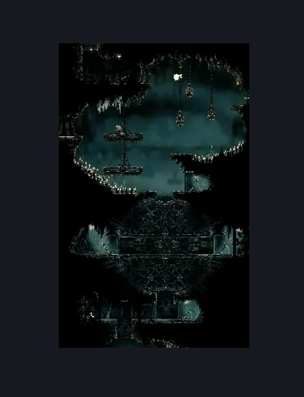
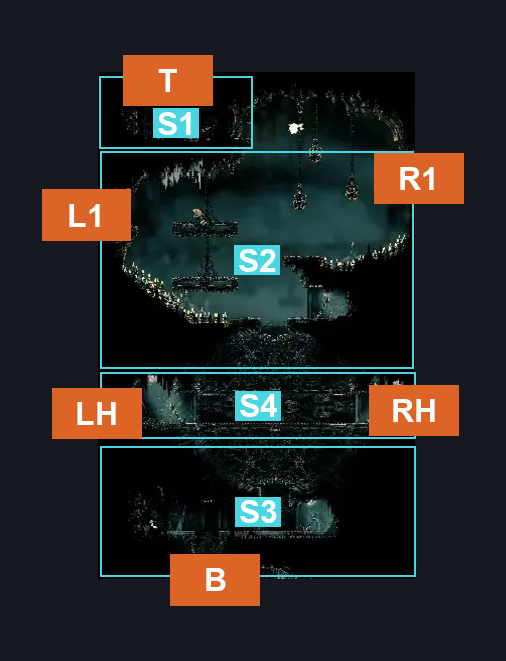
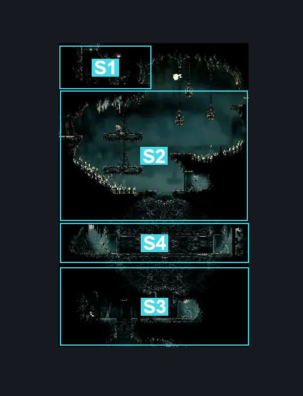

# Rotating Tunnel (Song_20b)

**Game ID:** Song_20b

**Contributors:** samupo

## Subrooms

| No. | Subroom | Annotated |
| --- | --- | --- |
| S1 | Top Platform | ✓ |
| S2 | Central Area | ✓ |
| S3 | Bottom Area | ✓ |
| S4 | Horizontal Tunnel | ✓ |

## Room Transitions

| Alias | Name | From subroom | Destination | Destination alias | Requirements | TODO | Verification | Annotated | Notes |
| --- | --- | --- | --- | --- | --- | --- | --- | --- | --- |
| T | top1 | Top Platform | [Memorium Entrance Tunnel (Song_25)](memorium-entrance-tunnel.md) | B | none |  | Verified | ✓ |  |
| L1 | left2 | Central Area | [Songclave Silk Shop (Song_29)](songclave-silk-shop.md) | R | ledge grab OR dash OR faydown cloak OR clawline OR sharpdart OR drifter's cloak OR silk soar OR easy enemy pogo |  | Verified | ✓ |  |
| R1 | right2 | Central Area | [Songclave Steam Tunnel (Library_02)](../whispering-vaults/songclave-steam-tunnel.md) | TL | none |  | Verified | ✓ |  |
| B | bot1 | Bottom Area | [Grand Bellway Shaft (Song_20)](grand-bellway-shaft.md) | T | none |  | Verified | ✓ |  |
| RH | right3 | Horizontal Tunnel | [Songclave Steam Tunnel (Library_02)](../whispering-vaults/songclave-steam-tunnel.md) | BL | none |  | Verified | ✓ | both sides have levers making the tunnel horizontal |
| LH | left4 | Horizontal Tunnel | [Cogwork Core East Choral Entrance (Cog_06)](../cogwork-core/cogwork-core-east-choral-entrance.md) | R | none |  | Verified | ✓ | both sides have levers making the tunnel horizontal |

## Subroom Connections

| Alias | Name | Source | Destination | Requirements | TODO | Verification | Annotated | Notes |
| --- | --- | --- | --- | --- | --- | --- | --- | --- |
| V | Vertical | Top Platform | Central Area | none |  | Verified |  | falling, door on top platform's side (no inverse) |
| T | Tunnel | Central Area | Bottom Area | none |  | Verified |  | falling, both sides have levers making the tunnel vertical |
| T | Tunnel | Bottom Area | Central Area | silk soar OR cling grip |  | Verified |  | both sides have levers making the tunnel vertical |

## Check Locations

No check locations defined.

## Room Images

### Scene

### Connections

### Checks

