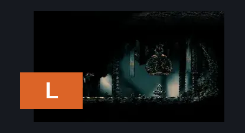
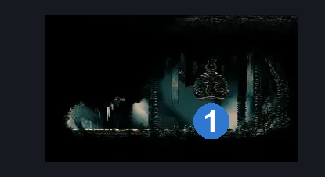
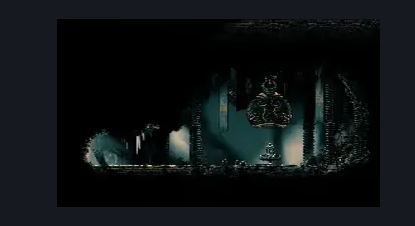

# Songclave Bellshrine (Bellshrine_Enclave)

**Game ID:** Bellshrine_Enclave

## Subrooms

No subrooms defined.

## Room Transitions

| Alias | Name | From subroom | Destination | Destination alias | Requirements | TODO | Verification | Annotated | Notes |
| --- | --- | --- | --- | --- | --- | --- | --- | --- | --- |
| L | left1 |  | [Songclave (Song_Enclave)](songclave.md) | D | none |  | Verified | ✓ |  |

## Subroom Connections

No subroom connections defined.

## Check Locations

| No. | Check | Subroom | Requirements | TODO | Verification | Location Type | Annotated | Notes |
| --- | --- | --- | --- | --- | --- | --- | --- | --- |
| 1 | bellshrine switch |  |  | TODO |  | switch | ✓ |  |
| 2 | bench |  | activate bellshrine switch |  | Verified | bench |  |  |

## Room Images

### Connections

### Checks

### Scene

