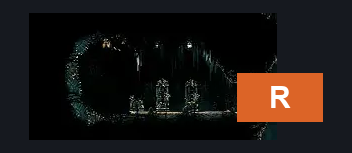
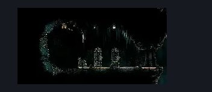

# Songclave Silk Shop (Song_29)

**Game ID:** Song_29

**Contributors:** samupo

## Subrooms

No subrooms defined.

## Room Transitions

| Alias | Name | From subroom | Destination | Destination alias | Requirements | TODO | Verification | Annotated | Notes |
| --- | --- | --- | --- | --- | --- | --- | --- | --- | --- |
| R | right1 |  | [Rotating Tunnel (Song_20b)](rotating-tunnel.md) | L1 | none |  |  | ✓ |  |

## Subroom Connections

No subroom connections defined.

## Check Locations

No check locations defined.

## Room Images

### Connections

### Checks

### Scene

