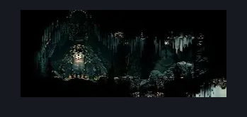
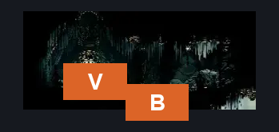
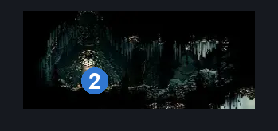

# Songclave Tube (Song_Enclave_Tube)

**Game ID:** Song_Enclave_Tube

**Contributors:** samupo

## Subrooms

No subrooms defined.

## Room Transitions

| Alias | Name | From subroom | Destination | Destination alias | Requirements | TODO | Verification | Annotated | Notes |
| --- | --- | --- | --- | --- | --- | --- | --- | --- | --- |
| B | bot1 |  | [Songclave (Song_Enclave)](songclave.md) | T | none |  | Verified | ✓ |  |
| V | door_tubeEnter |  | [Ventrica Menu](../fast-travel/ventrica-menu.md) | FS | unlock Ventrica: First Shrine |  | Verified | ✓ |  |

## Subroom Connections

No subroom connections defined.

## Check Locations

| No. | Check | Subroom | Requirements | TODO | Verification | Location Type | Annotated | Notes |
| --- | --- | --- | --- | --- | --- | --- | --- | --- |
| 1 | Ventrica: First Shrine Rosary Lock |  | rosaries 80 |  | Verified | lock |  |  |
| 2 | Ventrica: First Shrine |  | unlock Ventrica: First Shrine Rosary Lock |  | Verified | travel | ✓ |  |

## Room Images

### Scene

### Connections

### Checks

