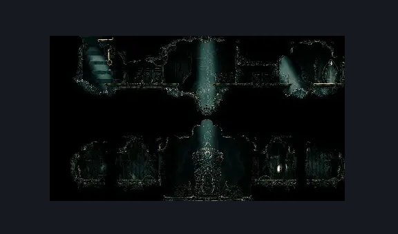
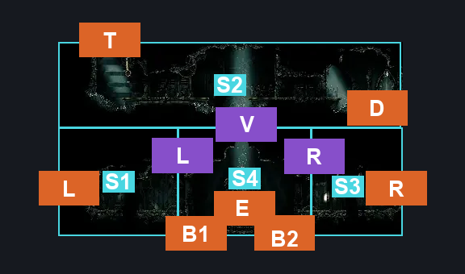
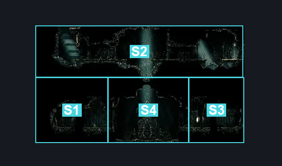

# Cog Dancers (Cog_Dancers)

**Game ID:** Cog_Dancers

**Contributors:** samupo

## Subrooms

| No. | Subroom | Annotated |
| --- | --- | --- |
| S1 | BaseLeft | ✓ |
| S2 | Top | ✓ |
| S3 | BaseRight | ✓ |
| S4 | BossArena | ✓ |

## Room Transitions

| Alias | Name | From subroom | Destination | Destination alias | Requirements | TODO | Verification | Annotated | Notes |
| --- | --- | --- | --- | --- | --- | --- | --- | --- | --- |
| R | right1 | BaseRight | [Memorium Entrance Tunnel (Song_25)](../choral-chambers/memorium-entrance-tunnel.md) | L | none |  | Verified | ✓ |  |
| L | left1 | BaseLeft | [High Halls Corridor (Hang_07)](../choral-chambers/high-halls-corridor.md) | R | none |  | Verified | ✓ |  |
| B1 | bot1 | BossArena | [Cogwork Core South Main (Cog_04)](cogwork-core-south-main.md) | TL | Defeat Cogwork Dancers Boss Fight |  | Verified | ✓ |  |
| B2 | bot2 | BossArena | [Cogwork Core South Main (Cog_04)](cogwork-core-south-main.md) | TR | Defeat Cogwork Dancers Boss Fight |  | Verified | ✓ |  |
| E | elevator | BossArena | [Lace 2 Fight (Song_Tower_01)](../the-cradle/lace-2-fight.md) | D |  | TODO |  | ✓ | TODO: Check all that's needed for the elevator to work |
| D | door1 | Top | [Cogwork Core Main Connection (Cog_Pass)](cogwork-core-main-connection.md) | TL | Nothing. |  |  | ✓ | TODO |
| T | top1 | Top | [Cogwork Core North Main (Cog_08)](cogwork-core-north-main.md) | B | clawline |  |  | ✓ | probably one way |

## Subroom Connections

| Alias | Name | Source | Destination | Requirements | TODO | Verification | Annotated | Notes |
| --- | --- | --- | --- | --- | --- | --- | --- | --- |
| V | Vertical | BossArena | Top | Defeat Cogwork Dancers Boss Fight AND Silk Soar |  | Verified | ✓ |  |
| V | Vertical | Top | BossArena | Nothing | TODO |  | ✓ | falling, check if dancers boss is required on a new save |
| R | RightSide | BaseRight | BossArena | none |  | Verified | ✓ |  |
| R | RightSide | BossArena | BaseRight | Defeat Cogwork Dancers Boss Fight |  | Verified | ✓ |  |
| L | LeftSide | BossArena | BaseLeft | Defeat Cogwork Dancers Boss Fight |  | Verified | ✓ |  |
| L | LeftSide | BaseLeft | BossArena | Nothing |  | Verified | ✓ |  |

## Check Locations

| No. | Check | Subroom | Requirements | TODO | Verification | Location Type | Annotated | Notes |
| --- | --- | --- | --- | --- | --- | --- | --- | --- |
| 1 | Cogwork Dancers Boss Fight | BossArena | Nothing | TODO | Verified | boss |  |  |
| 2 | Play Threefold Melody | BossArena | defeat Cogwork Dancers Boss Fight AND threefold melody parts 3 |  | Verified | logic-point |  | Used in Liquid Lacquer wish requirements per the wiki. |

## Notes

Boss needs only any crest to be beatable. The big line attack can be parried with appropriate timing.

## Room Images

### Scene

### Connections

### Checks

