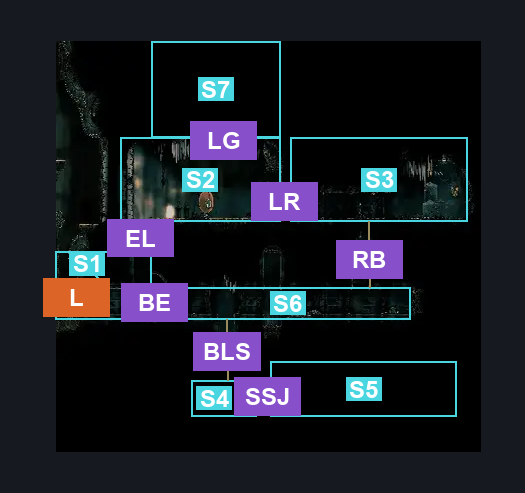
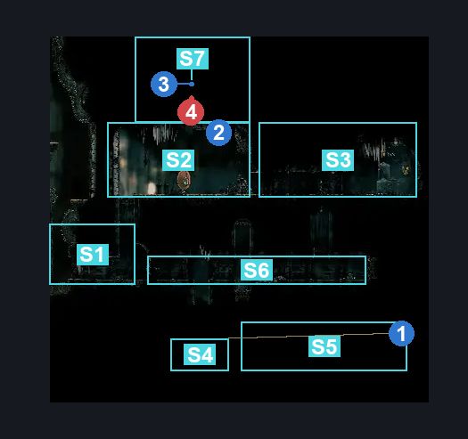
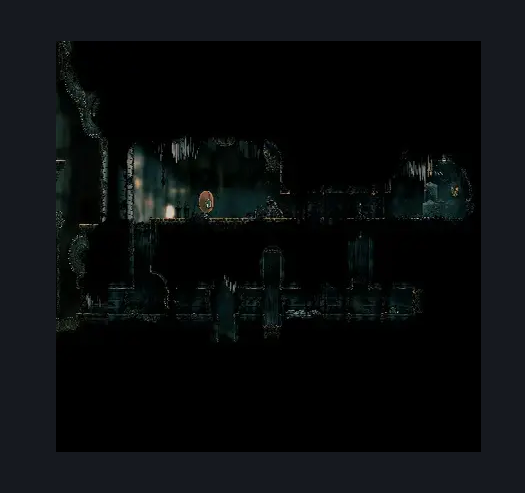

# Cogwork Core East Silk Spool & Gauntlet (Cog_07)

**Game ID:** Cog_07

**Contributors:** Rebel

## Subrooms

| No. | Subroom | Annotated |
| --- | --- | --- |
| S1 | Entrance | ✓ |
| S2 | Left Room | ✓ |
| S3 | Right Room | ✓ |
| S4 | Silk Spool Jump Left | ✓ |
| S5 | Silk Spool Jump Right | ✓ |
| S6 | Bottom Room | ✓ |
| S7 | Arena | ✓ |

## Room Transitions

| Alias | Name | From subroom | Destination | Destination alias | Requirements | TODO | Verification | Annotated | Notes |
| --- | --- | --- | --- | --- | --- | --- | --- | --- | --- |
| L | left1 | Entrance | [Cogwork Core South Main (Cog_04)](cogwork-core-south-main.md) | BR | Nothing. |  | Verified | ✓ |  |

## Subroom Connections

| Alias | Name | Source | Destination | Requirements | TODO | Verification | Annotated | Notes |
| --- | --- | --- | --- | --- | --- | --- | --- | --- |
| EL | Entrance-Left | Entrance | Left Room | Silk Soar OR Cling Grip OR Scuttlebrace |  | Verified | ✓ |  |
| LR | Left-Right | Left Room | Right Room | Activate Cogwork Core: Flip Switch #2 |  | Verified | ✓ |  |
| RB | Right-Bottom | Right Room | Bottom Room | Nothing. (Fall) |  | Verified | ✓ |  |
| BLS | Bottom-Spool Left | Bottom Room | Silk Spool Jump Left | Nothing. (Fall) |  | Verified | ✓ |  |
| SSJ | Silk Spool Jump | Silk Spool Jump Left | Silk Spool Jump Right | Dash OR Sprint OR Clawline OR Sharpdart OR Scuttlebrace |  | Verified | ✓ | hehe, funny dragonball reference. |
| SSJ | Silk Spool Jump | Silk Spool Jump Right | Silk Spool Jump Left | Dash OR Sprint OR Clawline OR Sharpdart OR Scuttlebrace |  | Verified | ✓ |  |
| BLS | Bottom-Spool Left | Silk Spool Jump Left | Bottom Room | Scuttlebrace OR Cling Grip |  | Verified | ✓ |  |
| BE | Bottom-Entrance | Bottom Room | Entrance | Nothing. |  | Verified | ✓ |  |
| BE | Bottom-Entrance | Entrance | Bottom Room | Invalid |  | Verified | ✓ |  |
| EL | Entrance-Left | Left Room | Entrance | Nothing. (Fall) |  | Verified | ✓ |  |
| LR | Left-Right | Right Room | Left Room | Activate Cogwork Core: Flip Switch #2 |  | Verified | ✓ |  |
| RB | Right-Bottom | Bottom Room | Right Room | Silk Soar OR Cling Grip OR Scuttlebrace |  | Verified | ✓ |  |
| LG | Left-Gauntlet | Left Room | Arena | Silk Soar |  | Verified | ✓ |  |
| LG | Left-Gauntlet | Arena | Left Room | Complete Cogwork Core: Gauntlet #2 |  | Verified | ✓ |  |

## Check Locations

| No. | Check | Subroom | Requirements | TODO | Verification | Location Type | Annotated | Notes |
| --- | --- | --- | --- | --- | --- | --- | --- | --- |
| 1 | Cogwork Core: Silk Spool #1 | Silk Spool Jump Left | Nothing. |  | Verified | collectible | ✓ |  |
| 2 | Cogwork Core: Flip Switch #2 | Left Room | Nothing. |  | Verified | switch | ✓ | interacting with this switch causes a mini-boss type enemy to spawn |
| 3 | Cogwork Core: Pristine Core | Arena | Complete Cogwork Core: Gauntlet #2 |  | Verified | collectible | ✓ |  |
| 4 | Cogwork Core: Gauntlet #2 | Arena | Nothing. |  | Verified | gauntlet | ✓ |  |
| 5 | import enemies |  |  | TODO | Needs verification |  |  |  |

## Room Images

### Connections

### Checks

### Scene

