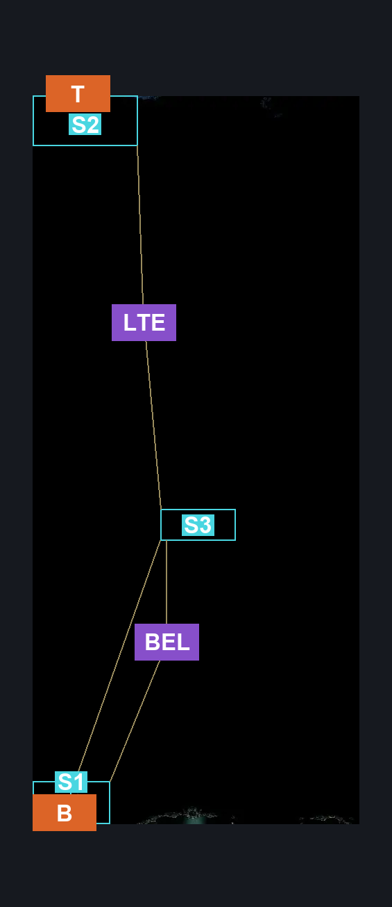
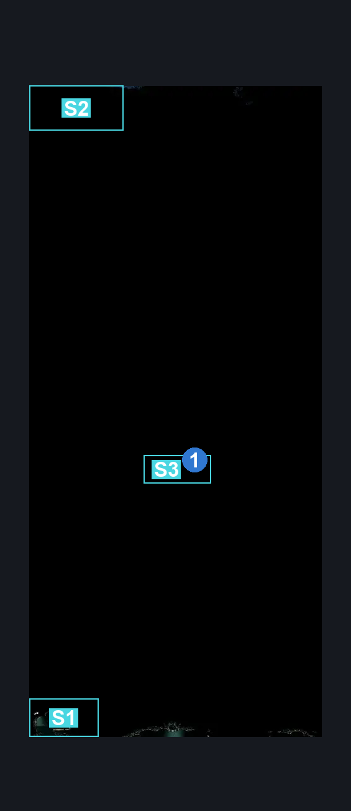
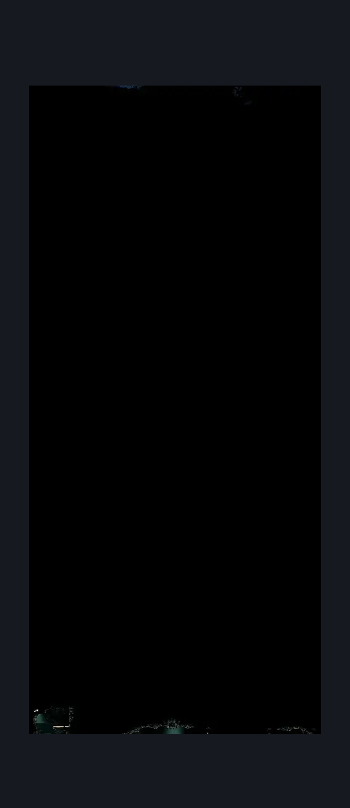

# Cogwork Core North Main (Cog_08)

**Game ID:** Cog_08

**Contributors:** Rebel

## Subrooms

| No. | Subroom | Annotated |
| --- | --- | --- |
| S1 | Lower Entrance | ✓ |
| S2 | Upper Entrance | ✓ |
| S3 | Lever Door | ✓ |

## Room Transitions

| Alias | Name | From subroom | Destination | Destination alias | Requirements | TODO | Verification | Annotated | Notes |
| --- | --- | --- | --- | --- | --- | --- | --- | --- | --- |
| B | bot1 | Lever Door | [Cog Dancers (Cog_Dancers)](cog-dancers.md) | T | Nothing |  | Verified | ✓ |  |
| T | top1 | Upper Entrance | [Cogwork Core Architect's Melody (Cog_09)](cogwork-core-architect-s-melody.md) | B | Nothing |  | Verified | ✓ |  |

## Subroom Connections

| Alias | Name | Source | Destination | Requirements | TODO | Verification | Annotated | Notes |
| --- | --- | --- | --- | --- | --- | --- | --- | --- |
| BEL | Bottom Entrance-Lever | Lower Entrance | Lever Door | ((Proficient Movement AND Spike Pogo)  AND Medium Hunter Pogo AND Medium Reaper Pogo AND Medium Architect Pogo AND Medium Shaman Pogo AND (Cling Grip OR Faydown Cloak OR Ledge Grab) AND Easy Enemy Pogo (Easy Skip)) |  | Verified | ✓ | Can be clawline only'd but since theres no specific skip tag for that i am omitting it. |
| BEL | Bottom Entrance-Lever | Lever Door | Lower Entrance | Drifter's Cloak |  | Verified | ✓ | let me add a Nothing as a medium skip pls it'll be funny |
| LTE | Lever-Top Entrance | Lever Door | Upper Entrance | Clawline AND Faydown Cloak AND Cling Grip |  | Verified | ✓ |  |
| LTE | Lever-Top Entrance | Upper Entrance | Lever Door | Clawline OR Sharpdart OR Dash OR Faydown Cloak OR Drifter's Cloak |  | Verified | ✓ |  |

## Check Locations

| No. | Check | Subroom | Requirements | TODO | Verification | Location Type | Annotated | Notes |
| --- | --- | --- | --- | --- | --- | --- | --- | --- |
| 1 | Cogwork Core: Flip Switch #7 | Lever Door | Nothing. |  | Verified | switch | ✓ |  |
| 2 | import enemies |  |  | TODO | Needs verification |  |  |  |

## Room Images

### Connections

### Checks

### Scene

