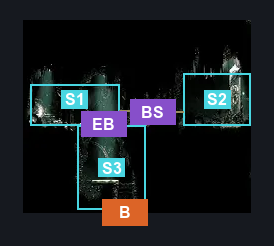
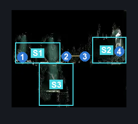
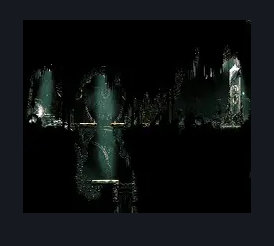

# Cogwork Core Second Sentinel (Cog_10)

**Game ID:** Cog_10

**Contributors:** Rebel

## Subrooms

| No. | Subroom | Annotated |
| --- | --- | --- |
| S1 | Shard Bundle Check | ✓ |
| S2 | Second Sentinel | ✓ |
| S3 | Entrance | ✓ |

## Room Transitions

| Alias | Name | From subroom | Destination | Destination alias | Requirements | TODO | Verification | Annotated | Notes |
| --- | --- | --- | --- | --- | --- | --- | --- | --- | --- |
| B | bot1 | Entrance | [Cogwork Core West Gauntlet (Cog_05)](cogwork-core-west-gauntlet.md) | T | Nothing. |  | Verified | ✓ |  |

## Subroom Connections

| Alias | Name | Source | Destination | Requirements | TODO | Verification | Annotated | Notes |
| --- | --- | --- | --- | --- | --- | --- | --- | --- |
| EB | Entrance-Bundle | Entrance | Shard Bundle Check | Silk Soar OR Faydown Cloak |  | Verified | ✓ |  |
| BS | Bundle-Sentinel | Shard Bundle Check | Second Sentinel | Activate Cogwork Core: Break Wall #1 AND Activate Cogwork Core: Break Wall #2 |  | Verified | ✓ |  |
| BS | Bundle-Sentinel | Second Sentinel | Shard Bundle Check | Activate Cogwork Core: Break Wall #1 AND Activate Cogwork Core: Break Wall #2 |  | Verified | ✓ |  |
| EB | Entrance-Bundle | Shard Bundle Check | Entrance | Nothing. (Fall) |  | Verified | ✓ |  |

## Check Locations

| No. | Check | Subroom | Requirements | TODO | Verification | Location Type | Annotated | Notes |
| --- | --- | --- | --- | --- | --- | --- | --- | --- |
| 1 | Cogwork Core: Shard Bundle #1 | Shard Bundle Check | Nothing. |  | Verified | collectible | ✓ |  |
| 2 | Cogwork Core: Break Wall #1 | Shard Bundle Check | Nothing. |  | Verified | blockade | ✓ |  |
| 3 | Cogwork Core: Break Wall #2 | Shard Bundle Check | Nothing. |  | Verified | blockade | ✓ |  |
| 4 | Second Sentinel Activation | Second Sentinel | (Break Wall Right AND Get 3 Cogheart Pieces) |  | Verified | event | ✓ |  |
| 5 | import enemies |  |  | TODO | Needs verification |  |  |  |

## Room Images

### Connections

### Checks

### Scene

