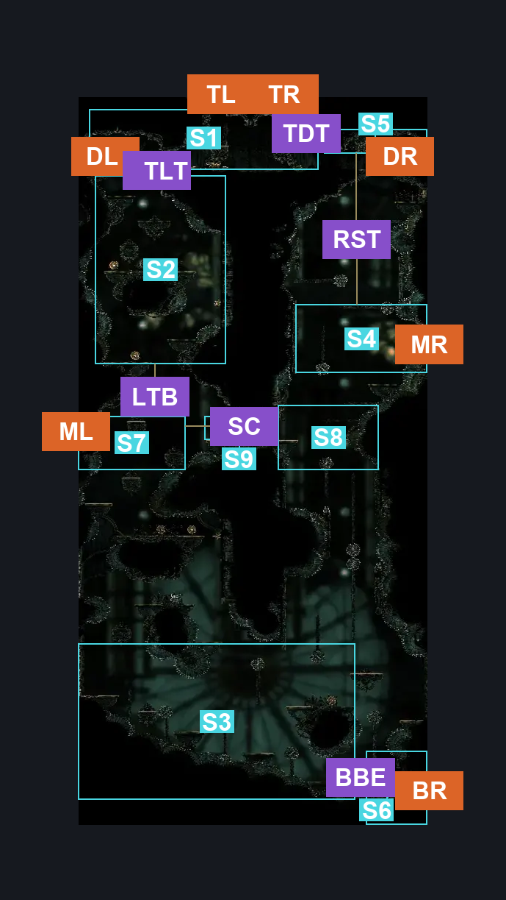
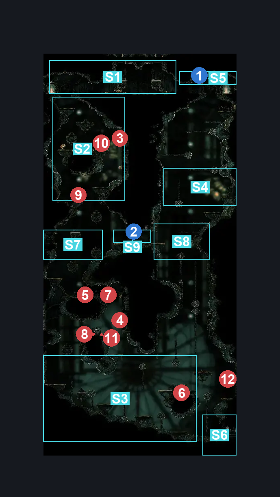
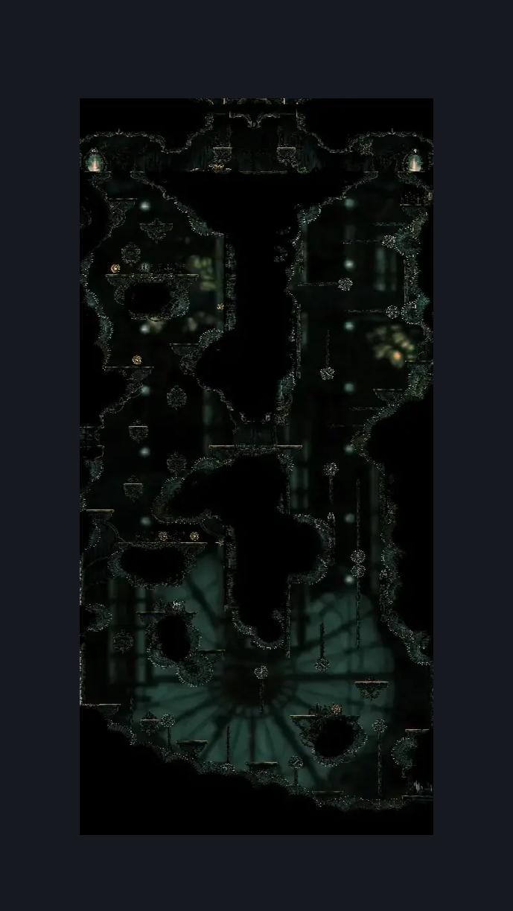

# Cogwork Core South Main (Cog_04)

**Game ID:** Cog_04

**Contributors:** Rebel

## Subrooms

| No. | Subroom | Annotated |
| --- | --- | --- |
| S1 | Top Entrance | ✓ |
| S2 | Left Shaft Top Side | ✓ |
| S3 | Bottom | ✓ |
| S4 | Right Shaft Top Side | ✓ |
| S5 | Top Right Door | ✓ |
| S6 | Bottom Right Entrance | ✓ |
| S7 | Left Shaft Bottom Side | ✓ |
| S8 | Right Shaft Bottom Side | ✓ |
| S9 | Shaft Shortcut | ✓ |

## Room Transitions

| Alias | Name | From subroom | Destination | Destination alias | Requirements | TODO | Verification | Annotated | Notes |
| --- | --- | --- | --- | --- | --- | --- | --- | --- | --- |
| BR | right3 | Bottom | [Cogwork Core East Silk Spool & Gauntlet (Cog_07)](cogwork-core-east-silk-spool-gauntlet.md) | L | Nothing. |  | Verified | ✓ |  |
| ML | left2 | Left Shaft Bottom Side | [Cogwork Core West Gauntlet (Cog_05)](cogwork-core-west-gauntlet.md) | R | Nothing. |  | Verified | ✓ |  |
| DL | door1 | Top Entrance | [Cogwork Core Bench & Map (Cog_Bench)](cogwork-core-bench-map.md) | L | Nothing. |  | Verified | ✓ |  |
| DR | door2 | Top Right Door | [Cogwork Core Main Connection (Cog_Pass)](cogwork-core-main-connection.md) | BL | Nothing. |  | Verified | ✓ |  |
| MR | right2 | Right Shaft Top Side | [Cogwork Core East Choral Entrance (Cog_06)](cogwork-core-east-choral-entrance.md) | L | Nothing. |  | Verified | ✓ |  |
| TL | top1 | Top Entrance | [Cog Dancers (Cog_Dancers)](cog-dancers.md) | B1 | Cling Grip OR Scuttlebrace OR Silk Soar OR Faydown Cloak |  | Verified | ✓ |  |
| TR | top2 | Top Entrance | [Cog Dancers (Cog_Dancers)](cog-dancers.md) | B2 | Cling Grip OR Scuttlebrace OR Silk Soar OR Faydown Cloak |  | Verified | ✓ |  |

## Subroom Connections

| Alias | Name | Source | Destination | Requirements | TODO | Verification | Annotated | Notes |
| --- | --- | --- | --- | --- | --- | --- | --- | --- |
| TLT | Top-Left Top | Top Entrance | Left Shaft Top Side | Nothing. (Fall) |  | Verified | ✓ |  |
| TLT | Top-Left Top | Left Shaft Top Side | Top Entrance | Ledge Grab OR Clawline OR Faydown Cloak OR Scuttlebrace |  | Verified | ✓ |  |
| LTB | Left Top-Left Bottom | Left Shaft Top Side | Left Shaft Bottom Side | Nothing. (Fall) |  | Verified | ✓ |  |
| LTB | Left Top-Left Bottom | Left Shaft Bottom Side | Left Shaft Top Side | (Spike Pogo AND (Ledge Grab OR Clawline OR (Faydown Cloak AND Proficient Movement (Easy Skip))))  OR (Cling Grip AND Ledge Grab) |  | Verified | ✓ |  |
| LBB | Left Bottom-Bottom | Left Shaft Bottom Side | Bottom | Nothing. (Fall) |  | Verified |  |  |
| LBB | Left Bottom-Bottom | Bottom | Left Shaft Bottom Side | (Cling Grip AND Ledge Grab) OR (Faydown Cloak AND (Spike Pogo OR Easy Enemy Pogo)) |  | Verified |  |  |
| BRR | Bottom-Right Bottom Shaft | Bottom | Right Shaft Bottom Side | (Cling Grip AND (Faydown Cloak OR Clawline OR (Dash AND Drifter's Cloak) OR Spike Pogo)) OR (Spike Pogo AND (Faydown Cloak OR (Clawline AND Faydown Cloak AND Proficient Movement (Hard Skip)))) |  | Verified |  |  |
| BRR | Bottom-Right Bottom Shaft | Right Shaft Bottom Side | Bottom | Nothing. (Fall) |  | Verified |  |  |
| RBT | Right Bottom-Right Top | Right Shaft Bottom Side | Right Shaft Top Side | (Cling Grip AND Faydown Cloak AND (Drifter's Cloak OR Dash)) OR (Faydown Cloak AND Spike Pogo) OR (Clawline AND Faydown Cloak AND Proficient Movement (Hard Skip)) |  | Verified |  | unsure if any of these marks are being properly read as skips |
| RBT | Right Bottom-Right Top | Right Shaft Top Side | Right Shaft Bottom Side | Nothing. (fall) |  | Verified |  |  |
| RST | Right Top-Top Door | Right Shaft Top Side | Top Right Door | ((Ledge Grab OR Clawline OR Scuttlebrace) AND (Spike Pogo AND (Cling Grip OR Faydown Cloak))) OR (Clawline AND (Faydown Cloak (Easy Skip))) |  | Verified | ✓ | AQ - my cat |
| RST | Right Top-Top Door | Top Right Door | Right Shaft Top Side | Nothing. (Fall) |  | Verified | ✓ |  |
| TDT | Right Top Door-Top | Top Right Door | Top Entrance | Activate Cogwork Core: Flipped Switch #4 |  | Verified | ✓ |  |
| TDT | Right Top Door-Top | Top Entrance | Top Right Door | Activate Cogwork Core: Flipped Switch #5 |  | Verified | ✓ |  |
| SC | Shortcut | Left Shaft Bottom Side | Right Shaft Bottom Side | Activate Cogwork Core: Flipped Switch #4 |  | Verified | ✓ |  |
| SC | Shortcut | Right Shaft Bottom Side | Left Shaft Bottom Side | Activate Cogwork Core: Flipped Switch #4 |  | Verified | ✓ |  |
| BBE | Bottom-Bottom Exit | Bottom | Bottom Right Entrance | Spike Pogo OR Clawline OR Sharpdart OR Sprint OR Dash OR Drifter's Cloak OR Faydown Cloak |  | Verified | ✓ |  |
| BBE | Bottom-Bottom Exit | Bottom Right Entrance | Bottom | Spike Pogo OR Clawline OR Sharpdart OR Sprint OR Dash OR Drifter's Cloak OR Faydown Cloak |  | Verified | ✓ |  |

## Check Locations

| No. | Check | Subroom | Requirements | TODO | Verification | Location Type | Annotated | Notes |
| --- | --- | --- | --- | --- | --- | --- | --- | --- |
| 1 | Cogwork Core: Flipped Switch #5 | Top Right Door | Nothing. |  | Verified | switch | ✓ |  |
| 2 | Cogwork Core: Flipped Switch #4 | Shaft Shortcut | Flip Switch Left |  | Verified | switch | ✓ |  |
| 3 | Cogwork Crawler 1 |  |  |  |  | enemy | ✓ |  |
| 4 | Cogwork Crawler 2 |  |  |  |  | enemy | ✓ |  |
| 5 | Cogwork Choirbug 1 |  |  |  |  | enemy | ✓ |  |
| 6 | Cogwork Choirbug 2 |  |  |  |  | enemy | ✓ |  |
| 7 | Cogwork Choirbug 3 |  |  |  |  | enemy | ✓ |  |
| 8 | Cogwork Cleanser 1 |  | Normal World Spawn |  |  | enemy | ✓ |  |
| 9 | Cogwork Choirbug 4 |  | Normal World Spawn |  |  | enemy | ✓ |  |
| 10 | Cogwork Choirbug 5 |  | Normal World Spawn |  |  | enemy | ✓ |  |
| 11 | Cogwork Cleanser 2 |  | Black Thread World Spawn |  |  | enemy | ✓ |  |
| 12 | Void Mass 1 |  | Black Thread World Spawn |  |  | enemy | ✓ |  |

## Room Images

### Connections

### Checks

### Scene

