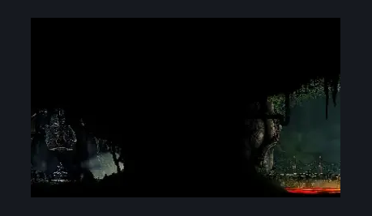
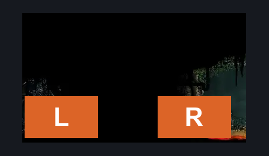

# Deep Docks Bellshrine (Bellshrine_05)

**Game ID:** Bellshrine_05

**Contributors:** herounit and Rebel

## Subrooms

No subrooms defined.

## Room Transitions

| Alias | Name | From subroom | Destination | Destination alias | Requirements | TODO | Verification | Annotated | Notes |
| --- | --- | --- | --- | --- | --- | --- | --- | --- | --- |
| L | left1 |  | [Deep Docks Lace Intro (Bone_East_12)](deep-docks-lace-intro.md) | R | none |  | Verified | ✓ |  |
| R | right1 |  | [Far Fields Entrance East (Bone_East_02)](../far-fields/far-fields-entrance-east.md) | L | ( bellshrinesanity off AND activate bellshrine switch )  OR ( bellshrinesanity on AND have bell deep docks ) |  | Verified | ✓ | must keep in sync with other side |

## Subroom Connections

No subroom connections defined.

## Check Locations

| No. | Check | Subroom | Requirements | TODO | Verification | Location Type | Annotated | Notes |
| --- | --- | --- | --- | --- | --- | --- | --- | --- |
| 1 | bellshrine switch |  | none |  | Verified | switch |  |  |
| 2 | bench |  | activate bellshrine switch |  | Verified | bench |  |  |
| 3 | bell deep docks |  | activate bellshrine switch |  | Verified | collectible |  |  |

## Room Images

### Scene

### Connections

### Checks

