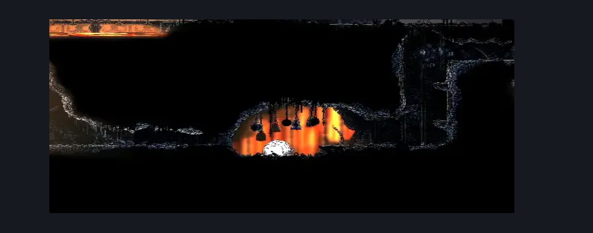
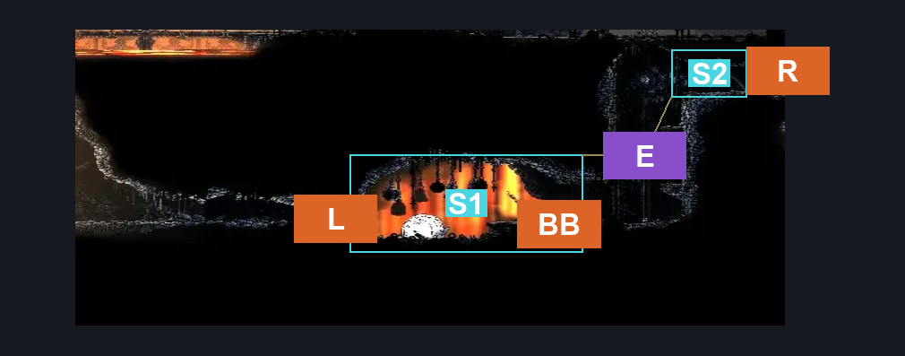
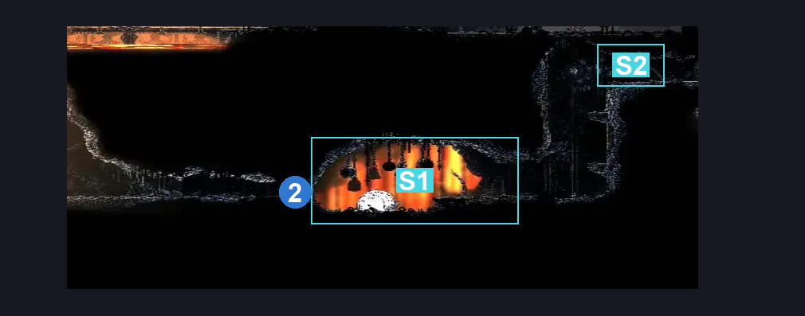

# Deep Docks Bellway (Bellway_02)

**Game ID:** Bellway_02

**Contributors:** herounit and Rebel

## Subrooms

| No. | Subroom | Annotated |
| --- | --- | --- |
| S1 | Bell Beast | ✓ |
| S2 | Entry | ✓ |

## Room Transitions

| Alias | Name | From subroom | Destination | Destination alias | Requirements | TODO | Verification | Annotated | Notes |
| --- | --- | --- | --- | --- | --- | --- | --- | --- | --- |
| L | left1 | Bell Beast | [Deep Docks Bellway Flea Rescue (Dock_16)](deep-docks-bellway-flea-rescue.md) | R | Activate bellway breakable wall |  | Verified | ✓ |  |
| BB | door_fastTravelExit | Bell Beast | [Bellway Menu](../fast-travel/bellway-menu.md) | DD | unlock bellway deep docks |  | Verified | ✓ |  |
| R | right1 | Entry | [Deep Docks Map Shop (Bone_East_01)](deep-docks-map-shop.md) | LL | none |  | Verified | ✓ |  |

## Subroom Connections

| Alias | Name | Source | Destination | Requirements | TODO | Verification | Annotated | Notes |
| --- | --- | --- | --- | --- | --- | --- | --- | --- |
| E | Entrance | Entry | Bell Beast | Nothing. (Fall) |  | Verified | ✓ |  |
| E | Entrance | Bell Beast | Entry | Ledge Grab OR Cling Grip OR Scuttlebrace OR Faydown Cloak OR Silk Soar |  | Verified | ✓ |  |

## Check Locations

| No. | Check | Subroom | Requirements | TODO | Verification | Location Type | Annotated | Notes |
| --- | --- | --- | --- | --- | --- | --- | --- | --- |
| 1 | bellway rosary lock | Bell Beast | rosaries 40 |  | Verified | lock |  |  |
| 2 | bellway breakable wall | Bell Beast | Break Wall Left |  | Verified | blockade | ✓ |  |
| 3 | bellway deep docks | Bell Beast | unlock bellway rosary lock |  | Verified | travel |  |  |

## Room Images

### Scene

### Connections

### Checks

