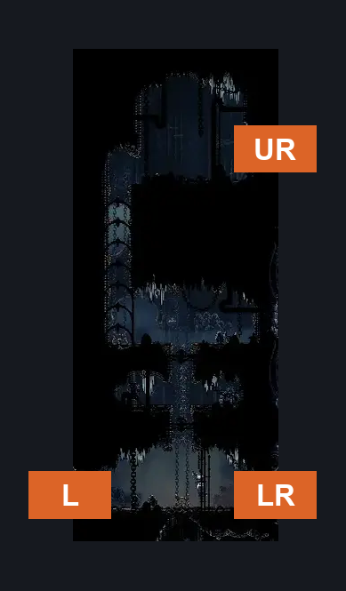
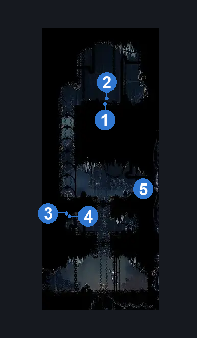
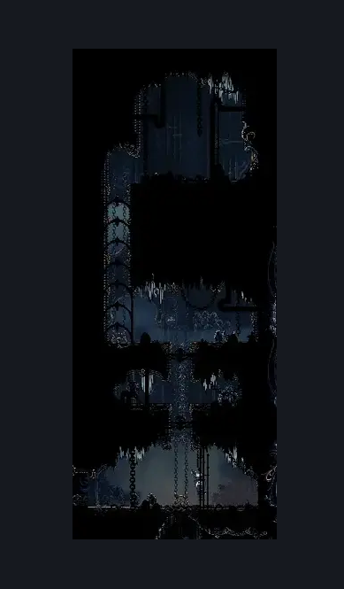

# Deep Docks Bench Shaft (Dock_01)

**Game ID:** Dock_01

**Contributors:** herounit and Rebel

## Subrooms

No subrooms defined.

## Room Transitions

| Alias | Name | From subroom | Destination | Destination alias | Requirements | TODO | Verification | Annotated | Notes |
| --- | --- | --- | --- | --- | --- | --- | --- | --- | --- |
| UR | right1 |  | [Deep Docks Upper Spire (Bone_East_05)](deep-docks-upper-spire.md) | L | Activate Deep Docks Upper Spire Gate Lever IN Deep Docks Upper Spire |  | Verified | ✓ | must be unlocked from the other side |
| LR | right2 |  | [Deep Docks Map Shop (Bone_East_01)](deep-docks-map-shop.md) | UL | Nothing. |  | Verified | ✓ |  |
| L | left1 |  | [Deep Docks Entrance (Dock_08)](deep-docks-entrance.md) | R | Nothing. |  | Verified | ✓ |  |

## Subroom Connections

No subroom connections defined.

## Check Locations

| No. | Check | Subroom | Requirements | TODO | Verification | Location Type | Annotated | Notes |
| --- | --- | --- | --- | --- | --- | --- | --- | --- |
| 1 | bench rosary lock |  | Rosaries 30 |  | Verified | lock | ✓ |  |
| 2 | Deep Docks Shaft Bench |  | Unlock bench rosary lock |  | Verified | bench | ✓ |  |
| 3 | Deep Docks - Rosary Cache #7 |  | Nothing. |  | Verified | resource | ✓ |  |
| 4 | Deep Docks - Rosary Cache #8 |  | Nothing. |  | Verified | resource | ✓ |  |
| 5 | Deep Docks - Shell Shard Cache #4 |  | Nothing. |  | Verified | resource | ✓ |  |

## Room Images

### Connections

### Checks

### Scene

