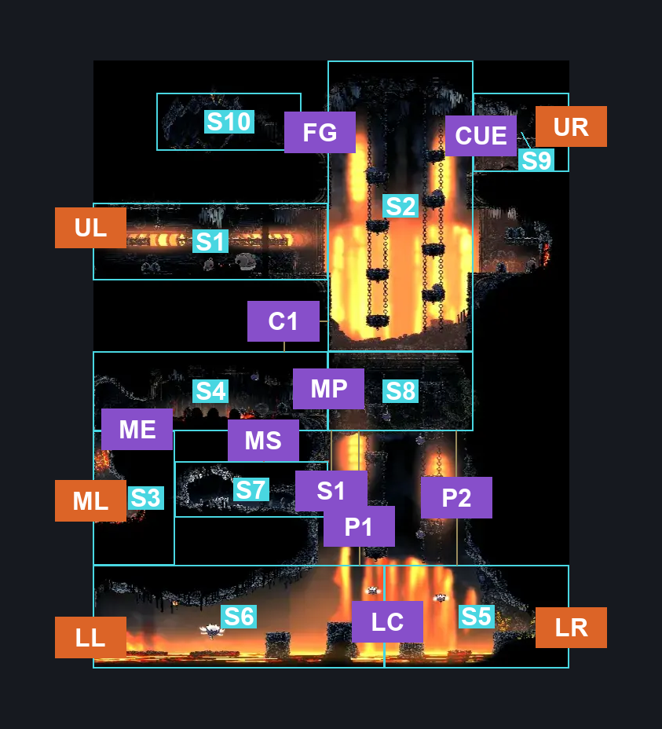
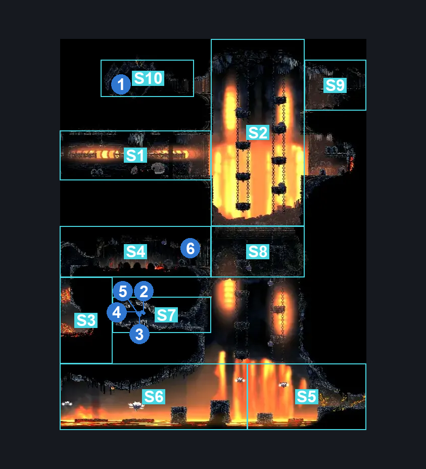
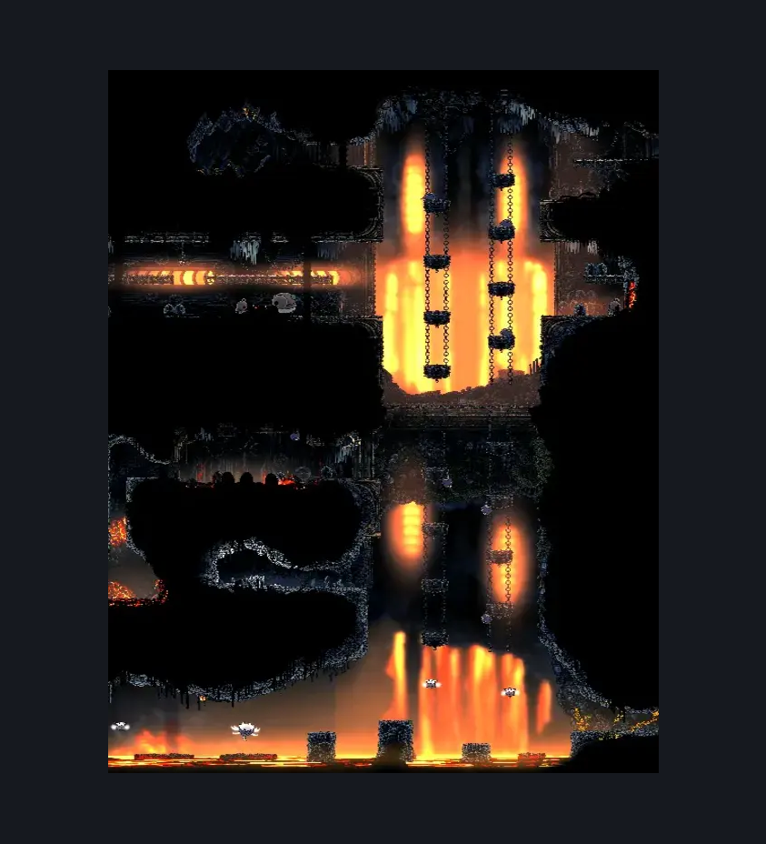

# Deep Docks Chains Center (Dock_02b)

**Game ID:** Dock_02b

**Contributors:** herounit and Rebel

## Subrooms

| No. | Subroom | Annotated |
| --- | --- | --- |
| S1 | upper left hallway | ✓ |
| S2 | upper chain platforms | ✓ |
| S3 | middle left exit area | ✓ |
| S4 | middle switch platform | ✓ |
| S5 | lower right area | ✓ |
| S6 | lower left area | ✓ |
| S7 | middle side room | ✓ |
| S8 | lower chain platforms | ✓ |
| S9 | upper right exit | ✓ |
| S10 | Flintslate | ✓ |

## Room Transitions

| Alias | Name | From subroom | Destination | Destination alias | Requirements | TODO | Verification | Annotated | Notes |
| --- | --- | --- | --- | --- | --- | --- | --- | --- | --- |
| UL | left1 | upper left hallway | [Deep Docks Chains West (Dock_02)](deep-docks-chains-west.md) | UR | none |  | Verified | ✓ |  |
| ML | left2 | middle left exit area | [Deep Docks Chains West (Dock_02)](deep-docks-chains-west.md) | MR | none |  | Verified | ✓ |  |
| LL | left3 | lower left area | [Deep Docks Chains West (Dock_02)](deep-docks-chains-west.md) | LR | none |  | Verified | ✓ |  |
| UR | right1 | upper right exit | [Deep Docks Chains Upper East (Dock_03)](deep-docks-chains-upper-east.md) | L | none |  | Verified | ✓ |  |
| LR | right2 | lower right area | [Deep Docks Chains Lower East (Dock_03c)](deep-docks-chains-lower-east.md) | L | activate shortcut blast rock IN Deep docks chains lower east |  | Verified | ✓ |  |

## Subroom Connections

| Alias | Name | Source | Destination | Requirements | TODO | Verification | Annotated | Notes |
| --- | --- | --- | --- | --- | --- | --- | --- | --- |
| ME | middle exit to switch platform | middle left exit area | middle switch platform | cling grip OR ( silk soar AND magma bell ) |  | Verified | ✓ |  |
| ME | middle exit to switch platform | middle switch platform | middle left exit area | none (falling) |  | Verified | ✓ |  |
| LC | lower crossing | lower right area | lower left area | run OR dash OR drifter's cloak OR faydown cloak OR cling grip OR silk soar OR clawline OR sharp dart OR easy beast crest pogo OR ((Ledge Grab AND (easy shaman crest pogo OR easy reaper pogo OR (Proficient Movement AND Architect Attack Left) OR Easy Architect Charge OR Easy Beast Charge))) |  | Verified | ✓ |  |
| LC | lower crossing | lower left area | lower right area | none (jump) |  | Verified | ✓ |  |
| P1 | lower to middle switch platform | lower left area | lower chain platforms | silk soar |  | Verified | ✓ |  |
| P1 | lower to middle switch platform | lower chain platforms | lower left area | none (falling) |  | Verified | ✓ |  |
| P2 | lower platforms to lower right area | lower chain platforms | lower right area | none (falling) |  | Verified | ✓ |  |
| P2 | lower platforms to lower right area | lower right area | lower chain platforms | silk soar |  | Verified | ✓ |  |
| C1 | middle chains to upper chains | middle switch platform | upper chain platforms | activate ceiling switch AND ( silk soar OR cling grip OR Scuttlebrace) |  | Verified | ✓ |  |
| C1 | middle chains to upper chains | upper chain platforms | middle switch platform | activate ceiling switch (Fall) |  | Verified | ✓ |  |
| MS | middle switch platform to side room | middle switch platform | middle side room | none (falling) |  | Verified | ✓ | one-way |
| MS | middle switch platform to side room | middle side room | middle switch platform | Silk Soar  OR (Cling Grip AND Faydown Cloak)  OR (Activate Ceiling Switch AND (Ledge Grab OR Cling Grip OR Scuttlebrace OR Faydown Cloak OR Clawline OR Sharpdart OR Dash OR Proficient Movement)) |  | Verified | ✓ |  |
| MP | middle platform to lower chains | middle switch platform | lower chain platforms | none |  | Verified | ✓ |  |
| MP | middle platform to lower chains | lower chain platforms | middle switch platform | Silk Soar  OR (Activate Ceiling Switch AND (Ledge Grab OR Cling Grip OR Scuttlebrace OR Faydown Cloak OR Clawline OR Sharpdart OR Dash OR Proficient Movement)) |  | Verified | ✓ |  |
| S1 | side room to chain platforms | middle side room | lower chain platforms | Silk Soar  OR (Activate Ceiling Switch AND (Ledge Grab OR Cling Grip OR Scuttlebrace OR Faydown Cloak OR Clawline OR Sharpdart OR Dash OR Proficient Movement)) |  | Verified | ✓ |  |
| S1 | side room to chain platforms | lower chain platforms | middle side room | none (falling) |  | Verified | ✓ | I have a feeling this line is going to cause problems |
| CUE | Upper Chain <> Right Exit | upper chain platforms | upper right exit | Ledge Grab OR Cling Grip OR Scuttlebrace OR Silk Soar OR Faydown Cloak OR Clawline OR Sharpdart OR Dash |  | Verified | ✓ |  |
| CUE | Upper Chain <> Right Exit | upper right exit | upper chain platforms | nada (Fall) |  | Verified | ✓ |  |
| FG | Flintslate Get | upper chain platforms | Flintslate | Silk Soar OR Ledge Grab OR Cling Grip OR Scuttlebrace OR Faydown Cloak OR Clawline OR Sharpdart OR Dash |  | Verified | ✓ |  |
| FG | Flintslate Get | Flintslate | upper chain platforms | Nada |  | Verified | ✓ |  |

## Check Locations

| No. | Check | Subroom | Requirements | TODO | Verification | Location Type | Annotated | Notes |
| --- | --- | --- | --- | --- | --- | --- | --- | --- |
| 1 | flintslate | Flintslate | none |  | Verified | collectible | ✓ |  |
| 2 | shell shard cache deep docks 6 | middle side room | none |  | Verified | resource | ✓ |  |
| 3 | shell shard cache deep docks 7 | middle side room | none |  | Verified | resource | ✓ |  |
| 4 | shell shard cache deep docks 8 | middle side room | none |  | Verified | resource | ✓ |  |
| 5 | shell shard cache deep docks 9 | middle side room | none |  | Verified | resource | ✓ |  |
| 6 | ceiling switch | middle switch platform | none |  | Verified | switch | ✓ | lowers middle chain platforms |

## Notes

the floor/lower half of this area is closed off initially

the switch to lower the middle chain section makes some of this logic difficult to reason about - but if you can reach the middle switch platform, there is no reason you can't reach all the stuff that unlocking the chains provides - might need to revise this for switch randomization

## Room Images

### Connections

### Checks

### Scene

