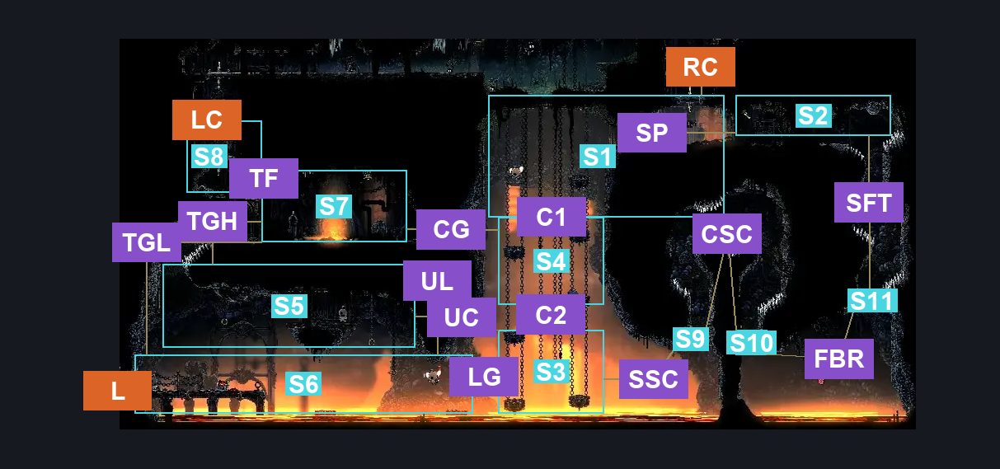
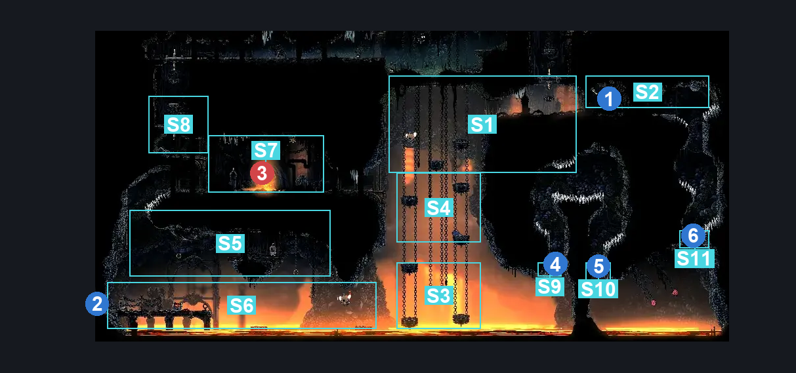
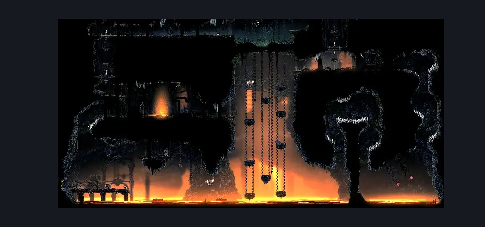

# Deep Docks Chains Lower East (Dock_03c)

**Game ID:** Dock_03c

**Contributors:** herounit and Rebel

## Subrooms

| No. | Subroom | Annotated |
| --- | --- | --- |
| S1 | upper chains | ✓ |
| S2 | spool fragment | ✓ |
| S3 | lower chains | ✓ |
| S4 | middle chains | ✓ |
| S5 | upper lava platform | ✓ |
| S6 | lower lava platform | ✓ |
| S7 | gauntlet | ✓ |
| S8 | upper left of gauntlet | ✓ |
| S9 | Spool Rock 1 | ✓ |
| S10 | Spool Rock 2 | ✓ |
| S11 | Spool Rock 3 | ✓ |

## Room Transitions

| Alias | Name | From subroom | Destination | Destination alias | Requirements | TODO | Verification | Annotated | Notes |
| --- | --- | --- | --- | --- | --- | --- | --- | --- | --- |
| RC | top2 | upper chains | [Deep Docks Chains Upper East (Dock_03)](deep-docks-chains-upper-east.md) | F | nothing. |  | Verified | ✓ |  |
| LC | top1 | upper left of gauntlet | [Deep Docks Chains Flea Rescue (Dock_03d)](deep-docks-chains-flea-rescue.md) | F | open airlock Up |  | Verified | ✓ |  |
| L | left2 | lower lava platform | [Deep Docks Chains Center (Dock_02b)](deep-docks-chains-center.md) | LR | Activate Shortcut Blast Rock |  | Verified | ✓ |  |

## Subroom Connections

| Alias | Name | Source | Destination | Requirements | TODO | Verification | Annotated | Notes |
| --- | --- | --- | --- | --- | --- | --- | --- | --- |
| SP | open spool door | spool fragment | upper chains | open airlock left |  | Verified | ✓ | one-way |
| SP | open spool door | upper chains | spool fragment | Invalid |  | Verified | ✓ |  |
| C1 | upper to middle chains | middle chains | upper chains | faydown cloak OR cling grip OR Scuttlebrace OR silk soar OR Ledge Grab |  | Verified | ✓ |  |
| C1 | upper to middle chains | upper chains | middle chains | none (falling) |  | Verified | ✓ |  |
| C2 | lower to middle chains | lower chains | middle chains | silk soar OR cling grip OR Scuttlebrace OR (faydown cloak AND Ledge Grab) |  | Verified | ✓ |  |
| C2 | lower to middle chains | middle chains | lower chains | none (falling) |  | Verified | ✓ |  |
| UC | upper clawline area | lower chains | upper lava platform | clawline |  | Verified | ✓ |  |
| UC | upper clawline area | upper lava platform | lower chains | clawline OR Sharpdart OR drifter's cloak OR (Medium Flintslate Stall AND Medium Hunter Pogo) OR Medium Voltvessels Stall OR Medium Beast Pogo OR Medium Architect Pogo OR (Flea Brew AND (Easy Architect Charge OR Easy Beast Charge OR Easy Hunter Pogo)) OR (Medium Flea Brew Stall AND Flea Brew) |  | Verified | ✓ |  |
| LG | cross lava gap | lower chains | lower lava platform | (clawline OR ( drifter's cloak AND (faydown cloak OR Medium Beast Charge OR Hard Architect Charge OR (Dash AND Easy Beast Pogo) ) ) OR (Sharpdart x 2 AND (Drifter's CLoak OR Easy Flea Brew Stall OR Easy Voltvessels Stall)) OR (Sharpdart x 3 AND Medium Flintslate Stall)) |  | Verified | ✓ | seems just out of reach of drifter's cloak and dash |
| LG | cross lava gap | lower lava platform | lower chains | clawline OR ( drifter's cloak AND faydown cloak ) |  | Verified | ✓ |  |
| UL | upper lava platform to lower lava platform | upper lava platform | lower lava platform | none (falling) |  | Verified | ✓ |  |
| UL | upper lava platform to lower lava platform | lower lava platform | upper lava platform | Clawline OR Silk Soar |  | Verified | ✓ |  |
| TGL | To Gauntlet Lower | lower lava platform | gauntlet | Silk Soar |  | Verified | ✓ |  |
| TGL | To Gauntlet Lower | gauntlet | lower lava platform | Nothing. (Fall) |  | Verified | ✓ |  |
| TGH | To Gauntlet Higher | upper lava platform | gauntlet | (Clawline AND (Cling Grip OR Scuttlebrace)) OR (((Sharpdart x 2 AND Cling Grip AND (Faydown Cloak OR Medium Flea Brew Stall)) AND (Spike Pogo OR Ledge Grab))) |  | Verified | ✓ |  |
| TGH | To Gauntlet Higher | gauntlet | upper lava platform | Invalid |  | Verified | ✓ |  |
| CG | Chain Gauntlet | gauntlet | middle chains | clear chains gauntlet |  | Verified | ✓ |  |
| CG | Chain Gauntlet | middle chains | gauntlet | clear chains gauntlet |  | Verified | ✓ |  |
| TF | To Flea | gauntlet | upper left of gauntlet | clear chains gauntlet AND (Silk Soar OR Cling Grip OR Faydown Cloak OR Scuttlebrace) |  | Verified | ✓ |  |
| TF | To Flea | upper left of gauntlet | gauntlet | Nothing (Fall) |  | Verified | ✓ |  |
| SSC | Start Spool Collection | lower chains | Spool Rock 1 | (((Clawline OR Progressive Swift Step 2 OR Sharpdart) AND (Drifter's Cloak OR Faydown Cloak)) OR (((Flea Brew AND Medium Flea Brew Stall) OR Medium Voltvessels Stall) AND Drifter's Cloak) OR (Drifter's Cloak AND Faydown Cloak)) AND Cling Grip |  | Verified | ✓ | functionally one way |
| SSC | Start Spool Collection | Spool Rock 1 | lower chains | Invalid |  | Verified | ✓ |  |
| CSC | Continue Spool Collection | Spool Rock 1 | Spool Rock 2 | Cling Grip AND (Spike Pogo OR Clawline OR Sharpdart OR (Faydown Cloak AND Drifter's Cloak)) |  | Verified | ✓ | functionally one way |
| CSC | Continue Spool Collection | Spool Rock 2 | Spool Rock 1 | Invalid |  | Verified | ✓ |  |
| FBR | Final Blast Rock | Spool Rock 2 | Spool Rock 3 | (Cling Grip AND ( ( ( (Easy Beast Pogo OR Clawline x 2 OR Faydown Cloak OR Drifter's Cloak OR Sharpdart OR Dash) AND Spike Pogo) ) OR ( (Faydown Cloak AND Drifter's Cloak) AND (Easy Flea Brew Stall OR Medium Voltvessels Stall) ) ) ) |  | Verified | ✓ | functionally one way |
| FBR | Final Blast Rock | Spool Rock 3 | Spool Rock 2 | Invalid |  | Verified | ✓ |  |
| SFT | spool fragment time | Spool Rock 3 | spool fragment | (Cling Grip AND (Proficient Movement OR Spike Pogo OR Dash OR Sharpdart x 2 OR Clawline OR Drifter's Cloak OR Faydown Cloak)) |  | Verified | ✓ | functionally one way |
| SFT | spool fragment time | spool fragment | Spool Rock 3 | Invalid |  | Verified | ✓ |  |

## Check Locations

| No. | Check | Subroom | Requirements | TODO | Verification | Location Type | Annotated | Notes |
| --- | --- | --- | --- | --- | --- | --- | --- | --- |
| 1 | silk spool deep docks 1 | spool fragment | Activate First Spool Blast Rock AND Activate Second Spool Blast Rock AND Activate Third Spool Blast Rock |  | Verified | collectible | ✓ |  |
| 2 | Shortcut Blast Rock | lower lava platform | nada |  | Verified | blockade | ✓ |  |
| 3 | Chains Gauntlet | gauntlet | nothing. |  | Verified | gauntlet | ✓ |  |
| 4 | First Spool Blast Rock | Spool Rock 1 | Break Blast Rock Up |  | Verified | blockade | ✓ |  |
| 5 | Second Spool Blast Rock | Spool Rock 2 | Break Blast Rock Down AND Activate First Spool Blast Rock |  | Verified | blockade | ✓ |  |
| 6 | Third Spool Blast Rock | Spool Rock 3 | Break Blast Rock Up AND Activate First Spool Blast Rock AND Activate Second Spool Blast Rock |  | Verified | blockade | ✓ |  |
| 7 | import enemies |  |  | TODO | Needs verification |  |  |  |

## Room Images

### Connections

### Checks

### Scene

