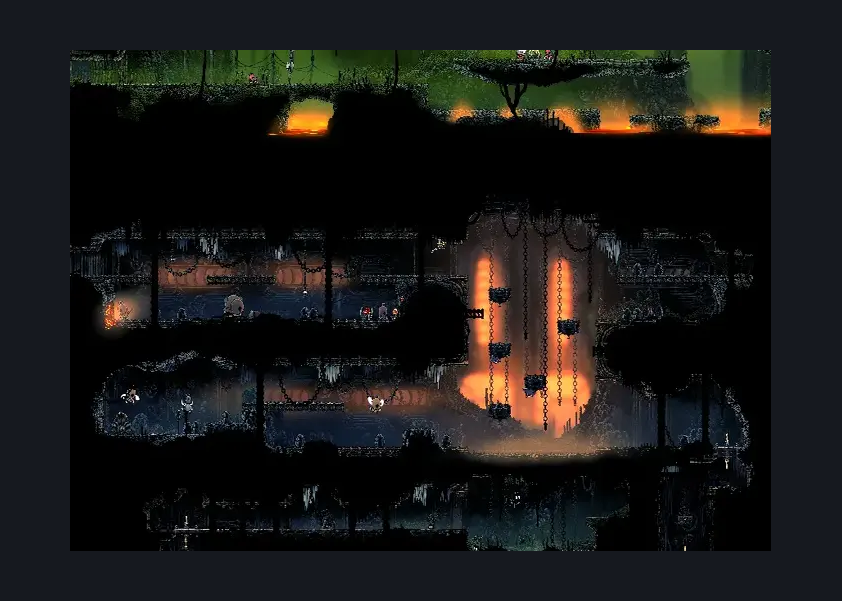
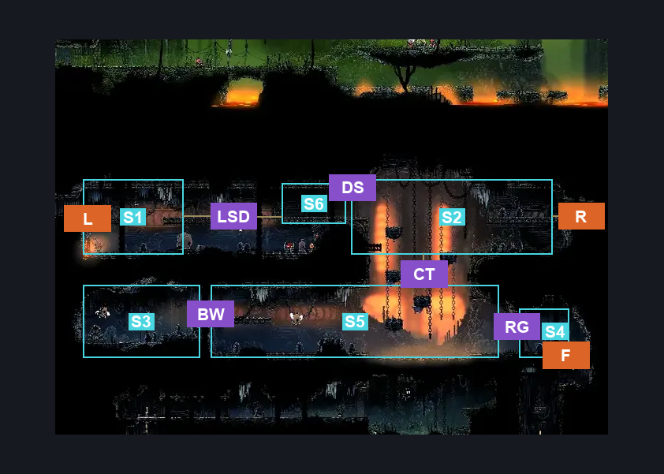
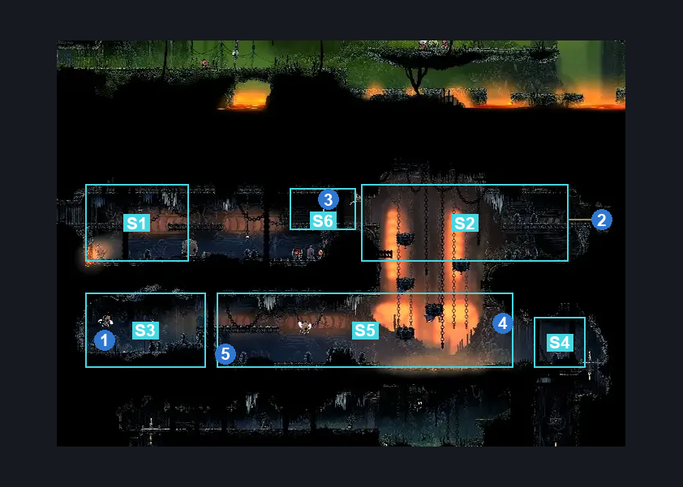

# Deep Docks Chains Upper East (Dock_03)

**Game ID:** Dock_03

**Contributors:** herounit and Rebel

## Subrooms

| No. | Subroom | Annotated |
| --- | --- | --- |
| S1 | upper left hallway | ✓ |
| S2 | chain platforms | ✓ |
| S3 | lower left chest room | ✓ |
| S4 | behind ring gate | ✓ |
| S5 | Lower Chain Platforms | ✓ |
| S6 | Door Switch | ✓ |

## Room Transitions

| Alias | Name | From subroom | Destination | Destination alias | Requirements | TODO | Verification | Annotated | Notes |
| --- | --- | --- | --- | --- | --- | --- | --- | --- | --- |
| L | left1 | upper left hallway | [Deep Docks Chains Center (Dock_02b)](deep-docks-chains-center.md) | UR | Ledge Grab OR Cling Grip OR Silk Soar OR Faydown Cloak OR Proficient Movement |  | Verified | ✓ |  |
| F | bot1 | behind ring gate | [Deep Docks Chains Lower East (Dock_03c)](deep-docks-chains-lower-east.md) | RC | Open Airlock Down |  | Verified | ✓ |  |
| R | right1 | chain platforms | [Far Fields Deep Docks Backdoor (Dock_03b)](../far-fields/far-fields-deep-docks-backdoor.md) | L | Activate Deep Docks Side Chain Room Door OR Activate Far Fields Side Chain Room Door IN Far Fields Deep Docks Backdoor |  | Verified | ✓ |  |

## Subroom Connections

| Alias | Name | Source | Destination | Requirements | TODO | Verification | Annotated | Notes |
| --- | --- | --- | --- | --- | --- | --- | --- | --- |
| DS | open door switch | Door Switch | chain platforms | Activate Left Side Door Switch |  | Verified | ✓ |  |
| DS | open door switch | chain platforms | Door Switch | Activate Left Side Door Switch |  | Verified | ✓ |  |
| BW | break wall | Lower Chain Platforms | lower left chest room | Activate Craftmetal Breakable Wall |  | Verified | ✓ |  |
| BW | break wall | lower left chest room | Lower Chain Platforms | Activate Craftmetal Breakable Wall |  | Verified | ✓ |  |
| RG | open ring gate | Lower Chain Platforms | behind ring gate | Activate Platforms Clawline Ring |  | Verified | ✓ |  |
| RG | open ring gate | behind ring gate | Lower Chain Platforms | Activate Platforms Clawline Ring |  | Verified | ✓ |  |
| LSD | Left Side <> Door | upper left hallway | Door Switch | Ledge Grab OR Cling Grip OR Scuttlebrace OR Silk Soar OR Faydown Cloak |  | Verified | ✓ |  |
| LSD | Left Side <> Door | Door Switch | upper left hallway | Ledge Grab OR Cling Grip OR Scuttlebrace OR Silk Soar OR Faydown Cloak |  | Verified | ✓ |  |
| CT | Chain Travel | Lower Chain Platforms | chain platforms | (Ledge Grab AND (Dash OR Clawline OR Sharpdart)) OR Cling Grip OR Scuttlebrace OR Silk Soar OR Faydown Cloak |  | Verified | ✓ |  |
| CT | Chain Travel | chain platforms | Lower Chain Platforms | Nothing. (Fall) |  | Verified | ✓ |  |

## Check Locations

| No. | Check | Subroom | Requirements | TODO | Verification | Location Type | Annotated | Notes |
| --- | --- | --- | --- | --- | --- | --- | --- | --- |
| 1 | craftmetal deep docks | lower left chest room | Activate Craftmetal Breakable Wall |  | Verified | collectible | ✓ | its freeeeee, right? :) |
| 2 | Deep Docks Side Chain Room Door | chain platforms | Break Wall Right |  | Verified | blockade | ✓ | wall can be opened from both sides |
| 3 | Left Side Door Switch | Door Switch | Flip Switch Right |  | Verified | switch | ✓ |  |
| 4 | Platforms Clawline Ring | Lower Chain Platforms | Clawline |  | Verified | switch | ✓ |  |
| 5 | Craftmetal Breakable Wall | Lower Chain Platforms | Break Wall Left |  | Verified | collectible | ✓ |  |

## Notes

the floor/lower half of this area is closed off initially

## Room Images

### Scene

### Connections

### Checks

