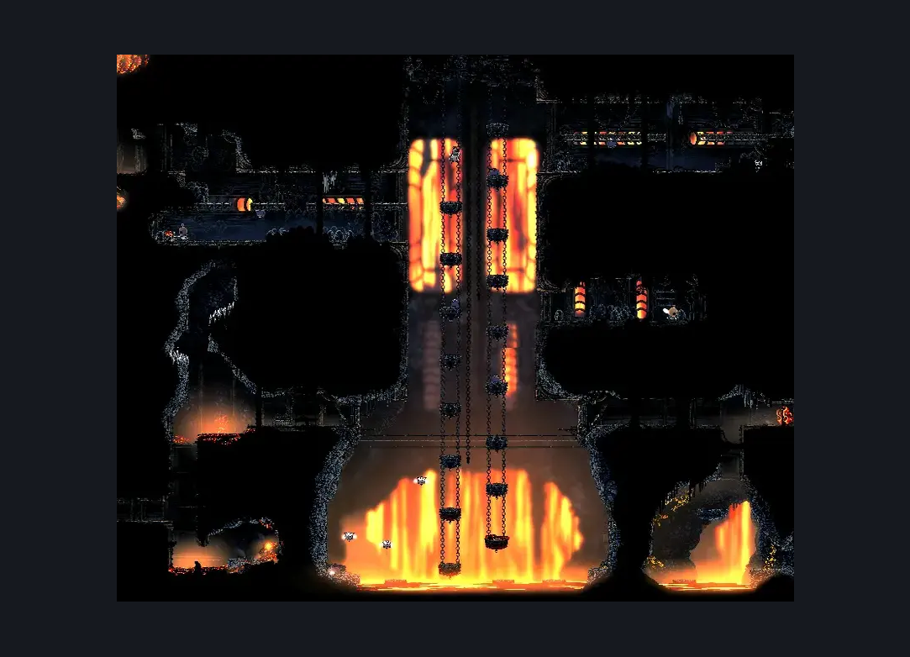
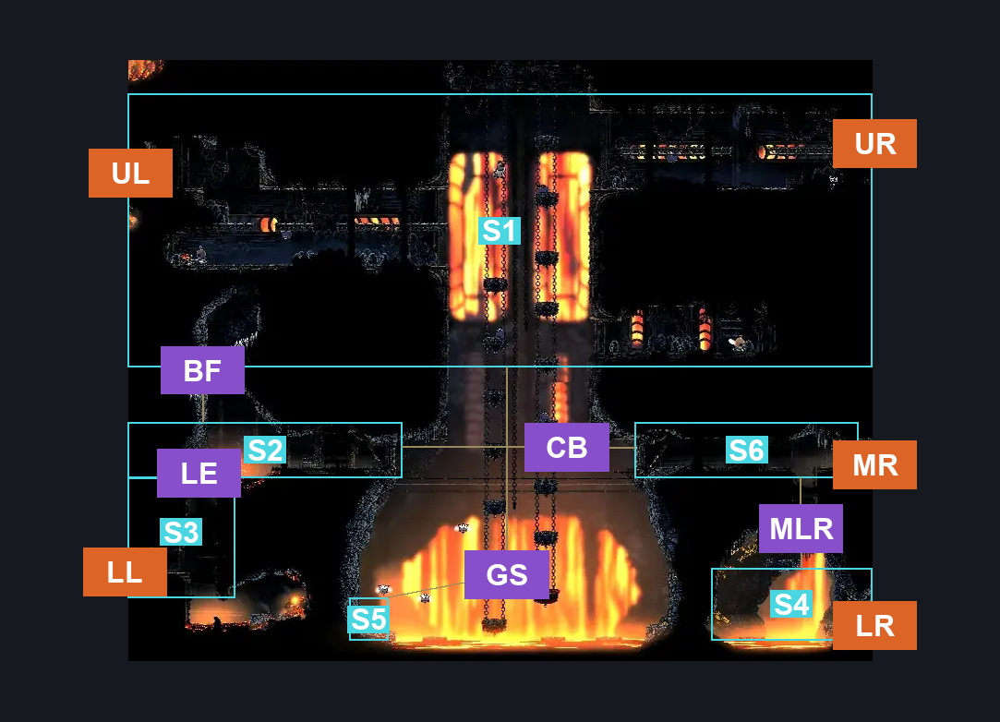
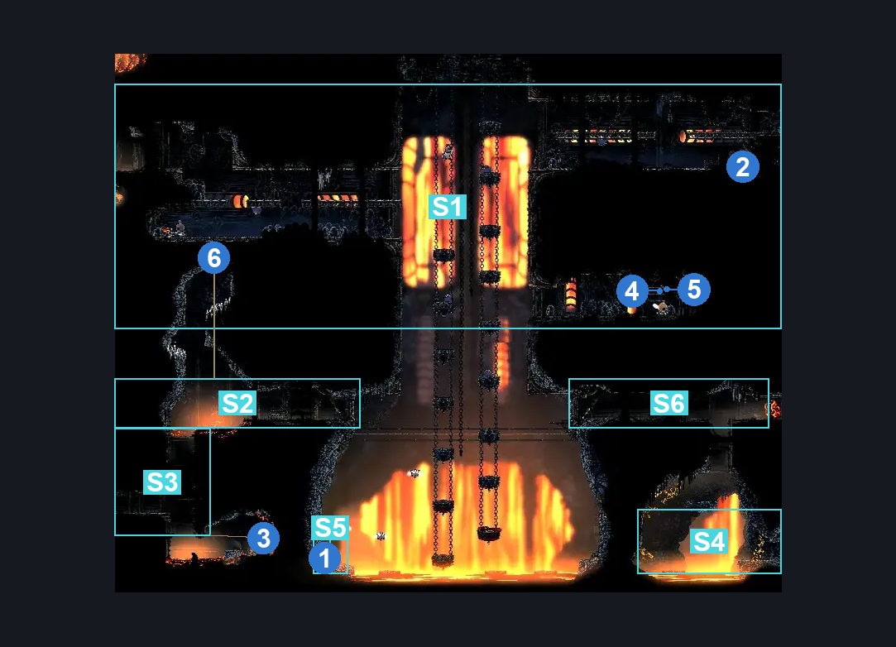

# Deep Docks Chains West (Dock_02)

**Game ID:** Dock_02

**Contributors:** herounit and Rebel

## Subrooms

| No. | Subroom | Annotated |
| --- | --- | --- |
| S1 | main area | ✓ |
| S2 | middle crossing Left | ✓ |
| S3 | lower left exit | ✓ |
| S4 | lower right exit | ✓ |
| S5 | Shard Bundle | ✓ |
| S6 | Middle Crossing Right | ✓ |

## Room Transitions

| Alias | Name | From subroom | Destination | Destination alias | Requirements | TODO | Verification | Annotated | Notes |
| --- | --- | --- | --- | --- | --- | --- | --- | --- | --- |
| UL | left1 | main area | [Deep Docks Forge (Room_Forge)](deep-docks-forge.md) | R | none |  | Verified | ✓ |  |
| LL | left2 | lower left exit | [Deep Docks Forebrothers (Dock_09)](deep-docks-forebrothers.md) | R | none |  | Verified | ✓ |  |
| UR | right1 | main area | [Deep Docks Chains Center (Dock_02b)](deep-docks-chains-center.md) | UL | Easy Enemy Pogo OR Ledge Grab OR Cling Grip OR Faydown Cloak OR Silk Soar |  | Verified | ✓ |  |
| MR | right2 | Middle Crossing Right | [Deep Docks Chains Center (Dock_02b)](deep-docks-chains-center.md) | ML | none |  | Verified | ✓ |  |
| LR | right3 | lower right exit | [Deep Docks Chains Center (Dock_02b)](deep-docks-chains-center.md) | LL | none |  | Verified | ✓ |  |

## Subroom Connections

| Alias | Name | Source | Destination | Requirements | TODO | Verification | Annotated | Notes |
| --- | --- | --- | --- | --- | --- | --- | --- | --- |
| BF | break floor | middle crossing Left | main area | ((( silk soar AND magma bell AND Drifter's Cloak ) OR ( Silk Soar AND Magma Bell AND Proficient Movement)) AND Activate spike hall breakable floor) |  | Verified | ✓ |  |
| BF | break floor | main area | middle crossing Left | Activate spike hall breakable floor |  | Verified | ✓ |  |
| LE | lower left exit | lower left exit | middle crossing Left | cling grip OR Scuttlebrace OR (Silk Soar AND Magma Bell) |  | Verified | ✓ |  |
| LE | lower left exit | middle crossing Left | lower left exit | Nothing. (Fall) |  | Verified | ✓ | you can miss the fall and trap yourself itemless lmao |
| GS | Get Shards | main area | Shard Bundle | Nothing. (Fall) |  | Verified | ✓ |  |
| GS | Get Shards | Shard Bundle | main area | Ledge Grab OR Cling Grip OR Faydown Cloak OR Silk Soar |  | Verified | ✓ |  |
| CB | Cross Bridge | middle crossing Left | Middle Crossing Right | Open Airlock Right |  | Verified | ✓ |  |
| CB | Cross Bridge | Middle Crossing Right | middle crossing Left | Open Airlock Left |  | Verified | ✓ |  |
| MLR | Middle Right <> Lower Right | Middle Crossing Right | lower right exit | Nothing. (Fall) |  | Verified | ✓ |  |
| MLR | Middle Right <> Lower Right | lower right exit | Middle Crossing Right | ((Dash OR Clawline OR Sharpdart OR Easy Architect Charge OR Easy Beast Charge OR Easy Architect Pogo OR Easy Hunter Pogo OR Easy Beast Pogo OR Easy Wanderer Charge OR Medium Shaman Pogo OR Easy Voltvessels Stall OR Easy Flintslate Stall OR Easy Flea Brew Stall OR Flea Brew) AND Cling Grip) OR (Faydown Cloak AND Medium Scuttlebrace) OR (Proficient Movement AND Silk Soar) |  | Verified | ✓ |  |

## Check Locations

| No. | Check | Subroom | Requirements | TODO | Verification | Location Type | Annotated | Notes |
| --- | --- | --- | --- | --- | --- | --- | --- | --- |
| 1 | shard bundle deep docks 1 | Shard Bundle | none |  | Verified | collectible | ✓ |  |
| 2 | shell shard cache deep docks 5 | main area | none |  | Verified | resource | ✓ |  |
| 3 | flintstone journal collection point | lower left exit | none |  | Verified | lore | ✓ |  |
| 4 | rosary cache deep docks 1 | main area | none |  | Verified | resource | ✓ |  |
| 5 | rosary cache deep docks 2 | main area | none |  | Verified | resource | ✓ |  |
| 6 | spike hall breakable floor | middle crossing Left | Break Wall Up |  | Verified | blockade | ✓ |  |

## Notes

need to verify how this room works - thought it had some of the platforms go away, but not sure if that was in act 3

## Room Images

### Scene

### Connections

### Checks

