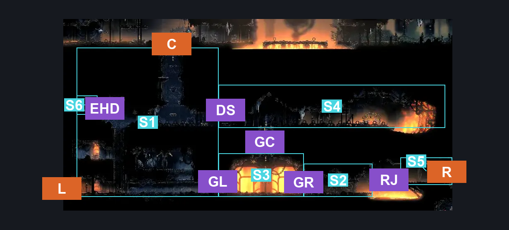
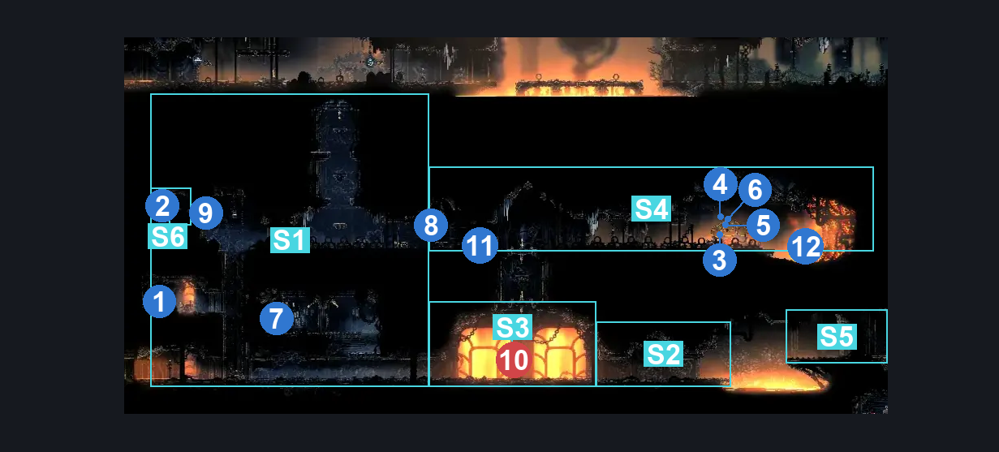
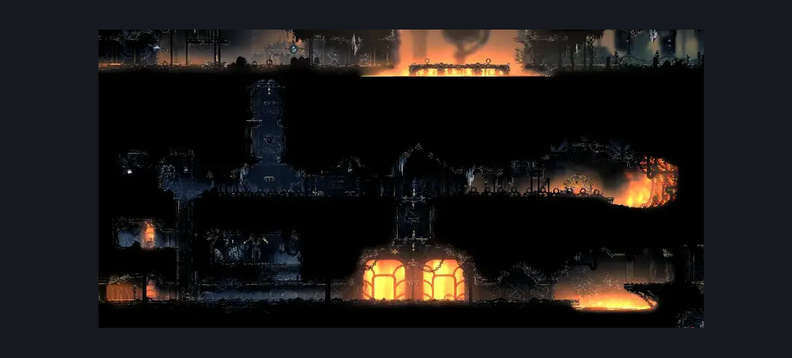

# Deep Docks Forge (Room_Forge)

**Game ID:** Room_Forge

**Contributors:** herounit and Rebel

## Subrooms

| No. | Subroom | Annotated |
| --- | --- | --- |
| S1 | left entrance | ✓ |
| S2 | right area | ✓ |
| S3 | gauntlet | ✓ |
| S4 | forge daughter | ✓ |
| S5 | right exit platform | ✓ |
| S6 | hidden left room | ✓ |

## Room Transitions

| Alias | Name | From subroom | Destination | Destination alias | Requirements | TODO | Verification | Annotated | Notes |
| --- | --- | --- | --- | --- | --- | --- | --- | --- | --- |
| C | top1 | left entrance | [Deep Docks Lace Intro (Bone_East_12)](deep-docks-lace-intro.md) | F | Open Airlock Up |  | Verified | ✓ |  |
| L | left1 | left entrance | [Deep Docks Lower West Shaft (Dock_04)](deep-docks-lower-west-shaft.md) | UR | none |  | Verified | ✓ |  |
| R | right1 | right exit platform | [Deep Docks Chains West (Dock_02)](deep-docks-chains-west.md) | UL | Own Simple Key Deep Docks |  | Verified | ✓ |  |

## Subroom Connections

| Alias | Name | Source | Destination | Requirements | TODO | Verification | Annotated | Notes |
| --- | --- | --- | --- | --- | --- | --- | --- | --- |
| DS | door switch | left entrance | forge daughter | activate gate switch forge |  | Verified | ✓ |  |
| DS | door switch | forge daughter | left entrance | activate gate switch forge |  | Verified | ✓ |  |
| GL | gauntlet left | left entrance | gauntlet | none |  | Verified | ✓ |  |
| GL | gauntlet left | gauntlet | left entrance | clear Forge Battle |  | Verified | ✓ |  |
| GR | gauntlet right | right area | gauntlet | none |  | Verified | ✓ |  |
| GR | gauntlet right | gauntlet | right area | clear Forge Battle |  | Verified | ✓ |  |
| GC | gauntlet upper | forge daughter | gauntlet | open airlock down |  | Verified | ✓ |  |
| GC | gauntlet upper | gauntlet | forge daughter | Clear Forge Battle AND ( open airlock up AND ( ledge grab OR faydown cloak OR scuttlebrace OR Silk Soar OR easy shaman crest pogo ) ) |  | Verified | ✓ |  |
| RJ | running jump | right area | right exit platform | Sprint OR Faydown Cloak OR Clawline OR Sharpdart OR Scuttlebrace OR Drifter's Cloak OR Easy Beast Charge OR Easy Beast Pogo OR (((Dash OR Medium Voltvessels Stall OR Easy Architect Charge OR (Flea Brew AND Easy Flea Brew Stall)) AND (Ledge Grab OR Cling Grip))) OR (Flea Brew AND Medium Flea Brew Stall AND Medium Heal Stall) OR (Easy Architect Pogo AND Cling Grip) OR (Medium Hunter Pogo AND Cling Grip) |  | Verified | ✓ |  |
| RJ | running jump | right exit platform | right area | Sprint OR Dash OR Faydown Cloak OR Drifter's Cloak OR Clawline OR Sharpdart OR Easy Beast Pogo OR Easy Hunter Pogo OR Easy Architect Pogo OR Easy Beast Charge OR Easy Architect Charge OR Easy Voltvessels Stall OR Easy Flintslate Stall OR Easy Flea Brew Stall OR Flea Brew OR Medium Heal Stall |  | Verified | ✓ |  |
| EHD | Hidden Room | left entrance | hidden left room | Ledge Grab OR Cling Grip OR Scuttlebrace OR Faydown Cloak OR Silk Soar OR Easy Beast Charge  OR Proficient Movement (Pogo the crate on the paltform) |  | Verified | ✓ |  |
| EHD | Hidden Room | hidden left room | left entrance | Nothing. (Fall) |  | Verified | ✓ |  |

## Check Locations

| No. | Check | Subroom | Requirements | TODO | Verification | Location Type | Annotated | Notes |
| --- | --- | --- | --- | --- | --- | --- | --- | --- |
| 1 | shell shard cache deep docks 10 | left entrance | Activate Shard Bundle Wall |  | Verified | resource | ✓ |  |
| 2 | shard bundle deep docks 2 | hidden left room | none |  | Verified | collectible | ✓ |  |
| 3 | silkshot (forge daughter) | forge daughter | own Ruined Tool AND Craftmetals 1 |  | Verified | collectible | ✓ | forge daughter shop |
| 4 | sting shard | forge daughter | Craftmetals 1 |  | Verified | collectible | ✓ | forge daughter shop |
| 5 | magma bell | forge daughter | Craftmetals 1 |  | Verified | collectible | ✓ | forge daughter shop |
| 6 | crafting kit forge daughter | forge daughter | none |  | Verified | collectible | ✓ | forge daughter shop |
| 7 | readable lore tablet forge | left entrance | open airlock left |  | Verified | lore | ✓ |  |
| 8 | gate switch forge | forge daughter | none |  | Verified | switch | ✓ |  |
| 9 | Shard Bundle Wall | left entrance | Break Wall Left |  | Verified | blockade | ✓ |  |
| 10 | Forge Battle | gauntlet | Nothing. |  | Verified | gauntlet | ✓ |  |
| 11 | Forge bench | forge daughter | Nothing. |  | Verified | bench | ✓ |  |
| 12 | Ballow Move to Control Room | forge daughter | Act 3 |  | Verified | event | ✓ |  |

## Room Images

### Connections

### Checks

### Scene

