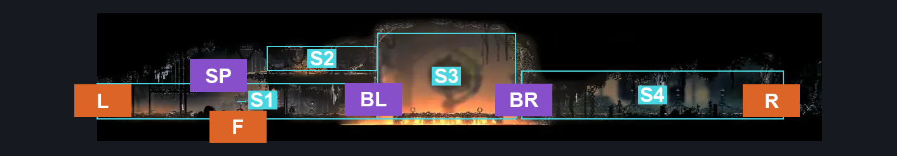
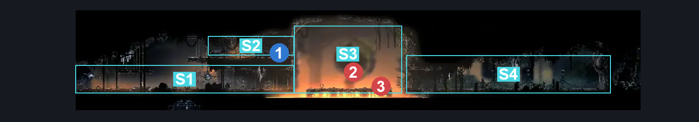
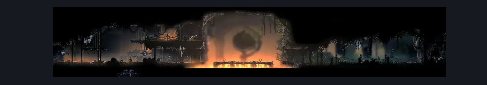

# Deep Docks Lace Intro (Bone_East_12)

**Game ID:** Bone_East_12

**Contributors:** herounit and Rebel

## Subrooms

| No. | Subroom | Annotated |
| --- | --- | --- |
| S1 | left area | ✓ |
| S2 | switch platform | ✓ |
| S3 | boss arena | ✓ |
| S4 | right area | ✓ |

## Room Transitions

| Alias | Name | From subroom | Destination | Destination alias | Requirements | TODO | Verification | Annotated | Notes |
| --- | --- | --- | --- | --- | --- | --- | --- | --- | --- |
| L | left1 | left area | [Deep Docks Map Shop (Bone_East_01)](deep-docks-map-shop.md) | LR | none |  | Verified | ✓ |  |
| R | right1 | right area | [Deep Docks Bellshrine (Bellshrine_05)](deep-docks-bellshrine.md) | L | none |  | Verified | ✓ |  |
| F | bot1 | left area | [Deep Docks Forge (Room_Forge)](deep-docks-forge.md) | C | Open Airlock Down |  | Verified | ✓ |  |

## Subroom Connections

| Alias | Name | Source | Destination | Requirements | TODO | Verification | Annotated | Notes |
| --- | --- | --- | --- | --- | --- | --- | --- | --- |
| SP | lever platform jump | left area | switch platform | Scuttlebrace OR Faydown Cloak OR Silk Soar OR Sprint OR Easy Beast Charge OR ((Ledge Grab OR Cling Grip) AND (Drifter's Cloak OR Dash OR Clawline OR Sharpdart OR Medium Voltvessels Stall OR Easy Architect Charge)) OR (Flea Brew AND Easy Flea Brew Stall) |  | Verified | ✓ |  |
| SP | lever platform jump | switch platform | left area | none (falling) |  | Verified | ✓ |  |
| BL | boss arena left | left area | boss arena | activate gate switch lace |  | Verified | ✓ |  |
| BL | boss arena left | boss arena | left area | activate gate switch lace AND defeat lace 1 boss fight |  | Verified | ✓ |  |
| BR | boss arena right | boss arena | right area | defeat lace 1 boss fight |  | Verified | ✓ |  |
| BR | boss arena right | right area | boss arena | defeat lace 1 boss fight |  | Verified | ✓ |  |

## Check Locations

| No. | Check | Subroom | Requirements | TODO | Verification | Location Type | Annotated | Notes |
| --- | --- | --- | --- | --- | --- | --- | --- | --- |
| 1 | gate switch lace | switch platform | none |  | Verified | switch | ✓ |  |
| 2 | lace 1 boss fight | boss arena | none |  | Verified | boss | ✓ |  |
| 3 | Lace 1 |  |  |  |  | enemy | ✓ |  |

## Room Images

### Connections

### Checks

### Scene

