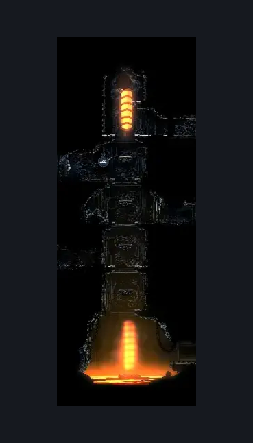
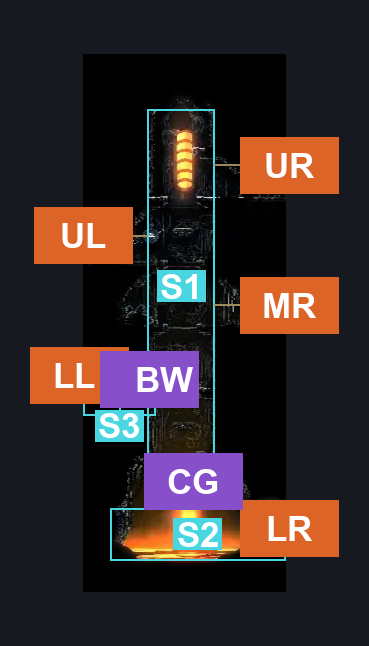
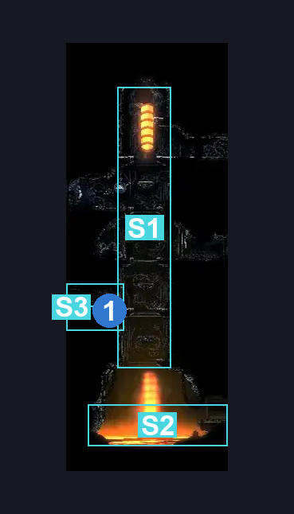

# Deep Docks Lower East Shaft (Dock_15)

**Game ID:** Dock_15

**Contributors:** herounit and Rebel

## Subrooms

| No. | Subroom | Annotated |
| --- | --- | --- |
| S1 | upper area | ✓ |
| S2 | the floor is lava | ✓ |
| S3 | lower left exit area | ✓ |

## Room Transitions

| Alias | Name | From subroom | Destination | Destination alias | Requirements | TODO | Verification | Annotated | Notes |
| --- | --- | --- | --- | --- | --- | --- | --- | --- | --- |
| UL | left1 | upper area | [Deep Docks Sauna (Dock_10)](deep-docks-sauna.md) | R | none |  | Verified | ✓ |  |
| LL | left2 | lower left exit area | [Deep Docks Memory Hole (Dock_13)](deep-docks-memory-hole.md) | R | none |  | Verified | ✓ |  |
| UR | right1 | upper area | [Deep Docks Forebrothers (Dock_09)](deep-docks-forebrothers.md) | L | none |  | Verified | ✓ |  |
| MR | right2 | upper area | [Deep Docks Silkeater Room (Dock_14)](deep-docks-silkeater-room.md) | L | none |  | Verified | ✓ |  |
| LR | right3 | the floor is lava | [Deep Docks Magma Slug Tunnels (Dock_11)](deep-docks-magma-slug-tunnels.md) | L | none |  | Verified | ✓ |  |

## Subroom Connections

| Alias | Name | Source | Destination | Requirements | TODO | Verification | Annotated | Notes |
| --- | --- | --- | --- | --- | --- | --- | --- | --- |
| CG | cling grip | upper area | the floor is lava | cling grip OR (Hard Scuttlebrace AND Faydown Cloak AND Clawline AND ((Proficient Movement OR (Ledge Grab OR Dash OR Drifter's Cloak)))) |  | Verified | ✓ |  |
| CG | cling grip | the floor is lava | upper area | none (falling) |  | Verified | ✓ |  |
| BW | breakable wall | upper area | lower left exit area | Activate Lower Left Entry Wall |  | Verified | ✓ |  |
| BW | breakable wall | lower left exit area | upper area | Activate Lower Left Entry Wall |  | Verified | ✓ |  |

## Check Locations

| No. | Check | Subroom | Requirements | TODO | Verification | Location Type | Annotated | Notes |
| --- | --- | --- | --- | --- | --- | --- | --- | --- |
| 1 | Lower Left Entry Wall | upper area | Break Wall Left |  | Verified | blockade | ✓ |  |

## Room Images

### Scene

### Connections

### Checks

