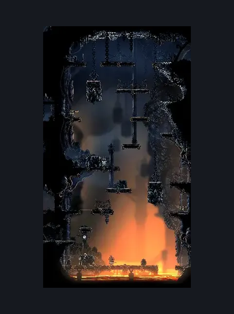
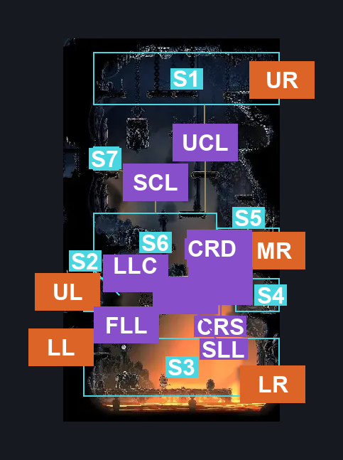
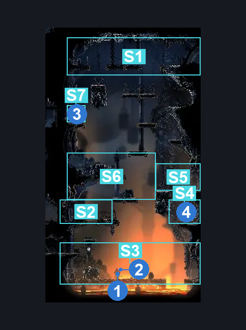

# Deep Docks Map Shop (Bone_East_01)

**Game ID:** Bone_East_01

**Contributors:** herounit and Rebel

## Subrooms

| No. | Subroom | Annotated |
| --- | --- | --- |
| S1 | upper area | ✓ |
| S2 | lower left door | ✓ |
| S3 | Floor | ✓ |
| S4 | Lower Right Switch | ✓ |
| S5 | Lower Right Door | ✓ |
| S6 | Center Left | ✓ |
| S7 | Upper Switch | ✓ |

## Room Transitions

| Alias | Name | From subroom | Destination | Destination alias | Requirements | TODO | Verification | Annotated | Notes |
| --- | --- | --- | --- | --- | --- | --- | --- | --- | --- |
| UL | left1 | lower left door | [Deep Docks Bench Shaft (Dock_01)](deep-docks-bench-shaft.md) | LR | none |  | Verified | ✓ |  |
| LL | left2 | Floor | [Deep Docks Bellway (Bellway_02)](deep-docks-bellway.md) | R | none |  | Verified | ✓ |  |
| UR | right1 | upper area | [Deep Docks Spire Lower (Bone_East_03)](deep-docks-spire-lower.md) | L | none |  | Verified | ✓ |  |
| MR | right2 | Lower Right Door | [Deep Docks Map Shop Side Room (Dock_05)](deep-docks-map-shop-side-room.md) | L | none |  | Verified | ✓ |  |
| LR | right3 | Floor | [Deep Docks Lace Intro (Bone_East_12)](deep-docks-lace-intro.md) | L | none |  | Verified | ✓ |  |

## Subroom Connections

| Alias | Name | Source | Destination | Requirements | TODO | Verification | Annotated | Notes |
| --- | --- | --- | --- | --- | --- | --- | --- | --- |
| FLL | Floor <> Lower Left | Floor | lower left door | Ledge Grab OR Cling Grip OR Scuttlebrace OR Faydown Cloak OR Silk Soar |  | Verified | ✓ |  |
| FLL | Floor <> Lower Left | lower left door | Floor | Nothing. (Fall) |  | Verified | ✓ |  |
| LLC | Lower Left <> Center | lower left door | Center Left | Ledge Grab OR Cling Grip OR Scuttlebrace OR Faydown Cloak OR Silk Soar |  | Verified | ✓ |  |
| LLC | Lower Left <> Center | Center Left | lower left door | Nothing. (Fall) |  | Verified | ✓ |  |
| CRD | Center <> Lower Right Door | Center Left | Lower Right Door | Sprint OR Dash OR Clawline OR Sharpdart OR Faydown Cloak OR Drifter's Cloak OR Silk Soar OR ((Medium Voltvessels Stall OR Easy Architect Charge OR (Flea Brew AND Easy Flea Brew Stall)) AND (Ledge Grab OR Cling Grip)) OR Easy Beast Charge OR Easy Beast Pogo OR Activate switch to lower lower platform |  | Verified | ✓ |  |
| CRD | Center <> Lower Right Door | Lower Right Door | Center Left | Activate switch to lower lower platform OR Sprint OR Dash OR Clawline OR Sharpdart OR Faydown Cloak OR Drifter's Cloak OR Silk Soar OR Easy Voltvessels Stall OR (Easy Flea Brew Stall AND Flea Brew) OR ((Hard Flintslate Stall OR Easy Hunter Pogo) AND (Ledge Grab OR Cling Grip)) OR Easy Architect Charge OR Easy Beast Charge OR Easy Beast Pogo OR Easy Architect Pogo |  | Verified | ✓ |  |
| CRS | Center <> Lower Right Switch | Center Left | Lower Right Switch | Nothing. (Fall) |  | Verified | ✓ |  |
| CRS | Center <> Lower Right Switch | Lower Right Switch | Center Left | Invalid |  | Verified | ✓ |  |
| SLL | Switch <> Lower Left | Lower Right Switch | lower left door | Silk Soar OR (Activate switch to lower lower platform AND (Cling Grip OR Ledge Grab OR Scuttlebrace OR Faydown Cloak)) OR ((Clawline OR Dash OR Sharpdart) AND (Ledge Grab OR Cling Grip OR Faydown Cloak)) OR Drifter's Cloak OR Sprint OR Easy Beast Crest Pogo OR Easy Beast Charge OR ((Easy Architect Charge OR Easy Voltvessels Stall) AND (Ledge Grab OR Cling Grip)) |  | Verified | ✓ |  |
| SLL | Switch <> Lower Left | lower left door | Lower Right Switch | Dash OR Sprint OR Sharpdart OR Clawline OR Faydown Cloak OR Drifter's Cloak OR Scuttlebrace |  | Verified | ✓ |  |
| SCL | Upper Switch <> Center Left | Center Left | Upper Switch | Ledge Grab OR Cling Grip OR Faydown Cloak OR Silk Soar |  | Verified | ✓ |  |
| SCL | Upper Switch <> Center Left | Upper Switch | Center Left | Nothing. (Fall) |  | Verified | ✓ |  |
| UCL | Upper <> Center Left | Center Left | upper area | Faydown Cloak OR Silk Soar OR (Activate switch to upper lower platform  AND (Ledge Grab OR Cling Grip OR Easy Beast Charge OR Easy Shaman Pogo)) |  | Verified | ✓ |  |
| UCL | Upper <> Center Left | upper area | Center Left | Nothing. (Fall) |  | Verified | ✓ |  |

## Check Locations

| No. | Check | Subroom | Requirements | TODO | Verification | Location Type | Annotated | Notes |
| --- | --- | --- | --- | --- | --- | --- | --- | --- |
| 1 | map purchase deep docks | Floor | none |  | Verified | collectible | ✓ | shakra shop |
| 2 | pin purchase vendor pins | Floor | none |  | Verified | collectible | ✓ | shakra shop |
| 3 | switch to upper lower platform | Upper Switch | Flip Switch Left |  | Verified | switch | ✓ | NOT CURRENTLY RANDOMIZED |
| 4 | switch to lower lower platform | Lower Right Switch | Flip Switch Right |  | Verified | switch | ✓ | NOT CURRENTLY RANDOMIZED (doesn't currently really block anything since you can just jump above and fall down) |

## Room Images

### Scene

### Connections

### Checks

