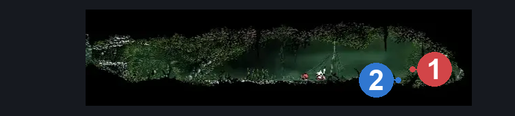
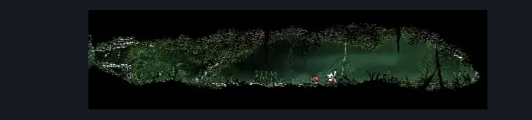

# "Deep Docks" March Side Room (Bone_East_04c)

**Game ID:** Bone_East_04c

**Contributors:** herounit and Rebel

## Subrooms

No subrooms defined.

## Room Transitions

| Alias | Name | From subroom | Destination | Destination alias | Requirements | TODO | Verification | Annotated | Notes |
| --- | --- | --- | --- | --- | --- | --- | --- | --- | --- |
| L | left1 |  | [Is this still Deep Docks? East (Bone_East_04)](is-this-still-deep-docks-east.md) | UR | Nothing. |  | Verified | ✓ |  |
| SC | slab capture |  | [Slab Capture](../fast-travel/slab-capture.md) | DD | after get kidnapped |  | Verified | ✓ |  |

## Subroom Connections

No subroom connections defined.

## Check Locations

| No. | Check | Subroom | Requirements | TODO | Verification | Location Type | Annotated | Notes |
| --- | --- | --- | --- | --- | --- | --- | --- | --- |
| 1 | wardenfly |  | ( act 1 OR act 2 ) AND defeat THE bell beast boss fight |  | Verified | enemy | ✓ | per the wiki |
| 2 | get kidnapped |  | after wardenfly |  | Verified | logic-point | ✓ |  |

## Notes

just a camp? no enemies? did we find bush girl here at some point?
and a wardenfly!

## Room Images

### Connections

### Checks

### Scene

