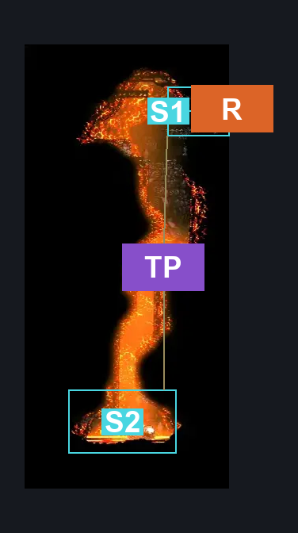
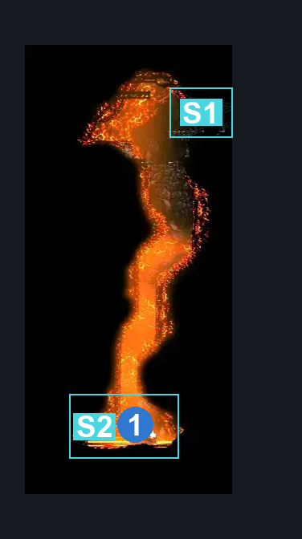
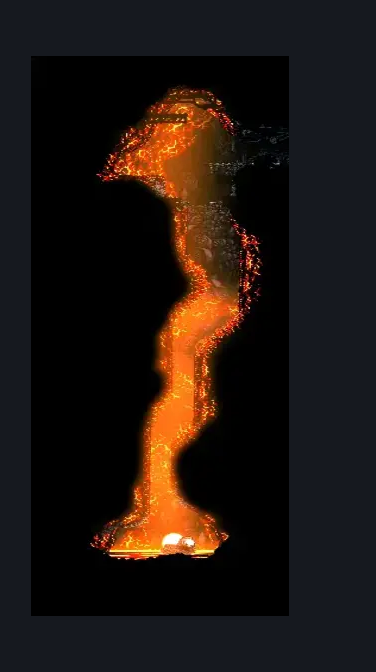

# Deep Docks Memory Hole (Dock_13)

**Game ID:** Dock_13

**Contributors:** herounit and Rebel

## Subrooms

| No. | Subroom | Annotated |
| --- | --- | --- |
| S1 | entrance | ✓ |
| S2 | pit of despair | ✓ |

## Room Transitions

| Alias | Name | From subroom | Destination | Destination alias | Requirements | TODO | Verification | Annotated | Notes |
| --- | --- | --- | --- | --- | --- | --- | --- | --- | --- |
| R | right1 | entrance | [Deep Docks Lower East Shaft (Dock_15)](deep-docks-lower-east-shaft.md) | LL | nada |  | Verified | ✓ |  |

## Subroom Connections

| Alias | Name | Source | Destination | Requirements | TODO | Verification | Annotated | Notes |
| --- | --- | --- | --- | --- | --- | --- | --- | --- |
| TP | the pit | entrance | pit of despair | Proficient Movement (git gud lmao) OR Drifter's Cloak OR Spike Pogo OR Cling Grip |  | Verified | ✓ | this is possible but a massive pain, also a one-way softlock potential |
| TP | the pit | pit of despair | entrance | (cling grip AND Proficient Movement) OR (Cling Grip AND (Faydown Cloak OR Clawline OR Spike Pogo)) |  | Verified | ✓ |  |

## Check Locations

| No. | Check | Subroom | Requirements | TODO | Verification | Location Type | Annotated | Notes |
| --- | --- | --- | --- | --- | --- | --- | --- | --- |
| 1 | memory locket deep docks | pit of despair | none |  | Verified | collectible | ✓ |  |
| 2 | import enemies |  |  | TODO | Needs verification |  |  |  |

## Room Images

### Connections

### Checks

### Scene

