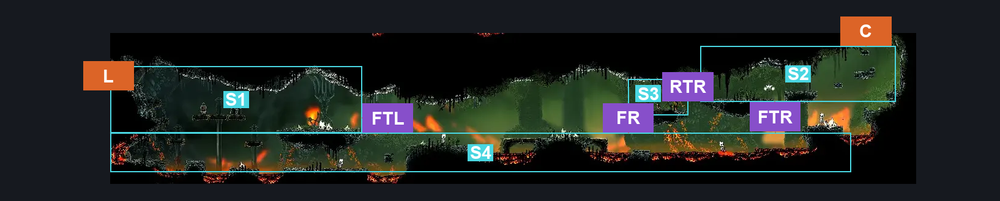
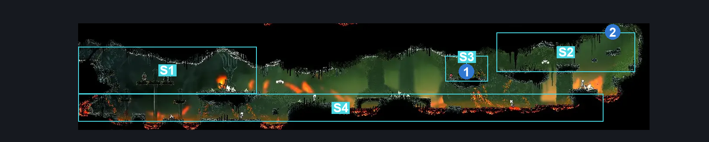
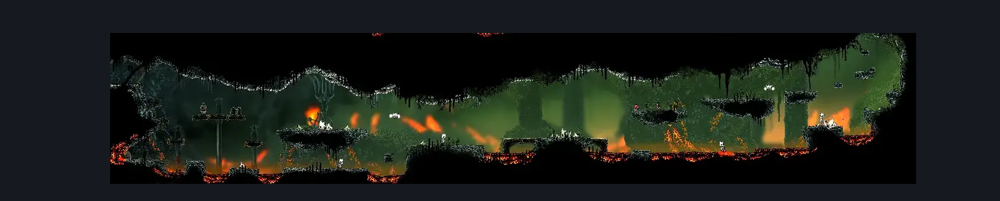

# Deep Docks Spire Lower (Bone_East_03)

**Game ID:** Bone_East_03

**Contributors:** herounit and Rebel

## Subrooms

| No. | Subroom | Annotated |
| --- | --- | --- |
| S1 | Top Left Entrance Path | ✓ |
| S2 | Top Right Entrance Path | ✓ |
| S3 | Rosary | ✓ |
| S4 | Floor | ✓ |

## Room Transitions

| Alias | Name | From subroom | Destination | Destination alias | Requirements | TODO | Verification | Annotated | Notes |
| --- | --- | --- | --- | --- | --- | --- | --- | --- | --- |
| C | top1 | Top Right Entrance Path | [Is this still Deep Docks? East (Bone_East_04)](is-this-still-deep-docks-east.md) | F | Activate Deep Docks Lower Spire Blast Rock |  | Verified | ✓ |  |
| L | left1 | Top Left Entrance Path | [Deep Docks Map Shop (Bone_East_01)](deep-docks-map-shop.md) | UR | none |  | Verified | ✓ |  |

## Subroom Connections

| Alias | Name | Source | Destination | Requirements | TODO | Verification | Annotated | Notes |
| --- | --- | --- | --- | --- | --- | --- | --- | --- |
| FTL | Floor <> Top Left | Floor | Top Left Entrance Path | Clawline x 2 OR Sharpdart x 2 OR Ledge Grab OR Cling Grip OR Scuttlebrace OR Faydown Cloak OR Drifter's Cloak OR Dash OR Sprint OR Silk Soar |  | Verified | ✓ |  |
| FTL | Floor <> Top Left | Top Left Entrance Path | Floor | Nothing. (Fall) |  | Verified | ✓ |  |
| FTR | Floor <> Top Right | Floor | Top Right Entrance Path | Ledge Grab  OR Cling Grip  OR Scuttlebrace  OR Faydown Cloak  OR (Silk Soar AND Magma Bell)  OR Easy Shaman Pogo OR Easy Enemy Pogo OR Easy Drill Crystal Pogo |  | Verified | ✓ |  |
| FTR | Floor <> Top Right | Top Right Entrance Path | Floor | Nothing. (Fall) |  | Verified | ✓ |  |
| FR | Floor <> Rosary | Floor | Rosary | ((Sprint OR Dash OR Clawline OR Sharpdart OR Easy Architect Charge OR Flea Brew OR Easy Flea Brew Stall) AND (Ledge Grab OR Cling Grip))  OR (((Proficient Movement AND Architect Attack Right) OR (Easy Heal Stall AND Easy Voltvessels Stall)) AND Cling Grip)  OR (Silk Soar AND Magma Bell) |  | Verified | ✓ |  |
| FR | Floor <> Rosary | Rosary | Floor | Nothing. (Fall) |  | Verified | ✓ |  |
| RTR | Rosary <> Top Right | Rosary | Top Right Entrance Path | Nothing. |  | Verified | ✓ |  |
| RTR | Rosary <> Top Right | Top Right Entrance Path | Rosary | Nothing. |  | Verified | ✓ |  |

## Check Locations

| No. | Check | Subroom | Requirements | TODO | Verification | Location Type | Annotated | Notes |
| --- | --- | --- | --- | --- | --- | --- | --- | --- |
| 1 | Deep Docks Lower Spire Rosary Cache | Rosary | Nothing. |  | Verified | resource | ✓ |  |
| 2 | Deep Docks Lower Spire Blast Rock | Top Right Entrance Path | Break Blast Rock Up |  | Verified | blockade | ✓ |  |
| 3 | import enemies |  |  | TODO | Needs verification |  |  |  |

## Room Images

### Connections

### Checks

### Scene

