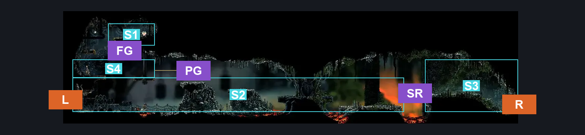
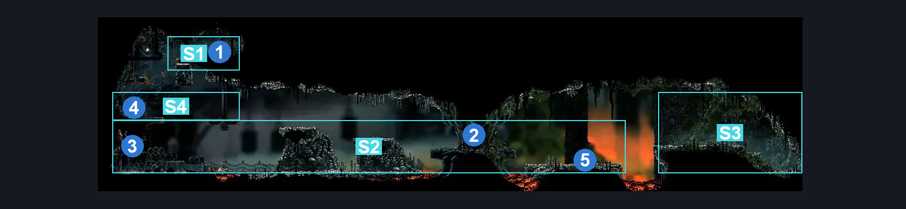
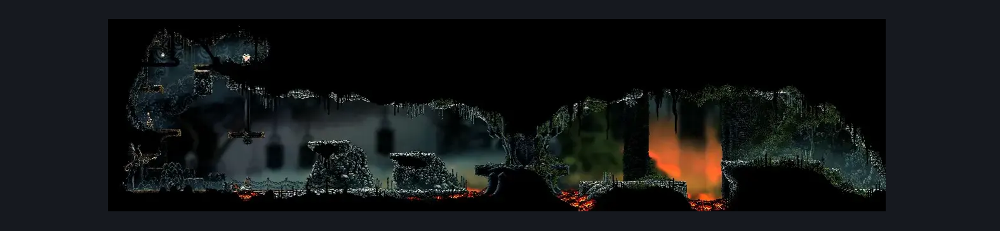

# Deep Docks Upper Spire (Bone_East_05)

**Game ID:** Bone_East_05

**Contributors:** herounit and Rebel

## Subrooms

| No. | Subroom | Annotated |
| --- | --- | --- |
| S1 | left flea platform | ✓ |
| S2 | spire | ✓ |
| S3 | right exit platform | ✓ |
| S4 | Flea Access Lever | ✓ |

## Room Transitions

| Alias | Name | From subroom | Destination | Destination alias | Requirements | TODO | Verification | Annotated | Notes |
| --- | --- | --- | --- | --- | --- | --- | --- | --- | --- |
| L | left1 | spire | [Deep Docks Bench Shaft (Dock_01)](deep-docks-bench-shaft.md) | UR | Activate Deep Docks Upper Spire Gate Lever |  | Verified | ✓ |  |
| R | right1 | right exit platform | [Is this still Deep Docks West (Bone_East_04b)](is-this-still-deep-docks-west.md) | L | none |  | Verified | ✓ |  |

## Subroom Connections

| Alias | Name | Source | Destination | Requirements | TODO | Verification | Annotated | Notes |
| --- | --- | --- | --- | --- | --- | --- | --- | --- |
| SR | spire right | spire | right exit platform | Cling Grip  OR Sprint  OR Faydown Cloak  OR Clawline  OR Easy Scuttlebrace OR (Silk Soar AND (Magma Bell OR Proficient Movement)) OR ((Dash OR Drifter's Cloak OR Flea Brew) AND Ledge Grab)  OR Easy Beast Charge OR Easy Beast Pogo  OR (Flea Brew AND Easy Flea Brew Stall)  OR Sharpdart  OR (Medium Shaman Crest Pogo AND Ledge Grab)  OR ((Easy Voltvessels Stall OR Easy Flintslate Stall  OR Easy Plasmium Stall) AND Ledge Grab)  OR (Easy Drill Crystal Pogo AND Ledge Grab)  OR Easy Architect Charge  OR (Proficient Movement AND Architect Attack Right AND ( Easy Heal Stall OR Easy Flea Brew Stall OR Easy Flintslate Stall OR Easy Voltvessels Stall ) AND Ledge Grab) OR Hard Plasmium Stall |  | Verified | ✓ |  |
| SR | spire right | right exit platform | spire | Nothing. |  | Verified | ✓ |  |
| PG | platform gaps | spire | Flea Access Lever | Sprint OR Dash OR Drifter's Cloak OR Faydown Cloak OR Clawline OR Silk Soar OR Scuttlebrace OR Easy Beast Charge OR Easy Beast Pogo OR Easy Architect Charge OR Flea Brew OR Medium Voltvessels Stall OR Sharpdart x 4 |  | Verified | ✓ |  |
| PG | platform gaps | Flea Access Lever | spire | Nothing. (fall) |  | Verified | ✓ |  |
| FG | Flea Get | Flea Access Lever | left flea platform | Silk Soar  OR (Faydown Cloak AND Ledge Grab)  OR Cling Grip  OR (Activate Deep Docks Upper Spire Flea Lever AND (Easy Scuttlebrace OR Sprint OR Dash)) OR (Drifter's Cloak AND (Ledge Grab OR (Proficient Movement AND Architect Attack Left) )) OR ((Easy Architect Charge OR Easy Beast Charge) AND Ledge Grab) |  | Verified | ✓ |  |
| FG | Flea Get | left flea platform | Flea Access Lever | Nothing. (Fall) |  | Verified | ✓ |  |

## Check Locations

| No. | Check | Subroom | Requirements | TODO | Verification | Location Type | Annotated | Notes |
| --- | --- | --- | --- | --- | --- | --- | --- | --- |
| 1 | Deep Docks Upper Spire - Flea | left flea platform | Nothing. |  | Verified | collectible | ✓ |  |
| 2 | Swift Step | spire | Nothing. |  | Verified | collectible | ✓ |  |
| 3 | Deep Docks Upper Spire Gate Lever | spire | Flip Switch Left |  | Verified | switch | ✓ |  |
| 4 | Deep Docks Upper Spire Flea Lever | Flea Access Lever | Flip Switch Left |  | Verified | switch | ✓ |  |
| 5 | Garmond and Zaza Act 3 Meeting Deep Docks | spire | Act 3 |  | Verified | event | ✓ |  |
| 6 | import enemies |  |  | TODO | Needs verification |  |  |  |

## Room Images

### Connections

### Checks

### Scene

