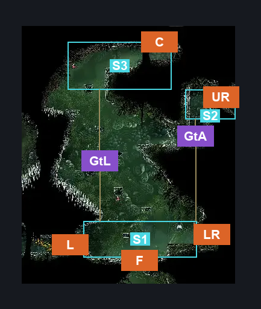
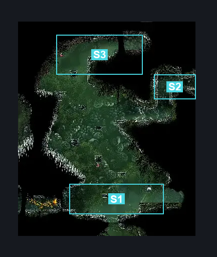
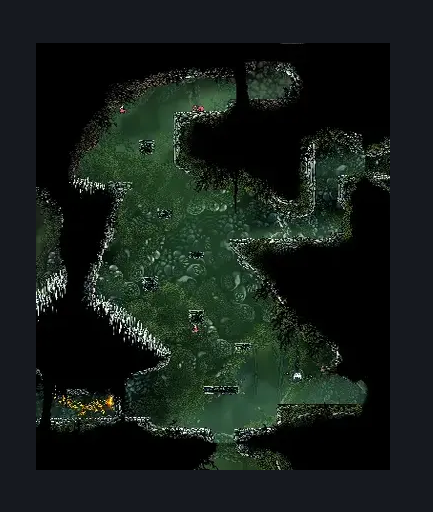

# Is this still Deep Docks? East (Bone_East_04)

**Game ID:** Bone_East_04

**Contributors:** herounit and Rebel

## Subrooms

| No. | Subroom | Annotated |
| --- | --- | --- |
| S1 | Ground | ✓ |
| S2 | Upper Right Door | ✓ |
| S3 | Upper Left | ✓ |

## Room Transitions

| Alias | Name | From subroom | Destination | Destination alias | Requirements | TODO | Verification | Annotated | Notes |
| --- | --- | --- | --- | --- | --- | --- | --- | --- | --- |
| C | top2 | Upper Left | [Hunter's March Deep Docks Passage (Ant_05b)](../hunter-s-march/hunter-s-march-deep-docks-passage.md) | RF | none |  | Verified | ✓ |  |
| UR | right2 | Upper Right Door | ["Deep Docks" March Side Room (Bone_East_04c)](deep-docks-march-side-room.md) | L | Nothing. |  | Verified | ✓ |  |
| LR | right1 | Ground | [Far Fields Deep Docks Loopback (Bone_East_15)](../far-fields/far-fields-deep-docks-loopback.md) | L | none |  | Verified | ✓ |  |
| L | left1 | Ground | [Is this still Deep Docks West (Bone_East_04b)](is-this-still-deep-docks-west.md) | R | Activate Deep Docks Is This Still Deep Docks West Blast Rock IN Is This Still Deep Docks West |  | Verified | ✓ |  |
| F | bot1 | Ground | [Deep Docks Spire Lower (Bone_East_03)](deep-docks-spire-lower.md) | C | Activate Deep Docks Lower Spire Blast Rock IN deep docks spire lower |  | Verified | ✓ |  |

## Subroom Connections

| Alias | Name | Source | Destination | Requirements | TODO | Verification | Annotated | Notes |
| --- | --- | --- | --- | --- | --- | --- | --- | --- |
| GtA | Ground to Right | Ground | Upper Right Door | ((Easy Enemy Pogo OR Faydown Cloak) AND Ledge Grab) OR Cling Grip OR Silk Soar |  | Verified | ✓ |  |
| GtA | Ground to Right | Upper Right Door | Ground | Nothing. (Fall) |  | Verified | ✓ |  |
| GtL | Ground to Left | Ground | Upper Left | Easy Enemy Pogo OR Faydown Cloak OR Cling Grip OR Ledge Grab OR (Scuttlebrace AND Dash) |  | Verified | ✓ | dash is included in the scuttlebrace use requirement so i dont think its necessary but i will anyway, |
| GtL | Ground to Left | Upper Left | Ground | Nothing. (Fall) |  | Verified | ✓ |  |

## Check Locations

| No. | Check | Subroom | Requirements | TODO | Verification | Location Type | Annotated | Notes |
| --- | --- | --- | --- | --- | --- | --- | --- | --- |
| 1 | import enemies |  |  | TODO | Needs verification |  |  |  |

## Room Images

### Connections

### Checks

### Scene

