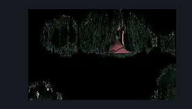

# Current Karmelita (Ant_Queen)

**Game ID:** Ant_Queen

**Contributors:** herounit

## Subrooms

No subrooms defined.

## Room Transitions

| Alias | Name | From subroom | Destination | Destination alias | Requirements | TODO | Verification | Annotated | Notes |
| --- | --- | --- | --- | --- | --- | --- | --- | --- | --- |
| L | left1 |  | [Far Fields Deep Fort (Bone_East_25)](far-fields-deep-fort.md) | D | none |  | Verified | ✓ |  |
| MG | memory |  | [Memory Karmelita (Memory_Ant_Queen)](memory-karmelita.md) | MG | elegy of the deep |  | Verified | ✓ |  |

## Subroom Connections

No subroom connections defined.

## Check Locations

| No. | Check | Subroom | Requirements | TODO | Verification | Location Type | Annotated | Notes |
| --- | --- | --- | --- | --- | --- | --- | --- | --- |
| 1 | meet karmelita |  | none |  | Verified | logic-point |  | used for the hidden hunter wish |

## Room Images

### Scene

### Connections

### Checks

