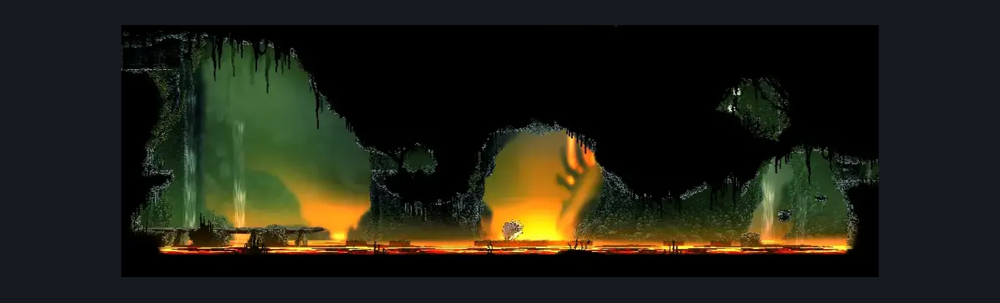
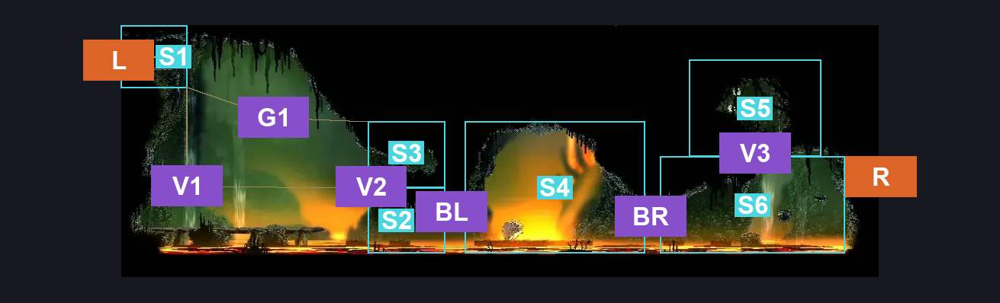
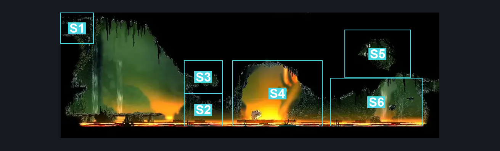

# Far Fields Chorus (Bone_East_08)

**Game ID:** Bone_East_08

**Contributors:** herounit

## Subrooms

| No. | Subroom | Annotated |
| --- | --- | --- |
| S1 | left exit area | ✓ |
| S2 | lower left side | ✓ |
| S3 | upper left alcove | ✓ |
| S4 | boss arena | ✓ |
| S5 | upper right alcove | ✓ |
| S6 | lower right side | ✓ |

## Room Transitions

| Alias | Name | From subroom | Destination | Destination alias | Requirements | TODO | Verification | Annotated | Notes |
| --- | --- | --- | --- | --- | --- | --- | --- | --- | --- |
| L | left1 | left exit area | [Far Fields Wind Shaft (Bone_East_07)](far-fields-wind-shaft.md) | R3 | none |  | Verified | ✓ |  |
| R | right1 | lower right side | [Far Fields Pinstress Room (Bone_East_09)](far-fields-pinstress-room.md) | LL | none |  | Verified | ✓ |  |

## Subroom Connections

| Alias | Name | Source | Destination | Requirements | TODO | Verification | Annotated | Notes |
| --- | --- | --- | --- | --- | --- | --- | --- | --- |
| V1 | vertical 1 | lower left side | left exit area | silk soar OR drifter's cloak |  | Verified | ✓ |  |
| V1 | vertical 1 | left exit area | lower left side | none (falling) |  | Verified | ✓ |  |
| G1 | gap 1 | left exit area | upper left alcove | drifter's cloak OR clawline |  | Verified | ✓ | one way only |
| V2 | vertical 2 | lower left side | upper left alcove | silk soar OR drifter's cloak |  | Verified | ✓ |  |
| V2 | vertical 2 | upper left alcove | lower left side | none (falling) |  | Verified | ✓ |  |
| BL | boss left entrance | lower left side | boss arena | none |  | Verified | ✓ | no boss defeat passthrough requirement |
| BL | boss left entrance | boss arena | lower left side | none |  | Verified | ✓ |  |
| BR | boss right entrance | lower right side | boss arena | none |  | Verified | ✓ | no boss defeat passthrough requirement |
| BR | boss right entrance | boss arena | lower right side | none |  | Verified | ✓ |  |
| V3 | vertical 3 | lower right side | upper right alcove | drifter's cloak OR ( silk soar AND ( scuttlebrace OR ( cling grip AND ( faydown cloak OR dash OR clawline OR sharpdart ) ) ) ) |  | Verified | ✓ |  |
| V3 | vertical 3 | upper right alcove | lower right side | none (falling) |  | Verified | ✓ |  |

## Check Locations

| No. | Check | Subroom | Requirements | TODO | Verification | Location Type | Annotated | Notes |
| --- | --- | --- | --- | --- | --- | --- | --- | --- |
| 1 | fourth chorus boss fight | boss arena | complete THE flexible spines wish granted |  | Verified | boss |  |  |
| 2 | rosary cache far fields 2 | upper left alcove | none |  | Verified | collectible |  |  |
| 3 | silk | upper right alcove | none |  | Verified | resource |  | silk webs |
| 4 | savage beastfly 2 boss fight | boss arena | complete THE savage beastfly wish promised |  | Verified | boss |  |  |
| 5 | Horn Fragment | boss arena | defeat savage beastfly 2 boss fight |  | Verified | collectible |  |  |

## Room Images

### Scene

### Connections

### Checks

