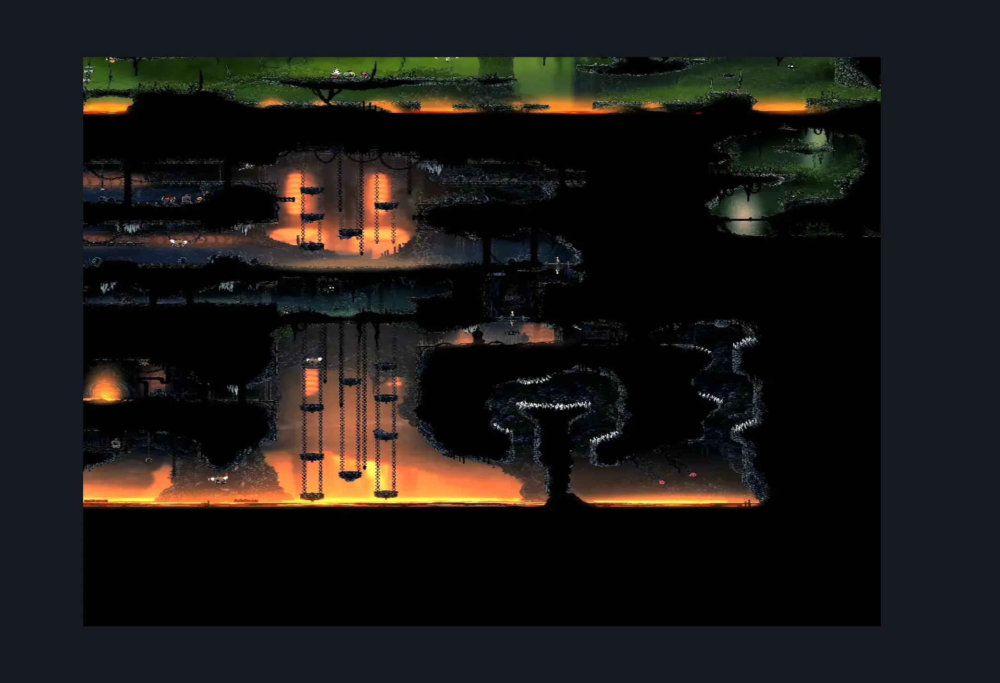
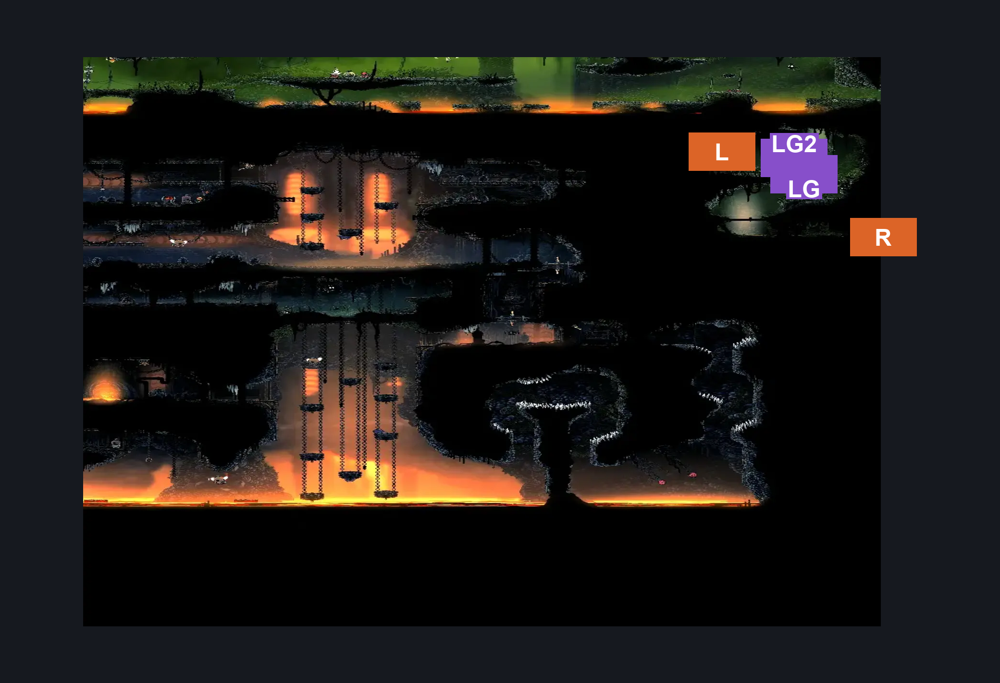

# Far Fields Deep Docks Backdoor (Dock_03b)

**Game ID:** Dock_03b

**Contributors:** herounit

## Subrooms

| No. | Subroom | Annotated |
| --- | --- | --- |
| S1 | upper area |  |
| S2 | lower area |  |
| S3 | platform |  |

## Room Transitions

| Alias | Name | From subroom | Destination | Destination alias | Requirements | TODO | Verification | Annotated | Notes |
| --- | --- | --- | --- | --- | --- | --- | --- | --- | --- |
| L | left1 | upper area | [Deep Docks Chains Upper East (Dock_03)](../deep-docks/deep-docks-chains-upper-east.md) | R | Activate Deep Docks Side Chain Room Door IN Deep Docks Chains East OR Activate Far Fields Side Chain Room Door |  | Verified | ✓ | is this true? map doesn't seem to agree -you can open it from both lol. |
| R | right1 | lower area | [Far Fields Wind Shaft (Bone_East_07)](far-fields-wind-shaft.md) | L3 | none |  | Verified | ✓ |  |

## Subroom Connections

| Alias | Name | Source | Destination | Requirements | TODO | Verification | Annotated | Notes |
| --- | --- | --- | --- | --- | --- | --- | --- | --- |
| LG | ledge grabs | lower area | upper area | ledge grab OR silk soar OR faydown cloak OR clawline OR easy shaman pogo |  | Verified | ✓ |  |
| LG | ledge grabs | upper area | lower area | none (falling) |  | Verified | ✓ |  |
| LG2 | ledge grab 2 | upper area | platform | ledge grab  OR silk soar  OR faydown  OR cling grip OR scuttlebrace |  | Verified | ✓ |  |
| LG2 | ledge grab 2 | platform | upper area | none (falling) |  | Verified | ✓ |  |

## Check Locations

| No. | Check | Subroom | Requirements | TODO | Verification | Location Type | Annotated | Notes |
| --- | --- | --- | --- | --- | --- | --- | --- | --- |
| 1 | warding bell | platform | none |  | Verified | collectible |  |  |
| 2 | Far Fields Side Chain Room Door | upper area | Break Wall Left |  | Verified | blockade |  | wall can be opened from both sides |

## Room Images

### Scene

### Connections

### Checks

