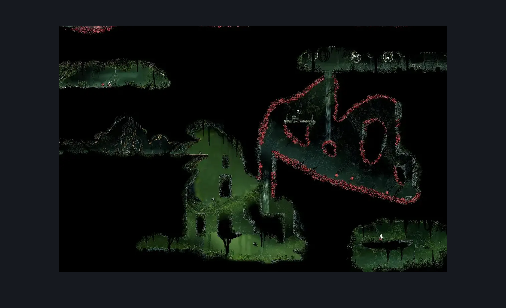
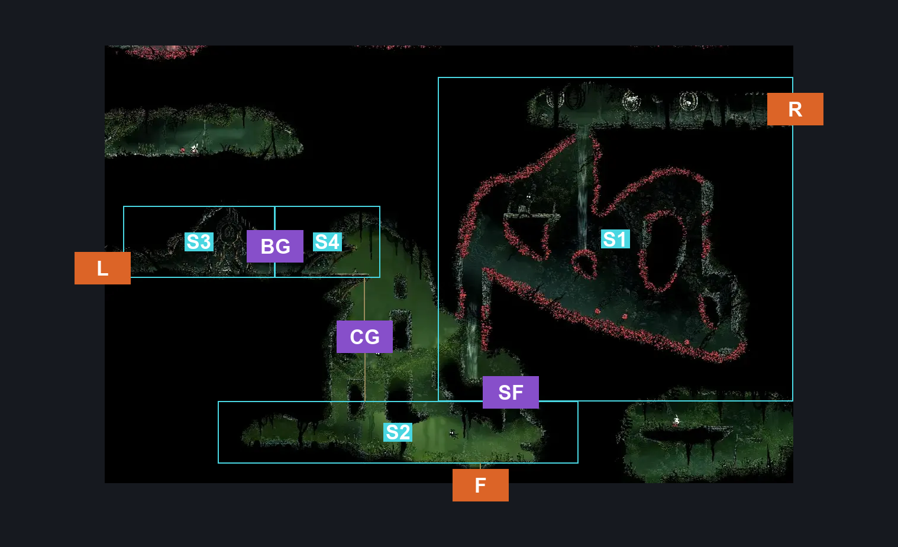
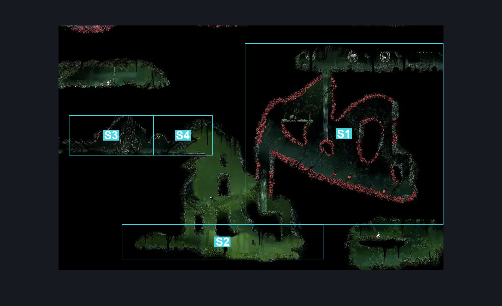

# Far Fields Deep Docks Loopback (Bone_East_15)

**Game ID:** Bone_East_15

**Contributors:** herounit

## Subrooms

| No. | Subroom | Annotated |
| --- | --- | --- |
| S1 | spike exit | ✓ |
| S2 | ground | ✓ |
| S3 | bell bench | ✓ |
| S4 | before gate | ✓ |

## Room Transitions

| Alias | Name | From subroom | Destination | Destination alias | Requirements | TODO | Verification | Annotated | Notes |
| --- | --- | --- | --- | --- | --- | --- | --- | --- | --- |
| L | left1 | bell bench | [Is this still Deep Docks? East (Bone_East_04)](../deep-docks/is-this-still-deep-docks-east.md) | LR | none |  | Verified | ✓ |  |
| F | bot1 | ground | [Far Fields Entrance East (Bone_East_02)](far-fields-entrance-east.md) | C | none |  | Verified | ✓ |  |
| R | right1 | spike exit | [Far Fields Fort Upper Passage (Bone_East_17)](far-fields-fort-upper-passage.md) | L | none |  | Verified | ✓ |  |

## Subroom Connections

| Alias | Name | Source | Destination | Requirements | TODO | Verification | Annotated | Notes |
| --- | --- | --- | --- | --- | --- | --- | --- | --- |
| SF | spike float | ground | spike exit | ( cling grip AND drifter's cloak ) OR ( silk soar AND drifter's cloak ) |  | Verified | ✓ | exit silk soar early and land on platform |
| SF | spike float | spike exit | ground | none (falling) |  | Verified | ✓ | can barely ledge grab by falling to jump down |
| BG | bell bench gate | before gate | bell bench | none (switch is on this side) |  | Verified | ✓ |  |
| BG | bell bench gate | bell bench | before gate | activate gate switch |  | Verified | ✓ |  |
| CG | cling grip | ground | before gate | cling grip OR silk soar OR scuttlebrace |  | Verified | ✓ |  |
| CG | cling grip | before gate | ground | none (falling) |  | Verified | ✓ |  |

## Check Locations

| No. | Check | Subroom | Requirements | TODO | Verification | Location Type | Annotated | Notes |
| --- | --- | --- | --- | --- | --- | --- | --- | --- |
| 1 | rosary cache far fields 9 | ground | none |  | Verified | collectible |  | MARKED AS ??? ON TRACKER |
| 2 | rosary cache far fields 10 | ground | none |  | Verified | collectible |  | MARKED AS ??? ON TRACKER |
| 3 | gate switch | before gate | flip switch up |  | Verified | switch |  |  |
| 4 | bench rosary lock | bell bench | none |  | Verified | lock |  |  |
| 5 | bench :) | bell bench | unlock bench rosary lock |  | Verified | bench |  |  |

## Room Images

### Scene

### Connections

### Checks

