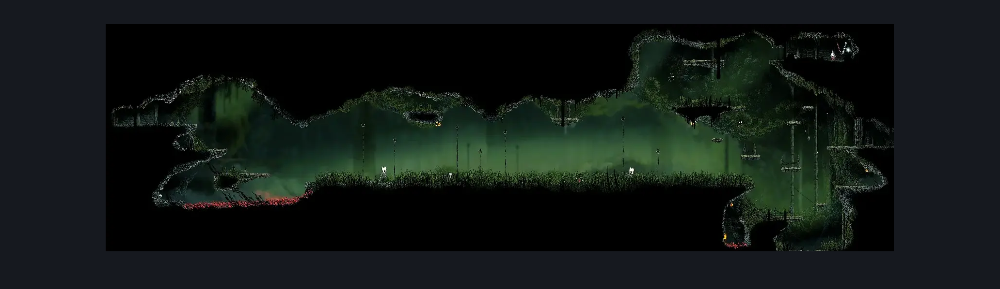
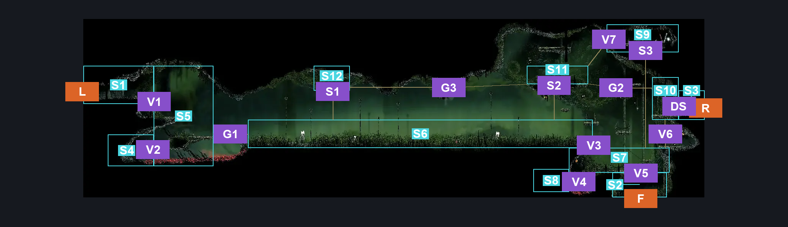
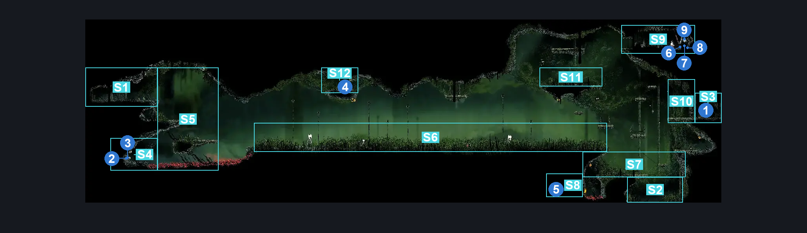

# Far Fields Deep Entrance (Bone_East_24)

**Game ID:** Bone_East_24

**Contributors:** herounit

## Subrooms

| No. | Subroom | Annotated |
| --- | --- | --- |
| S1 | left exit area | ✓ |
| S2 | bottom exit area | ✓ |
| S3 | right exit area | ✓ |
| S4 | lower left alcove | ✓ |
| S5 | middle left platform | ✓ |
| S6 | plains | ✓ |
| S7 | lower right area | ✓ |
| S8 | lower right alcove | ✓ |
| S9 | upper right alcove | ✓ |
| S10 | left of right exit gate | ✓ |
| S11 | plains upper right platform | ✓ |
| S12 | plains upper left platform | ✓ |

## Room Transitions

| Alias | Name | From subroom | Destination | Destination alias | Requirements | TODO | Verification | Annotated | Notes |
| --- | --- | --- | --- | --- | --- | --- | --- | --- | --- |
| F | bot1 | bottom exit area | [Far Fields Deep Lower West (Bone_East_18)](far-fields-deep-lower-west.md) | C | none |  | Verified | ✓ |  |
| L | left1 | left exit area | [Far Fields Upper Shaft (Bone_East_11)](far-fields-upper-shaft.md) | UR | none |  | Verified | ✓ |  |
| R | right1 | right exit area | [Far Fields Deep Fort Bench (Bone_East_27)](far-fields-deep-fort-bench.md) | L | none |  | Verified | ✓ |  |

## Subroom Connections

| Alias | Name | Source | Destination | Requirements | TODO | Verification | Annotated | Notes |
| --- | --- | --- | --- | --- | --- | --- | --- | --- |
| V1 | vertical 1 | left exit area | middle left platform | none (falling) |  | Verified | ✓ |  |
| V1 | vertical 1 | middle left platform | left exit area | silk soar OR faydown cloak |  | Verified | ✓ |  |
| V2 | vertical 2 | middle left platform | lower left alcove | run OR dash OR easy beast pogo OR drifter's cloak OR faydown cloak OR clawline OR sharpdart OR scuttlebrace |  | Verified | ✓ |  |
| V2 | vertical 2 | lower left alcove | middle left platform | ( faydown cloak AND ledge grab ) OR ( cling grip AND ( run OR dash OR drifter's cloak OR faydown cloak OR clawline OR sharpdart ) ) |  | Verified | ✓ |  |
| G1 | gap 1 | middle left platform | plains | run OR dash OR drifter's cloak OR faydown cloak OR clawline OR sharpdart OR scuttlebrace |  | Verified | ✓ |  |
| G1 | gap 1 | plains | middle left platform | run OR drifter's cloak OR faydown cloak OR clawline OR sharpdart OR ( dash AND ledge grab ) |  | Verified | ✓ |  |
| V3 | vertical 3 | plains | lower right area | none (falling) |  | Verified | ✓ |  |
| V3 | vertical 3 | lower right area | plains | silk soar  OR faydown OR ( ledge grab AND ( run OR clawline ) ) |  | Verified | ✓ |  |
| V4 | vertical 4 | lower right area | lower right alcove | break blast rock left AND ( spike pogo OR cling grip OR faydown cloak OR scuttlebrace OR   easy hazard respawn ) |  | Verified | ✓ | can just break it, reset from thorns and jump down again - won't work with 1 hp though :) |
| V4 | vertical 4 | lower right alcove | lower right area | cling grip OR faydown cloak OR scuttlebrace |  | Verified | ✓ |  |
| V5 | vertical 5 | lower right area | bottom exit area | none (falling) |  | Verified | ✓ |  |
| V5 | vertical 5 | bottom exit area | lower right area | silk soar OR cling grip OR scuttlebrace ( faydown cloak AND ledge grab ) |  | Verified | ✓ |  |
| DS | door switch | right exit area | left of right exit gate | activate right exit door switch |  | Verified | ✓ |  |
| DS | door switch | left of right exit gate | right exit area | activate right exit door switch |  | Verified | ✓ |  |
| V6 | vertical 6 | lower right area | left of right exit gate | silk soar OR faydown cloak OR ( ledge grab AND ( run OR drifter's cloak OR clawline ) ) |  | Verified | ✓ |  |
| V6 | vertical 6 | left of right exit gate | lower right area | none (falling) |  | Verified | ✓ |  |
| S1 | silk soar 1 | plains | plains upper left platform | silk soar OR ( faydown cloak AND clawline ) |  | Verified | ✓ | can hop up from the ground here or cross over from the plains upper right platform - requirements are the same |
| S1 | silk soar 1 | plains upper left platform | plains | none (falling) |  | Verified | ✓ |  |
| S2 | silk soar 2 | plains | plains upper right platform | silk soar |  | Verified | ✓ |  |
| S2 | silk soar 2 | plains upper right platform | plains | none (falling) |  | Verified | ✓ |  |
| S3 | silk soar 3 | lower right area | upper right alcove | silk soar |  | Verified | ✓ |  |
| S3 | silk soar 3 | upper right alcove | lower right area | none (falling) |  | Verified | ✓ |  |
| G2 | gap 2 | left of right exit gate | plains upper right platform | faydown cloak AND ( run OR dash OR drifter's cloak OR clawline OR sharpdart OR scuttlebrace ) |  | Verified | ✓ |  |
| G2 | gap 2 | plains upper right platform | left of right exit gate | run OR dash OR drifter's cloak OR faydown cloak OR clawline OR scuttlebrace OR sharpdart |  | Verified | ✓ |  |
| V7 | vertical 7 | plains upper right platform | upper right alcove | cling grip AND faydown cloak AND ( ledge grab OR run OR dash OR drifter's cloak OR clawline OR sharpdart OR scuttlebrace ) |  | Verified | ✓ |  |
| V7 | vertical 7 | upper right alcove | plains upper right platform | none (falling) |  | Verified | ✓ |  |
| G3 | gap 3 | plains upper left platform | plains upper right platform | faydown cloak AND clawline |  | Verified | ✓ |  |
| G3 | gap 3 | plains upper right platform | plains upper left platform | faydown cloak AND clawline |  | Verified | ✓ |  |

## Check Locations

| No. | Check | Subroom | Requirements | TODO | Verification | Location Type | Annotated | Notes |
| --- | --- | --- | --- | --- | --- | --- | --- | --- |
| 1 | right exit door switch | right exit area | flip switch down |  | Verified | switch | ✓ |  |
| 2 | AP Minor Cache - Shell Shard Cache: Far Fields #4 | lower left alcove | none |  | Verified | collectible | ✓ |  |
| 3 | AP Minor Cache - Shell Shard Cache: Far Fields #5 | lower left alcove | none |  | Verified | collectible | ✓ |  |
| 4 | AP Minor Cache - Shell Shard Cache: Far Fields #6 | plains upper left platform | none |  | Verified | collectible | ✓ |  |
| 5 | AP Minor Cache - Shell Shard Cache: Far Fields #7 | lower right alcove | none |  | Verified | collectible | ✓ |  |
| 6 | AP Minor Cache - Rosary Cache: Far Fields #20 | upper right alcove | none |  | Verified | collectible | ✓ |  |
| 7 | AP Minor Cache - Rosary Cache: Far Fields #21 | upper right alcove | none |  | Verified | collectible | ✓ |  |
| 8 | AP Minor Cache - Rosary Cache: Far Fields #22 | upper right alcove | none |  | Verified | collectible | ✓ |  |
| 9 | far fields pale rosary necklace | upper right alcove | act 3 |  | Verified | collectible | ✓ |  |

## Room Images

### Scene

### Connections

### Checks

