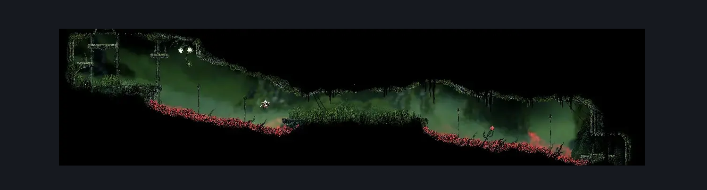
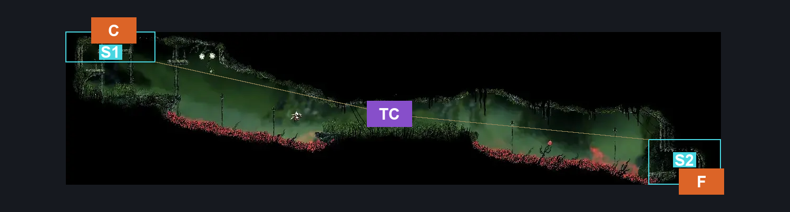
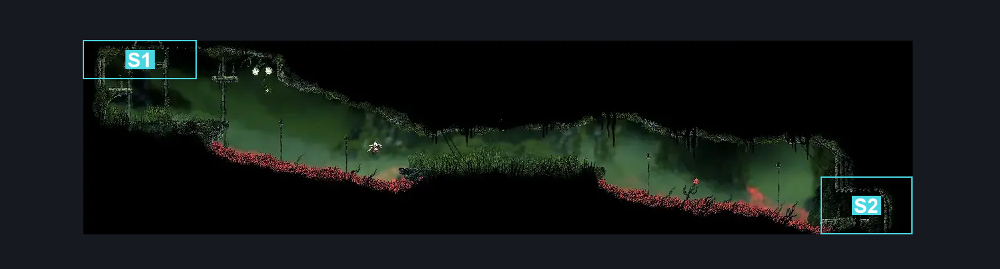

# Far Fields Deep Fort Passage (Bone_East_26)

**Game ID:** Bone_East_26

**Contributors:** herounit

## Subrooms

| No. | Subroom | Annotated |
| --- | --- | --- |
| S1 | ceiling exit area | ✓ |
| S2 | floor exit area | ✓ |

## Room Transitions

| Alias | Name | From subroom | Destination | Destination alias | Requirements | TODO | Verification | Annotated | Notes |
| --- | --- | --- | --- | --- | --- | --- | --- | --- | --- |
| C | top1 | ceiling exit area | [Far Fields Deep Fort Bench (Bone_East_27)](far-fields-deep-fort-bench.md) | F | none |  | Verified | ✓ |  |
| F | bot1 | floor exit area | [Far Fields Deep Lower East (Bone_East_18b)](far-fields-deep-lower-east.md) | C | none |  | Verified | ✓ |  |

## Subroom Connections

| Alias | Name | Source | Destination | Requirements | TODO | Verification | Annotated | Notes |
| --- | --- | --- | --- | --- | --- | --- | --- | --- |
| TC | thorn crossing | floor exit area | ceiling exit area | clawline  AND silkhearts 1 AND ( faydown OR silk soar ) |  | Verified | ✓ |  |
| TC | thorn crossing | ceiling exit area | floor exit area | ( clawline  AND ( silkhearts 2  OR ( silkhearts 1 AND ( faydown OR dash OR drifters ) ) ) ) OR ( run AND dash AND drifters AND faydown ) |  | Verified | ✓ |  |

## Check Locations

No check locations defined.

## Room Images

### Scene

### Connections

### Checks

