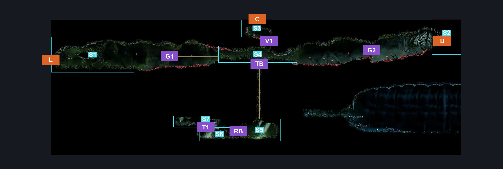
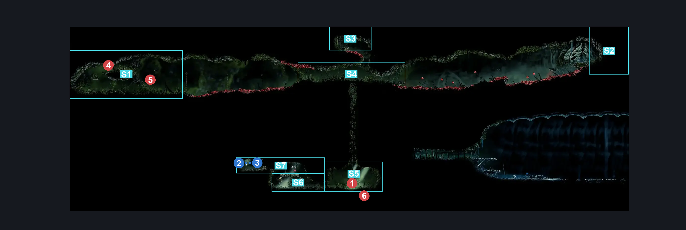
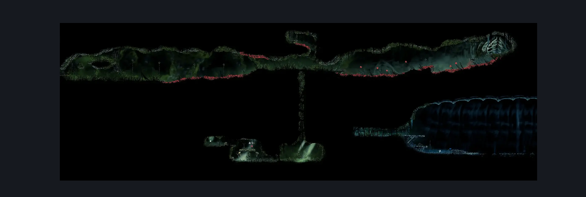

# Far Fields Deep Lower East (Bone_East_18b)

**Game ID:** Bone_East_18b

**Contributors:** herounit

## Subrooms

| No. | Subroom | Annotated |
| --- | --- | --- |
| S1 | left exit area | ✓ |
| S2 | right exit area | ✓ |
| S3 | ceiling exit area | ✓ |
| S4 | crossing | ✓ |
| S5 | trapper's arena | ✓ |
| S6 | trapper's den | ✓ |
| S7 | trapper's ledge | ✓ |

## Room Transitions

| Alias | Name | From subroom | Destination | Destination alias | Requirements | TODO | Verification | Annotated | Notes |
| --- | --- | --- | --- | --- | --- | --- | --- | --- | --- |
| D | door1 | right exit area | [Sprintmaster Cave (Sprintmaster_Cave)](sprintmaster-cave.md) | L | none |  | Verified | ✓ |  |
| C | top1 | ceiling exit area | [Far Fields Deep Fort Passage (Bone_East_26)](far-fields-deep-fort-passage.md) | F | none |  | Verified | ✓ |  |
| L | left1 | left exit area | [Far Fields Deep Lower West (Bone_East_18)](far-fields-deep-lower-west.md) | R | none |  | Verified | ✓ |  |

## Subroom Connections

| Alias | Name | Source | Destination | Requirements | TODO | Verification | Annotated | Notes |
| --- | --- | --- | --- | --- | --- | --- | --- | --- |
| TB | trapped bench | crossing | trapper's arena | act 3 AND complete THE the hidden hunter wish promised |  | Verified | ✓ |  |
| TB | trapped bench | trapper's arena | crossing | defeat gurr the outcast boss fight AND silk soar |  | Verified | ✓ |  |
| RB | right boss fight | trapper's arena | trapper's den | defeat gurr the outcast boss fight |  | Verified | ✓ |  |
| RB | right boss fight | trapper's den | trapper's arena | defeat gurr the outcast boss fight |  | Verified | ✓ |  |
| G1 | gap 1 | left exit area | crossing | clawline AND silkhearts x 1 |  | Verified | ✓ |  |
| G1 | gap 1 | crossing | left exit area | clawline  AND silkhearts x 1 AND ( run OR dash OR drifters OR faydown ) |  | Verified | ✓ |  |
| G2 | gap 2 | crossing | right exit area | clawline AND silkhearts x 1 |  | Verified | ✓ | need to pogo to let silk recharge with only 1 heart, but it isn't that bad |
| G2 | gap 2 | right exit area | crossing | ( clawline AND silkhearts x 1 ) OR ( clawline  AND silkhearts x 1 AND ( dash OR faydown OR drifters ) ) |  | Verified | ✓ | need enough silk to clawline twice to get the distance by itself |
| V1 | vertical 1 | crossing | ceiling exit area | ( faydown cloak AND ( cling grip OR scuttlebrace ) )  OR ( silk soar AND ( clawline OR drifter's cloak OR faydown cloak OR ( ledge grab AND dash ) ) ) |  | Verified | ✓ |  |
| V1 | vertical 1 | ceiling exit area | crossing | run OR dash OR drifter's cloak OR  faydown cloak OR easy beast pogo OR sharpdart OR scuttlebrace |  | Verified | ✓ |  |
| T1 | trapper 1 | trapper's den | trapper's ledge | faydown OR cling grip OR scuttlebrace OR silk soar |  | Verified | ✓ |  |
| T1 | trapper 1 | trapper's ledge | trapper's den | none (falling) |  | Verified | ✓ |  |

## Check Locations

| No. | Check | Subroom | Requirements | TODO | Verification | Location Type | Annotated | Notes |
| --- | --- | --- | --- | --- | --- | --- | --- | --- |
| 1 | gurr the outcast boss fight | trapper's arena | none |  | Verified | boss | ✓ |  |
| 2 | AP Minor Cache - Rosary Cache: Far Fields #19 | trapper's ledge | none |  | Verified | collectible | ✓ |  |
| 3 | Grass Doll | trapper's ledge | none |  | Verified | collectible | ✓ |  |

## Room Images

### Connections

### Checks

### Scene

