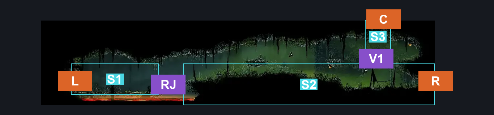
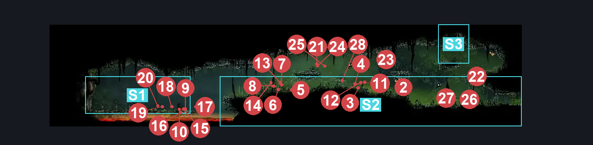
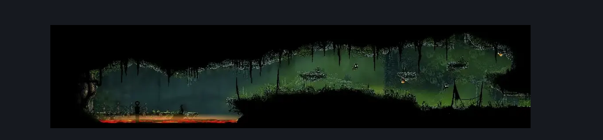

# Far Fields Entrance East (Bone_East_02)

**Game ID:** Bone_East_02

**Contributors:** herounit

## Subrooms

| No. | Subroom | Annotated |
| --- | --- | --- |
| S1 | deep docks platform | ✓ |
| S2 | main pathway | ✓ |
| S3 | ceiling exit platform | ✓ |

## Room Transitions

| Alias | Name | From subroom | Destination | Destination alias | Requirements | TODO | Verification | Annotated | Notes |
| --- | --- | --- | --- | --- | --- | --- | --- | --- | --- |
| C | top1 | ceiling exit platform | [Far Fields Deep Docks Loopback (Bone_East_15)](far-fields-deep-docks-loopback.md) | F | silk soar OR faydown cloak OR cling grip |  | Verified | ✓ | car barely make it up with faydown cloak |
| L | left1 | deep docks platform | [Deep Docks Bellshrine (Bellshrine_05)](../deep-docks/deep-docks-bellshrine.md) | R | ( bellshrinesanity off AND activate bellshrine switch IN deep docks bellshrine )  OR ( bellshrinesanity on AND have bell deep docks ) |  | Verified | ✓ | must keep in sync with other side |
| R | right1 | main pathway | [Far Fields Entrance West (Bone_East_02b)](far-fields-entrance-west.md) | L | none |  | Verified | ✓ |  |

## Subroom Connections

| Alias | Name | Source | Destination | Requirements | TODO | Verification | Annotated | Notes |
| --- | --- | --- | --- | --- | --- | --- | --- | --- |
| RJ | running jump | deep docks platform | main pathway | run OR faydown cloak OR sharpdart OR clawline OR ( ledge grab AND ( dash OR drifter's cloak ) ) |  | Verified | ✓ | couldn't get beast crest pogo to work, but might be possible |
| RJ | running jump | main pathway | deep docks platform | none |  | Verified | ✓ |  |
| V1 | vertical 1 | main pathway | ceiling exit platform | silk soar OR faydown cloak OR clawline OR ( ledge grab AND ( run OR dash OR drifter's cloak  OR sharpdart ) ) |  | Verified | ✓ |  |
| V1 | vertical 1 | ceiling exit platform | main pathway | none (falling) |  | Verified | ✓ |  |

## Check Locations

| No. | Check | Subroom | Requirements | TODO | Verification | Location Type | Annotated | Notes |
| --- | --- | --- | --- | --- | --- | --- | --- | --- |
| 1 | Garmond and Zaza Act 3 Meeting Far Fields West | main pathway | Act 3 |  | Verified | event |  |  |

## Room Images

### Connections

### Checks

### Scene

