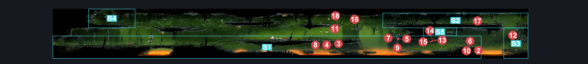

# Far Fields Entrance West (Bone_East_02b)

**Game ID:** Bone_East_02b

**Contributors:** herounit

## Subrooms

| No. | Subroom | Annotated |
| --- | --- | --- |
| S1 | lower walkway | ✓ |
| S2 | upper right platforms | ✓ |
| S3 | lower right exit platform | ✓ |
| S4 | upper left platforms | ✓ |
| S5 | check alcove | ✓ |

## Room Transitions

| Alias | Name | From subroom | Destination | Destination alias | Requirements | TODO | Verification | Annotated | Notes |
| --- | --- | --- | --- | --- | --- | --- | --- | --- | --- |
| UR | right1 | upper right platforms | [Far Fields Wind Shaft (Bone_East_07)](far-fields-wind-shaft.md) | L1 | none |  | Verified | ✓ |  |
| LR | right2 | lower right exit platform | [Far Fields Wind Shaft (Bone_East_07)](far-fields-wind-shaft.md) | L2 | none |  | Verified | ✓ |  |
| L | left1 | lower walkway | [Far Fields Entrance East (Bone_East_02)](far-fields-entrance-east.md) | R | none |  | Verified | ✓ |  |
| C | top3 | upper left platforms | [Far Fields Fort Lower Passage (Bone_East_16)](far-fields-fort-lower-passage.md) | F | none |  | Verified | ✓ |  |

## Subroom Connections

| Alias | Name | Source | Destination | Requirements | TODO | Verification | Annotated | Notes |
| --- | --- | --- | --- | --- | --- | --- | --- | --- |
| V1 | vertical 1 | lower walkway | upper right platforms | run OR clawline OR ( ledge grab AND ( dash OR sharpdart OR silk soar OR drifter's cloak OR faydown cloak ) ) |  | Verified | ✓ |  |
| V1 | vertical 1 | upper right platforms | lower walkway | none (falling) |  | Verified | ✓ |  |
| LC | lava crossing | lower walkway | lower right exit platform | run OR dash OR clawline OR sharpdart OR cling grip OR silk soar OR drifter's cloak  OR faydown cloak |  | Verified | ✓ |  |
| LC | lava crossing | lower right exit platform | lower walkway | run OR dash OR clawline OR sharpdart OR cling grip OR silk soar OR drifter's cloak  OR faydown cloak |  | Verified | ✓ |  |
| V2 | vertical 2 | lower walkway | upper left platforms | silk soar |  | Verified | ✓ |  |
| V2 | vertical 2 | upper left platforms | lower walkway | none (falling) |  | Verified | ✓ |  |
| UC | upper crossing | upper right platforms | upper left platforms | run OR dash OR clawline OR sharpdart OR silk soar OR drifter's cloak OR faydown cloak |  | Verified | ✓ |  |
| UC | upper crossing | upper left platforms | upper right platforms | run OR dash OR clawline OR sharpdart OR silk soar OR drifter's cloak OR faydown cloak |  | Verified | ✓ |  |
| V3 | vertical 3 | lower right exit platform | upper right platforms | cling grip OR silk soar |  | Verified | ✓ |  |
| V3 | vertical 3 | upper right platforms | lower right exit platform | none (falling) |  | Verified | ✓ |  |
| AC | alcove access | lower walkway | check alcove | ledge grab OR silk soar OR faydown cloak OR clawline OR easy shaman pogo |  | Verified | ✓ | i love shaman pogo |
| AC | alcove access | check alcove | lower walkway | none (falling) |  | Verified | ✓ |  |

## Check Locations

| No. | Check | Subroom | Requirements | TODO | Verification | Location Type | Annotated | Notes |
| --- | --- | --- | --- | --- | --- | --- | --- | --- |
| 1 | shell shard cache far fields 1 | check alcove | none |  | Verified | collectible |  |  |
| 2 | Skarr Scout 1 |  | Black Thread World Spawn |  |  | enemy | ✓ |  |
| 3 | Skarr Stalker 1 |  | Black Thread World Spawn |  |  | enemy | ✓ |  |
| 4 | Spear Skarr 1 |  | Black Thread World Spawn |  |  | enemy | ✓ |  |
| 5 | Rhinogrund 1 |  | Black Thread World Spawn |  |  | enemy | ✓ |  |
| 6 | Void Mass 1 |  | Black Thread World Spawn |  |  | enemy | ✓ |  |
| 7 | Skarr Stalker 2 |  | Normal World Spawn |  |  | enemy | ✓ |  |
| 8 | Skarr Scout 2 |  | Normal World Spawn |  |  | enemy | ✓ |  |
| 9 | Skarr Scout 3 |  | Normal World Spawn |  |  | enemy | ✓ |  |
| 10 | Fertid 1 |  | Normal World Spawn |  |  | enemy | ✓ |  |
| 11 | Fertid 2 |  |  |  |  | enemy | ✓ |  |
| 12 | Flapping Fertid 1 |  |  |  |  | enemy | ✓ |  |
| 13 | Brushflit 1 |  | Normal World Spawn |  |  | enemy | ✓ |  |
| 14 | Brushflit 2 |  | Normal World Spawn |  |  | enemy | ✓ |  |
| 15 | Brushflit 3 |  | Normal World Spawn |  |  | enemy | ✓ |  |
| 16 | Flapping Fertid 2 |  | Normal World Spawn |  |  | enemy | ✓ |  |
| 17 | Fertid 3 |  | Normal World Spawn |  |  | enemy | ✓ |  |
| 18 | Flapping Fertid 3 |  | Black Thread World Spawn |  |  | enemy | ✓ |  |

## Room Images

### Connections

### Checks

### Scene

