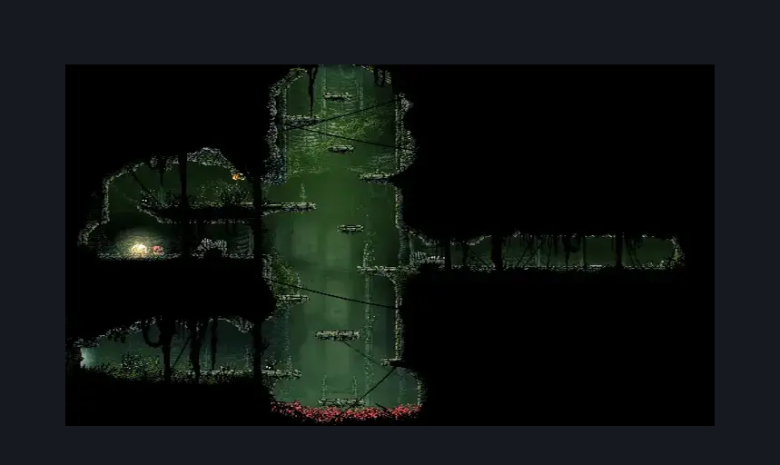
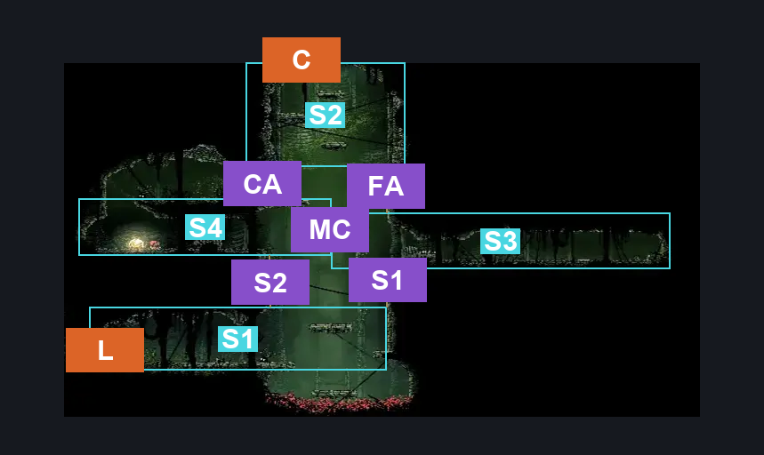
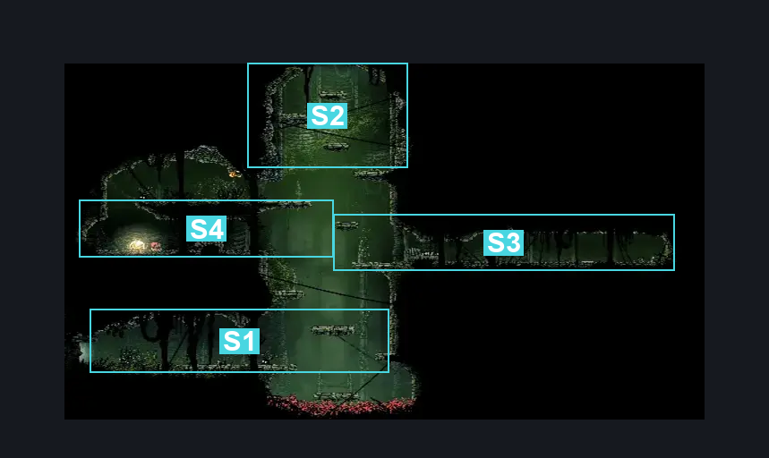

# Far Fields Fort Flea Rescue (Bone_East_17b)

**Game ID:** Bone_East_17b

**Contributors:** herounit

## Subrooms

| No. | Subroom | Annotated |
| --- | --- | --- |
| S1 | left exit area | ✓ |
| S2 | ceiling exit area | ✓ |
| S3 | flea rescue area | ✓ |
| S4 | camp | ✓ |

## Room Transitions

| Alias | Name | From subroom | Destination | Destination alias | Requirements | TODO | Verification | Annotated | Notes |
| --- | --- | --- | --- | --- | --- | --- | --- | --- | --- |
| L | left1 | left exit area | [Far Fields Fort Lower Passage (Bone_East_16)](far-fields-fort-lower-passage.md) | R | none |  | Verified | ✓ | break wall |
| C | top1 | ceiling exit area | [Far Fields Fort Upper Passage (Bone_East_17)](far-fields-fort-upper-passage.md) | B | none |  | Verified | ✓ | break wall (can be broken from either side) |

## Subroom Connections

| Alias | Name | Source | Destination | Requirements | TODO | Verification | Annotated | Notes |
| --- | --- | --- | --- | --- | --- | --- | --- | --- |
| S1 | shaft 1 | left exit area | flea rescue area | ledge grab OR faydown cloak OR silk soar OR clawline |  | Verified | ✓ |  |
| S1 | shaft 1 | flea rescue area | left exit area | none (falling) |  | Verified | ✓ |  |
| S2 | shaft 2 | left exit area | camp | ledge grab OR faydown cloak OR silk soar OR clawline |  | Verified | ✓ |  |
| S2 | shaft 2 | camp | left exit area | none (falling) |  | Verified | ✓ |  |
| FA | flea ascend | flea rescue area | ceiling exit area | ledge grab OR faydown cloak OR silk soar OR clawline |  | Verified | ✓ |  |
| FA | flea ascend | ceiling exit area | flea rescue area | none (falling) |  | Verified | ✓ |  |
| CA | camp ascend | camp | ceiling exit area | ledge grab OR faydown cloak OR silk soar OR clawline OR cling grip |  | Verified | ✓ |  |
| CA | camp ascend | ceiling exit area | camp | none (falling) |  | Verified | ✓ |  |
| MC | middling crossing | camp | flea rescue area | ledge grab OR run OR dash OR sharpdart OR drifter's cloak OR faydown cloak OR cling grip OR silk soar OR scuttlebrace |  | Verified | ✓ |  |
| MC | middling crossing | flea rescue area | camp | ledge grab OR run OR sharpdart OR clawline OR faydown cloak OR cling grip OR silk soar OR scuttlebrace |  | Verified | ✓ |  |

## Check Locations

| No. | Check | Subroom | Requirements | TODO | Verification | Location Type | Annotated | Notes |
| --- | --- | --- | --- | --- | --- | --- | --- | --- |
| 1 | flea rescue | flea rescue area | none |  | Verified | collectible |  | break cage |
| 2 | rosary cache far fields 16 | camp | none |  | Verified | collectible |  |  |
| 3 | rosary cache far fields 17 | camp | none |  | Verified | collectible |  |  |

## Notes

this had no subrooms before ledge grab...

## Room Images

### Scene

### Connections

### Checks

