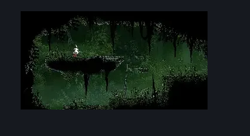

# Far Fields Fort Lower Passage (Bone_East_16)

**Game ID:** Bone_East_16

**Contributors:** herounit

## Subrooms

| No. | Subroom | Annotated |
| --- | --- | --- |
| S1 | the pit of despair |  |
| S2 | the highest highs |  |

## Room Transitions

| Alias | Name | From subroom | Destination | Destination alias | Requirements | TODO | Verification | Annotated | Notes |
| --- | --- | --- | --- | --- | --- | --- | --- | --- | --- |
| F | bot1 | the pit of despair | [Far Fields Entrance West (Bone_East_02b)](far-fields-entrance-west.md) | C | none |  | Verified | ✓ |  |
| R | right1 | the highest highs | [Far Fields Fort Flea Rescue (Bone_East_17b)](far-fields-fort-flea-rescue.md) | L | none (break wall) |  | Verified | ✓ | can be broken from either side |

## Subroom Connections

| Alias | Name | Source | Destination | Requirements | TODO | Verification | Annotated | Notes |
| --- | --- | --- | --- | --- | --- | --- | --- | --- |
| MJ | massive jump | the pit of despair | the highest highs | ledge grab OR clawline OR faydown cloak OR silk soar OR scuttlebrace OR cling grip OR easy shaman pogo |  | Verified |  |  |
| MJ | massive jump | the highest highs | the pit of despair | none (falling) |  | Verified |  |  |

## Check Locations

| No. | Check | Subroom | Requirements | TODO | Verification | Location Type | Annotated | Notes |
| --- | --- | --- | --- | --- | --- | --- | --- | --- |
| 1 | rosary cache far fields 11 | the highest highs | none |  | Verified | collectible |  |  |
| 2 | rosary cache far fields 12 | the highest highs | none |  | Verified | collectible |  |  |
| 3 | rosary cache far fields 13 | the highest highs | none |  | Verified | collectible |  |  |
| 4 | Fertid 1 |  |  |  |  | enemy | ✓ |  |
| 5 | Skarr Stalker 1 |  | Normal World Spawn |  |  | enemy | ✓ |  |

## Room Images

### Connections

### Checks

### Scene

