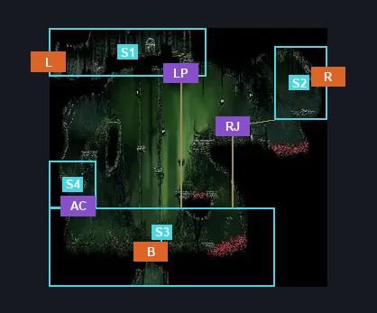
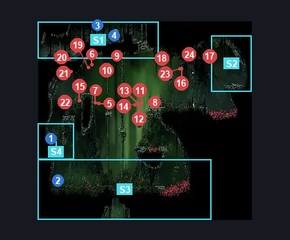
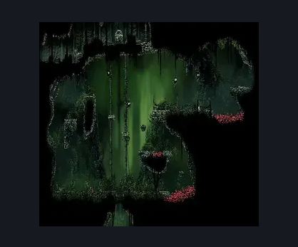

# Far Fields Fort Upper Passage (Bone_East_17)

**Game ID:** Bone_East_17

**Contributors:** herounit

## Subrooms

| No. | Subroom | Annotated |
| --- | --- | --- |
| S1 | left exit area | ✓ |
| S2 | right exit area | ✓ |
| S3 | main area | ✓ |
| S4 | check niche | ✓ |

## Room Transitions

| Alias | Name | From subroom | Destination | Destination alias | Requirements | TODO | Verification | Annotated | Notes |
| --- | --- | --- | --- | --- | --- | --- | --- | --- | --- |
| L | left1 | left exit area | [Far Fields Deep Docks Loopback (Bone_East_15)](far-fields-deep-docks-loopback.md) | R | none |  | Verified | ✓ |  |
| B | bot1 | main area | [Far Fields Fort Flea Rescue (Bone_East_17b)](far-fields-fort-flea-rescue.md) | C | none |  | Verified | ✓ |  |
| R | right1 | right exit area | [Far Fields Wind Shaft (Bone_East_07)](far-fields-wind-shaft.md) | L4 | none |  | Verified | ✓ |  |

## Subroom Connections

| Alias | Name | Source | Destination | Requirements | TODO | Verification | Annotated | Notes |
| --- | --- | --- | --- | --- | --- | --- | --- | --- |
| LP | lower platforms | left exit area | main area | activate lower platform switch |  | Verified | ✓ |  |
| LP | lower platforms | main area | left exit area | activate lower platform switch |  | Verified | ✓ |  |
| RJ | running jump | main area | right exit area | run OR dash OR drifter's cloak OR faydown cloak OR clawline OR sharpdart |  | Verified | ✓ | silk soar doesn't get enough horizontal distance without one of the skills that just gets you there |
| RJ | running jump | right exit area | main area | none (falling) |  | Verified | ✓ |  |
| AC | access niche | main area | check niche | ledge grab OR run OR dash OR silk soar OR drifter's cloak OR faydown cloak OR cling grip OR clawline OR sharpdart OR scuttlebrace OR easy beast pogo OR easy shaman pogo |  | Verified | ✓ |  |
| AC | access niche | check niche | main area | none (falling) |  | Verified | ✓ |  |

## Check Locations

| No. | Check | Subroom | Requirements | TODO | Verification | Location Type | Annotated | Notes |
| --- | --- | --- | --- | --- | --- | --- | --- | --- |
| 1 | rosary cache far fields 14 | check niche | none |  | Verified | collectible | ✓ |  |
| 2 | rosary cache far fields 15 | main area | none |  | Verified | collectible | ✓ |  |
| 3 | lower platform switch | left exit area | flip switch up |  | Verified | switch | ✓ |  |
| 4 | rosary chest | left exit area | none |  | Verified | collectible | ✓ | NOT YET RANDOMIZED |
| 5 | Brushflit 1 |  |  |  |  | enemy | ✓ |  |
| 6 | Brushflit 2 |  |  |  |  | enemy | ✓ |  |
| 7 | Brushflit 3 |  |  |  |  | enemy | ✓ |  |
| 8 | Fertid 1 |  |  |  |  | enemy | ✓ |  |
| 9 | Flapping Fertid 1 |  |  |  |  | enemy | ✓ |  |
| 10 | Flapping Fertid 2 |  | Normal World Spawn |  |  | enemy | ✓ |  |
| 11 | Brushflit 4 |  | Normal World Spawn |  |  | enemy | ✓ |  |
| 12 | Brushflit 5 |  | Normal World Spawn |  |  | enemy | ✓ |  |
| 13 | Brushflit 6 |  | Normal World Spawn |  |  | enemy | ✓ |  |
| 14 | Brushflit 7 |  | Normal World Spawn |  |  | enemy | ✓ |  |
| 15 | Skarr Stalker 1 |  | Normal World Spawn |  |  | enemy | ✓ |  |
| 16 | Skarr Scout 1 |  | Normal World Spawn |  |  | enemy | ✓ |  |
| 17 | Flapping Fertid 3 |  | Normal World Spawn |  |  | enemy | ✓ |  |
| 18 | Flapping Fertid 4 |  | Normal World Spawn |  |  | enemy | ✓ |  |
| 19 | Brushflit 8 |  | Normal World Spawn |  |  | enemy | ✓ |  |
| 20 | Void Mass 1 |  | Black Thread World Spawn |  |  | enemy | ✓ |  |
| 21 | Spear Skarr 1 |  | Black Thread World Spawn |  |  | enemy | ✓ |  |
| 22 | Skarr Stalker 2 |  | Black Thread World Spawn |  |  | enemy | ✓ |  |
| 23 | Skarr Scout 2 |  | Black Thread World Spawn |  |  | enemy | ✓ |  |
| 24 | Spear Skarr 2 |  | Black Thread World Spawn |  |  | enemy | ✓ |  |

## Room Images

### Connections

### Checks

### Scene

