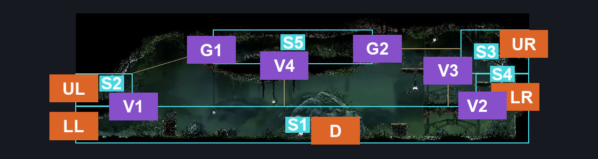
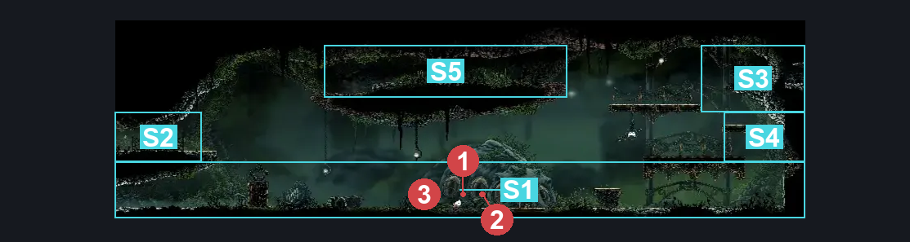
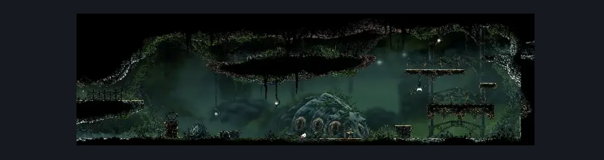

# Far Fields Pilgrim's Rest (Bone_East_10)

**Game ID:** Bone_East_10

**Contributors:** herounit

## Subrooms

| No. | Subroom | Annotated |
| --- | --- | --- |
| S1 | main floor | ✓ |
| S2 | upper left exit | ✓ |
| S3 | upper right exit | ✓ |
| S4 | lower right exit | ✓ |
| S5 | middle upper platform | ✓ |

## Room Transitions

| Alias | Name | From subroom | Destination | Destination alias | Requirements | TODO | Verification | Annotated | Notes |
| --- | --- | --- | --- | --- | --- | --- | --- | --- | --- |
| UL | left1 | upper left exit | [Far Fields Upper Shaft (Bone_East_11)](far-fields-upper-shaft.md) | LR | none |  | Verified | ✓ |  |
| LL | left2 | main floor | [Far Fields Wind Shaft (Bone_East_07)](far-fields-wind-shaft.md) | R1 | none |  | Verified | ✓ |  |
| D | door1 | main floor | [Far Fields Pilgrim's Rest Shop (Bone_East_10_Room)](far-fields-pilgrim-s-rest-shop.md) | R | none (rosary gated) |  | Verified | ✓ |  |
| UR | right1 | upper right exit | [Far Fields Pilgrim's Rest Deep Passage (Bone_East_18c)](far-fields-pilgrim-s-rest-deep-passage.md) | L | clear blast rock exit block IN hunters march pilgrims rest deep passage |  | Verified | ✓ |  |
| LR | right2 | lower right exit | [Far Fields Pilgrim's Rest Church (Bone_East_10_Church)](far-fields-pilgrim-s-rest-church.md) | L | activate door switch IN far fields pilgrims rest church |  | Verified | ✓ |  |

## Subroom Connections

| Alias | Name | Source | Destination | Requirements | TODO | Verification | Annotated | Notes |
| --- | --- | --- | --- | --- | --- | --- | --- | --- |
| V1 | vertical 1 | main floor | upper left exit | silk soar OR faydown cloak |  | Verified | ✓ | platform can be dropped to make it only ledge grab after middle platform access is granted |
| V1 | vertical 1 | upper left exit | main floor | none (falling) |  | Verified | ✓ |  |
| G1 | gap 1 | middle upper platform | upper left exit | run OR ledge grab OR clawline OR faydown cloak OR drifter's cloak OR  clawline OR sharpdart |  | Verified | ✓ | based on after platform falls |
| V2 | vertical 2 | main floor | lower right exit | ledge grab OR faydown cloak OR silk soar OR scuttlebrace OR clawline OR easy shaman pogo |  | Verified | ✓ |  |
| V2 | vertical 2 | lower right exit | main floor | none (falling) |  | Verified | ✓ |  |
| V3 | vertical 3 | main floor | upper right exit | ledge grab OR faydown cloak OR silk soar OR scuttlebrace |  | Verified | ✓ |  |
| V3 | vertical 3 | upper right exit | main floor | none (falling) |  | Verified | ✓ |  |
| G2 | gap 2 | upper right exit | middle upper platform | run OR dash OR drifter's cloak OR faydown cloak OR silk soar OR clawline OR sharpdart OR scuttlebrace |  | Verified | ✓ |  |
| G2 | gap 2 | middle upper platform | upper right exit | none (jump) |  | Verified | ✓ |  |
| V4 | vertical 4 | main floor | middle upper platform | silk soar |  | Verified | ✓ |  |
| V4 | vertical 4 | middle upper platform | main floor | none (falling) |  | Verified | ✓ |  |

## Check Locations

No check locations defined.

## Room Images

### Connections

### Checks

### Scene

