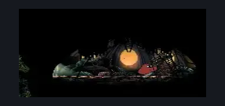

# Far Fields Pinstress Hut Interior (Bone_East_Umbrella)

**Game ID:** Bone_East_Umbrella

**Contributors:** herounit

## Subrooms

No subrooms defined.

## Room Transitions

| Alias | Name | From subroom | Destination | Destination alias | Requirements | TODO | Verification | Annotated | Notes |
| --- | --- | --- | --- | --- | --- | --- | --- | --- | --- |
| L | left1 |  | [Far Fields Pinstress Room (Bone_East_09)](far-fields-pinstress-room.md) | D | none |  | Verified | ✓ |  |

## Subroom Connections

No subroom connections defined.

## Check Locations

| No. | Check | Subroom | Requirements | TODO | Verification | Location Type | Annotated | Notes |
| --- | --- | --- | --- | --- | --- | --- | --- | --- |
| 1 | bench |  | none |  | Verified | bench | ✓ |  |
| 2 | flexible spines wish promised |  | none |  | Verified | event |  |  |
| 3 | flexible spines wish granted |  | complete flexible spines wish promised AND ( flexible spines 25  OR defeat hoker enemy IN far fields skull room west OR defeat hoker enemy IN far fields skull room east ) |  | Verified | event |  | wasn't sure which made more sense here - the former is more accurate, but the latter is more logic complete |
| 4 | drifters cloak |  | complete flexible spines wish granted |  | Verified | collectible |  |  |

## Room Images

### Scene

### Connections

### Checks

