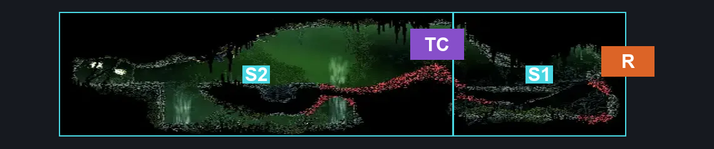
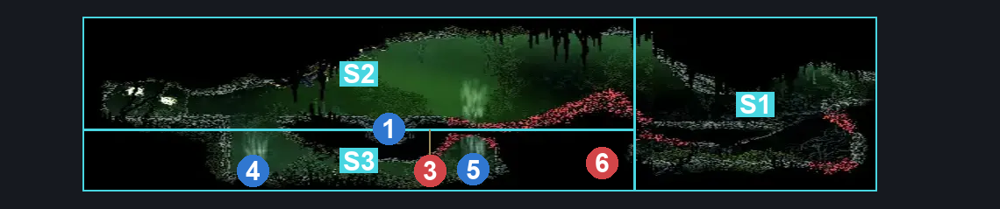
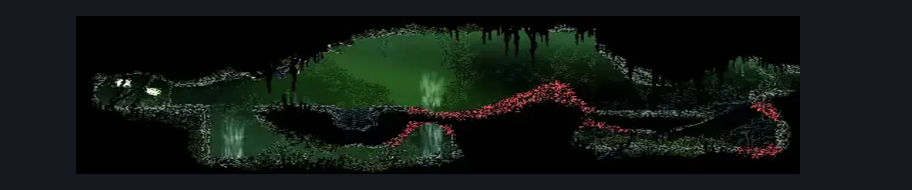

# Far Fields Pinstress Mask Shard (Bone_East_20)

**Game ID:** Bone_East_20

**Contributors:** herounit

## Subrooms

| No. | Subroom | Annotated |
| --- | --- | --- |
| S1 | right side | ✓ |
| S2 | left side | ✓ |
| S3 | left side tunnel | ✓ |

## Room Transitions

| Alias | Name | From subroom | Destination | Destination alias | Requirements | TODO | Verification | Annotated | Notes |
| --- | --- | --- | --- | --- | --- | --- | --- | --- | --- |
| R | right1 | right side | [Far Fields Pinstress Room (Bone_East_09)](far-fields-pinstress-room.md) | UL | none |  | Verified | ✓ |  |

## Subroom Connections

| Alias | Name | Source | Destination | Requirements | TODO | Verification | Annotated | Notes |
| --- | --- | --- | --- | --- | --- | --- | --- | --- |
| TC | thorn crossing | right side | left side | clawline OR ( drifter's cloak AND ( ledge grab OR silk soar ) ) OR (faydown cloak AND ((drifter's cloak AND proficient movement) OR (dash AND (easy flea brew stall OR easy voltvessels stall)))) |  | Verified | ✓ |  |
| TC | thorn crossing | left side | right side | (clear vent boulder 2 AND drifter's cloak) OR ( clawline AND ( silk soar OR faydown cloak OR run ) ) OR (faydown cloak AND (drifter's cloak OR (dash AND (easy flea brew stall OR easy voltvessels stall)))) |  | Verified | ✓ |  |
| TT | thorn crossing tunnel | left side | left side tunnel | none (falling) |  | Verified | ✓ |  |
| TT | thorn crossing tunnel | left side tunnel | left side | (faydown cloak AND ledge grab) OR cling grip OR scuttlebrace OR silk soar OR (clear vent boulder 1 AND drifter's cloak) |  | Verified | ✓ |  |

## Check Locations

| No. | Check | Subroom | Requirements | TODO | Verification | Location Type | Annotated | Notes |
| --- | --- | --- | --- | --- | --- | --- | --- | --- |
| 1 | mask shard far fields above the seamstress | left side | drifter's cloak OR silk soar OR faydown cloak |  | Verified | collectible | ✓ | must break blast rock on ceiling - this likely has a large number of tool options - haven't really considered this here |
| 2 | random silk | left side | none |  | Verified | resource |  | NOT YET RANDOMIZED |
| 3 | fertid | left side | none |  | Verified | enemy | ✓ | shell shards |
| 4 | vent boulder 1 | left side tunnel | none (attack) |  | Verified | blockade | ✓ | must be broken to return escape tunnel with drifter's cloak |
| 5 | vent boulder 2 | left side tunnel | none (attack) |  | Verified | blockade | ✓ | must be broken to return to right side using drifter's cloak |
| 6 | Fertid 1 |  |  |  |  | enemy | ✓ |  |

## Room Images

### Connections

### Checks

### Scene

