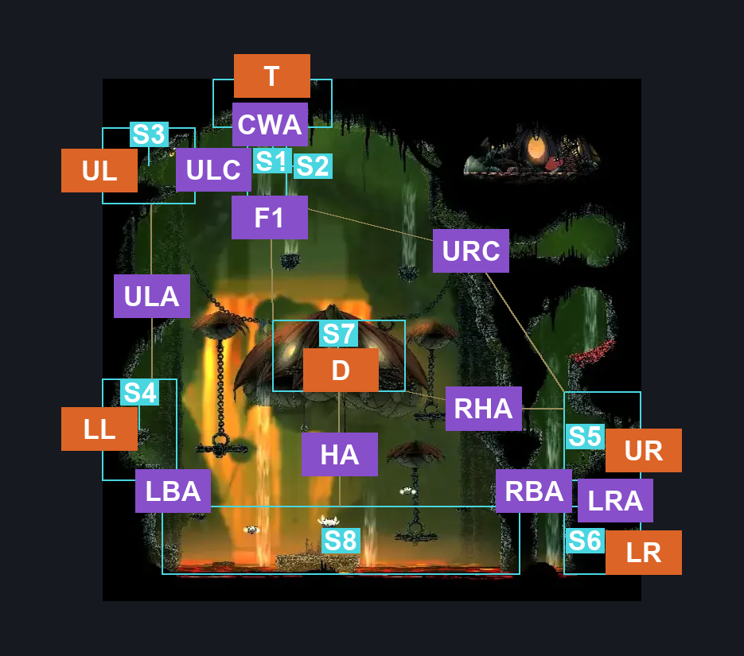
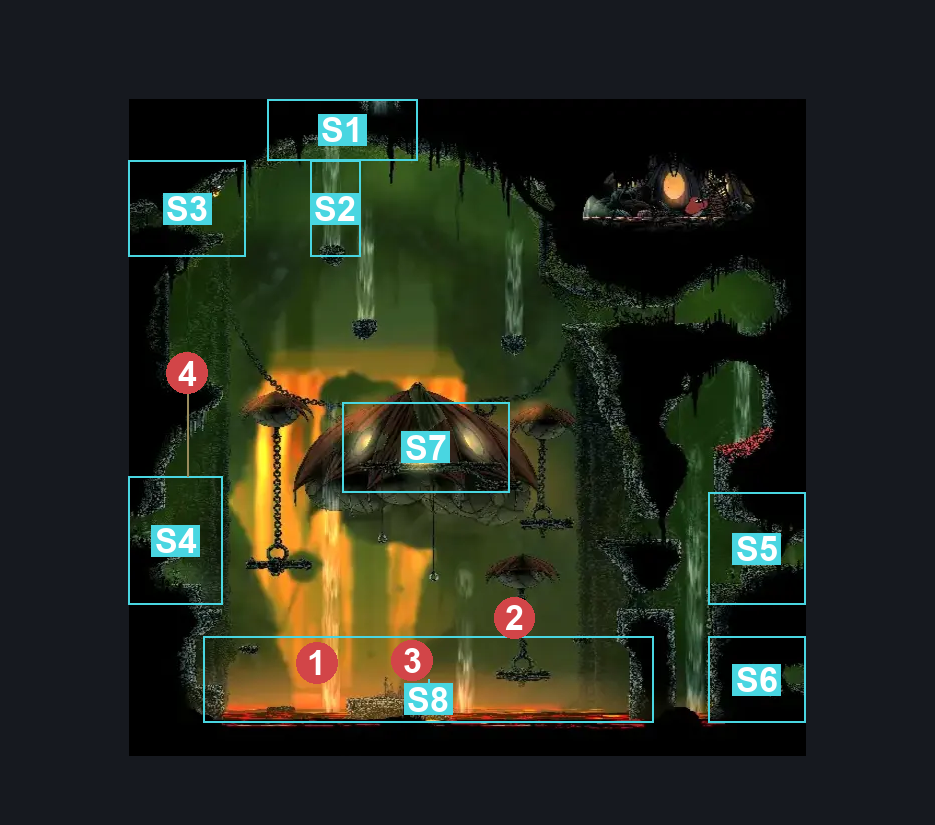
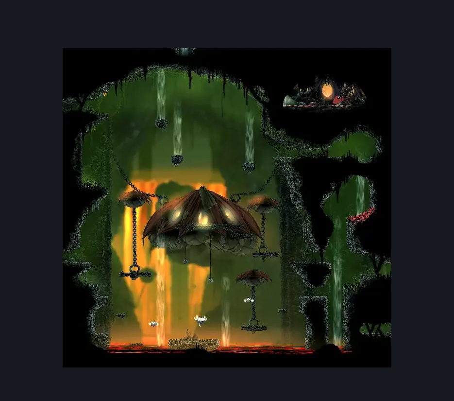

# Far Fields Pinstress Room (Bone_East_09)

**Game ID:** Bone_East_09

**Contributors:** herounit

## Subrooms

| No. | Subroom | Annotated |
| --- | --- | --- |
| S1 | ceiling exit area | ✓ |
| S2 | ceiling wind tunnel | ✓ |
| S3 | upper left exit area | ✓ |
| S4 | lower left exit area | ✓ |
| S5 | upper right exit area | ✓ |
| S6 | lower right exit area | ✓ |
| S7 | pinstress hut platform | ✓ |
| S8 | lava basin | ✓ |

## Room Transitions

| Alias | Name | From subroom | Destination | Destination alias | Requirements | TODO | Verification | Annotated | Notes |
| --- | --- | --- | --- | --- | --- | --- | --- | --- | --- |
| T | top1 | ceiling exit area | [Far Fields Pinstress Attic (Bone_East_09b)](far-fields-pinstress-attic.md) | F | clear blast rock exit block IN far fields pinstress attic |  | Verified | ✓ |  |
| UL | left3 | upper left exit area | [Far Fields Pinstress Mask Shard (Bone_East_20)](far-fields-pinstress-mask-shard.md) | R | none |  | Verified | ✓ |  |
| LR | right2 | lower right exit area | [Far Fields Skull Room West (Bone_East_14)](far-fields-skull-room-west.md) | LL | none |  | Verified | ✓ |  |
| LL | left2 | lower left exit area | [Far Fields Chorus (Bone_East_08)](far-fields-chorus.md) | R | none |  | Verified | ✓ |  |
| UR | right1 | upper right exit area | [Far Fields Skull Room West (Bone_East_14)](far-fields-skull-room-west.md) | UL | none |  | Verified | ✓ |  |
| D | door1 | pinstress hut platform | [Far Fields Pinstress Hut Interior (Bone_East_Umbrella)](far-fields-pinstress-hut-interior.md) | L | none |  | Verified | ✓ |  |

## Subroom Connections

| Alias | Name | Source | Destination | Requirements | TODO | Verification | Annotated | Notes |
| --- | --- | --- | --- | --- | --- | --- | --- | --- |
| LBA | left basin access | lower left exit area | lava basin | none (falling) |  | Verified | ✓ |  |
| LBA | left basin access | lava basin | lower left exit area | ledge grab OR drifter's cloak OR faydown cloak OR silk soar OR scuttlebrace OR (easy shaman pogo AND (flea brew OR run OR clawline)) OR (easy beast pogo AND easy flea brew stall) OR easy beast needle strike |  | Verified | ✓ |  |
| RBA | right basin access | upper right exit area | lava basin | none |  | Verified | ✓ | actually none both ways - not even ledge grab |
| RBA | right basin access | lava basin | upper right exit area | none |  | Verified | ✓ | actually none both ways - not even ledge grab |
| LRA | lower right access | upper right exit area | lower right exit area | none (falling) |  | Verified | ✓ |  |
| LRA | lower right access | lower right exit area | upper right exit area | cling grip OR drifter's cloak |  | Verified | ✓ |  |
| RHA | right hut access | upper right exit area | pinstress hut platform | ledge grab OR drifter's cloak OR faydown cloak OR cling grip OR scuttlebrace OR clawline OR easy beast pogo OR flea brew |  | Verified | ✓ |  |
| RHA | right hut access | pinstress hut platform | upper right exit area | none (falling) |  | Verified | ✓ |  |
| HA | hut ascend | lava basin | pinstress hut platform | drifter's cloak OR silk soar |  | Verified | ✓ |  |
| HA | hut ascend | pinstress hut platform | lava basin | none (falling) |  | Verified | ✓ |  |
| ULA | upper left ascend | lower left exit area | upper left exit area | silk soar OR (cling grip AND clawline AND easy flea brew stall) |  | Verified | ✓ |  |
| ULA | upper left ascend | upper left exit area | lower left exit area | none (falling) |  | Verified | ✓ |  |
| URC | upper right crossing | upper right exit area | ceiling wind tunnel | ( drifter's cloak AND break blast rock down ) OR ( cling grip AND faydown cloak AND clawline ) OR (silk soar AND (scuttlebrace OR faydown cloak)) |  | Verified | ✓ | maybe someone else try to find other options? |
| CWA | ceiling wind ascend | ceiling wind tunnel | ceiling exit area | silk soar OR ( break blast rock down AND drifter's cloak ) |  | Verified | ✓ |  |
| CWA | ceiling wind ascend | ceiling exit area | ceiling wind tunnel | none (falling) |  | Verified | ✓ |  |
| F1 | fall 1 | ceiling wind tunnel | pinstress hut platform | none (falling) |  | Verified | ✓ |  |
| ULC | upper left crossing | upper left exit area | ceiling wind tunnel | run OR dash OR easy beast pogo OR drifter's cloak OR faydown cloak OR silk soar OR sharpdart OR scuttlebrace |  | Verified | ✓ |  |
| ULC | upper left crossing | ceiling wind tunnel | upper left exit area | run OR ( easy beast pogo AND ledge grab ) OR drifter's cloak OR faydown cloak OR silk soar OR sharpdart |  | Verified | ✓ | left ledge is slightly higher, so fewer options this way |

## Check Locations

| No. | Check | Subroom | Requirements | TODO | Verification | Location Type | Annotated | Notes |
| --- | --- | --- | --- | --- | --- | --- | --- | --- |
| 1 | caranid | lava basin | none |  | Verified | enemy | ✓ | shell shards |
| 2 | caranid 2 | lava basin | none |  | Verified | enemy | ✓ | shell shards |
| 3 | vicious caranid | lava basin | none |  | Verified | enemy | ✓ | shell shards |
| 4 | fertid | lower left exit area | none |  | Verified | enemy | ✓ | shell shards |

## Room Images

### Connections

### Checks

### Scene

