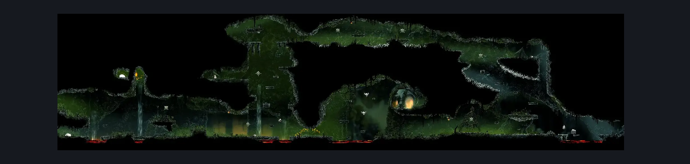
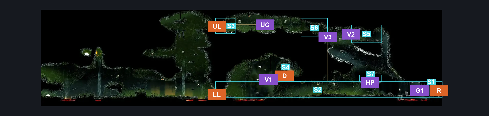
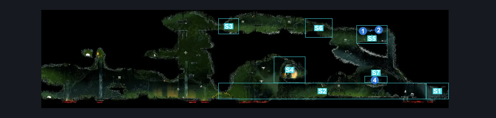

# Far Fields Skull Room East (Bone_East_14b)

**Game ID:** Bone_East_14b

**Contributors:** herounit

## Subrooms

| No. | Subroom | Annotated |
| --- | --- | --- |
| S1 | weavenest platform | ✓ |
| S2 | main floor | ✓ |
| S3 | upper left exit area | ✓ |
| S4 | skull platform | ✓ |
| S5 | rosary platform | ✓ |
| S6 | upper passage | ✓ |
| S7 | herald platform | ✓ |

## Room Transitions

| Alias | Name | From subroom | Destination | Destination alias | Requirements | TODO | Verification | Annotated | Notes |
| --- | --- | --- | --- | --- | --- | --- | --- | --- | --- |
| UL | left1 | upper left exit area | [Far Fields Skull Room West (Bone_East_14)](far-fields-skull-room-west.md) | UR | none |  | Verified | ✓ |  |
| LL | left2 | main floor | [Far Fields Skull Room West (Bone_East_14)](far-fields-skull-room-west.md) | LR | none |  | Verified | ✓ |  |
| D | door1 | skull platform | [Far Fields Skull Arena (Bone_East_LavaChallenge)](far-fields-skull-arena.md) | L | none |  | Verified | ✓ |  |
| R | right1 | weavenest platform | [Weavenest Cindril Entrance (Bone_East_Weavehome)](weavenest-cindril-entrance.md) | L | needolin |  | Verified | ✓ |  |

## Subroom Connections

| Alias | Name | Source | Destination | Requirements | TODO | Verification | Annotated | Notes |
| --- | --- | --- | --- | --- | --- | --- | --- | --- |
| G1 | gap 1 | main floor | weavenest platform | run OR dash OR easy beast pogo OR drifters cloak OR faydown cloak OR clawline OR sharpdart OR scuttlebrace |  | Verified | ✓ |  |
| G1 | gap 1 | weavenest platform | main floor | run OR dash OR easy beast pogo OR drifters cloak OR faydown cloak OR clawline OR sharpdart OR scuttlebrace |  | Verified | ✓ |  |
| V1 | vertical 1 | main floor | skull platform | silk soar OR ( clawline AND ( cling grip OR faydown cloak ) ) OR ( ledge grab AND run AND dash AND faydown cloak ) |  | Verified | ✓ |  |
| V1 | vertical 1 | skull platform | main floor | none (falling) |  | Verified | ✓ |  |
| V2 | vertical 2 | main floor | rosary platform | silk soar OR faydown cloak OR ( ledge grab AND ( run OR dash OR drifter's cloak OR clawline OR sharpdart ) ) |  | Verified | ✓ |  |
| V2 | vertical 2 | rosary platform | main floor | none (falling) |  | Verified | ✓ |  |
| V3 | vertical 3 | main floor | upper passage | ledge grab OR silk soar OR faydown cloak |  | Verified | ✓ | might be missing options here |
| V3 | vertical 3 | upper passage | main floor | none (falling) |  | Verified | ✓ |  |
| UC | upper crossing | upper passage | upper left exit area | ledge grab OR spike pogo OR run OR dash OR drifter's cloak OR faydown cloak OR clawline OR sharpdart OR scuttlebrace |  | Verified | ✓ |  |
| UC | upper crossing | upper left exit area | upper passage | ledge grab OR spike pogo OR run OR dash OR drifter's cloak OR faydown cloak OR clawline OR sharpdart OR scuttlebrace |  | Verified | ✓ |  |
| HP | herald platform access | main floor | herald platform | ledge grab OR cling grip OR silk soar OR faydown |  | Verified | ✓ |  |
| HP | herald platform access | herald platform | main floor | none (falling) |  | Verified | ✓ |  |

## Check Locations

| No. | Check | Subroom | Requirements | TODO | Verification | Location Type | Annotated | Notes |
| --- | --- | --- | --- | --- | --- | --- | --- | --- |
| 1 | rosary cache far fields 7 | rosary platform | none |  | Verified | collectible | ✓ |  |
| 2 | rosary cache far fields 8 | rosary platform | none |  | Verified | collectible | ✓ |  |
| 3 | hoker enemy | main floor | none (attack enemy up) |  | Verified | enemy |  | used to farm flexible spines |
| 4 | Mister Mushroom Meeting Far Fields | herald platform | after THE Mister Mushroom Meeting Bone Bottom AND Needolin |  | Verified | event | ✓ |  |

## Room Images

### Scene

### Connections

### Checks

