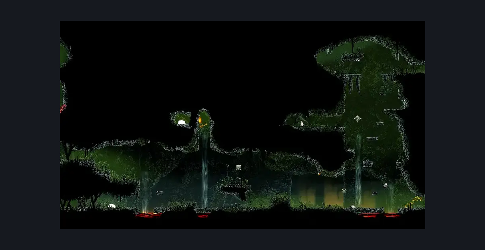
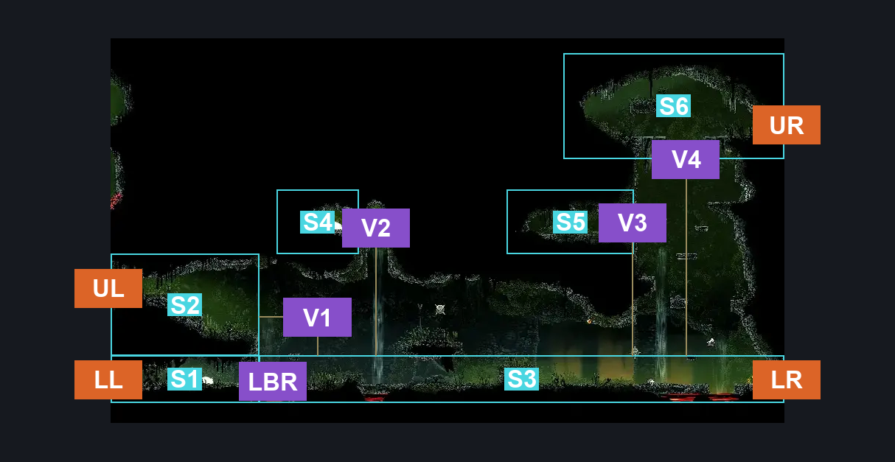
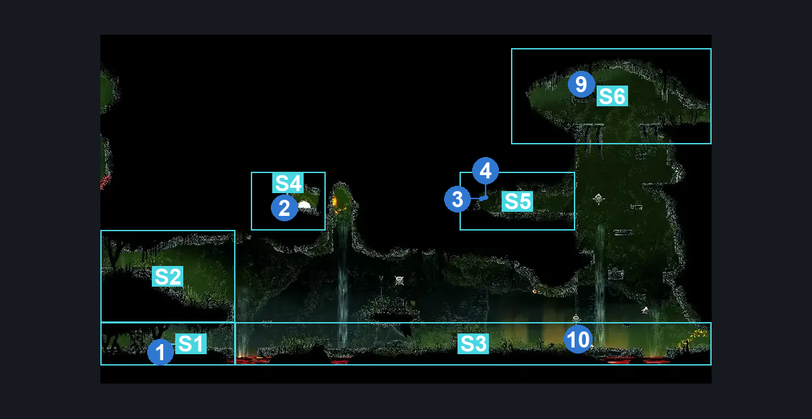

# Far Fields Skull Room West (Bone_East_14)

**Game ID:** Bone_East_14

**Contributors:** herounit

## Subrooms

| No. | Subroom | Annotated |
| --- | --- | --- |
| S1 | lower left exit area | ✓ |
| S2 | upper left exit area | ✓ |
| S3 | main floor | ✓ |
| S4 | relic alcove | ✓ |
| S5 | rosary alcove | ✓ |
| S6 | bone bridge | ✓ |

## Room Transitions

| Alias | Name | From subroom | Destination | Destination alias | Requirements | TODO | Verification | Annotated | Notes |
| --- | --- | --- | --- | --- | --- | --- | --- | --- | --- |
| UL | left1 | upper left exit area | [Far Fields Pinstress Room (Bone_East_09)](far-fields-pinstress-room.md) | UR | none |  | Verified | ✓ |  |
| LL | left2 | lower left exit area | [Far Fields Pinstress Room (Bone_East_09)](far-fields-pinstress-room.md) | LR | none |  | Verified | ✓ |  |
| UR | right1 | bone bridge | [Far Fields Skull Room East (Bone_East_14b)](far-fields-skull-room-east.md) | UL | none |  | Verified | ✓ |  |
| LR | right2 | main floor | [Far Fields Skull Room East (Bone_East_14b)](far-fields-skull-room-east.md) | LL | break blast rock right |  | Verified | ✓ |  |

## Subroom Connections

| Alias | Name | Source | Destination | Requirements | TODO | Verification | Annotated | Notes |
| --- | --- | --- | --- | --- | --- | --- | --- | --- |
| LBR | left blast rock | lower left exit area | main floor | clear lower left blast rock blockade |  | Verified | ✓ |  |
| LBR | left blast rock | main floor | lower left exit area | clear lower left blast rock blockade |  | Verified | ✓ |  |
| V1 | vertical 1 | main floor | upper left exit area | ledge grab OR silk soar OR easy shaman pogo OR drifter's cloak OR faydown cloak OR cling grip OR clawline OR scuttlebrace |  | Verified | ✓ |  |
| V1 | vertical 1 | upper left exit area | main floor | clear upper left blast rock blockade |  | Verified | ✓ |  |
| V2 | vertical 2 | main floor | relic alcove | clear upper left blast rock blockade AND ( drifter's cloak OR silk soar ) |  | Verified | ✓ |  |
| V2 | vertical 2 | relic alcove | main floor | none (falling) |  | Verified | ✓ |  |
| V3 | vertical 3 | main floor | rosary alcove | drifter's cloak OR faydown cloak OR silk soar OR ( ledge grab AND ( run OR dash OR easy beast pogo OR cling grip OR clawline OR sharpdart OR scuttlebrace ) ) |  | Verified | ✓ |  |
| V3 | vertical 3 | rosary alcove | main floor | none (falling) |  | Verified | ✓ |  |
| V4 | vertical 4 | main floor | bone bridge | clear spine break blast rock AND ( faydown cloak OR silk soar OR ledge grab ) |  | Verified | ✓ |  |
| V4 | vertical 4 | bone bridge | main floor | clear spine break blast rock |  | Verified | ✓ |  |

## Check Locations

| No. | Check | Subroom | Requirements | TODO | Verification | Location Type | Annotated | Notes |
| --- | --- | --- | --- | --- | --- | --- | --- | --- |
| 1 | rosary string far fields | lower left exit area | none |  | Verified | collectible | ✓ | MARKED AS ??? ON TRACKER |
| 2 | relic bone scroll far fields | relic alcove | none |  | Verified | collectible | ✓ |  |
| 3 | rosary cache far fields 5 | rosary alcove | none |  | Verified | collectible | ✓ |  |
| 4 | rosary cache far fields 6 | rosary alcove | none |  | Verified | collectible | ✓ |  |
| 5 | hoker enemy | main floor | none |  | Verified | enemy |  | used to farm flexible spines |
| 6 | spine break blast rock | bone bridge | break blast rock up |  | Verified | blockade |  |  |
| 7 | lower left blast rock blockade | lower left exit area | break blast rock right |  | Verified | blockade |  |  |
| 8 | upper left blast rock blockade | upper left exit area | break blast rock left |  | Verified | blockade |  |  |
| 9 | Resting Site Far Fields | bone bridge | complete THE a vassal lost wish promised |  | Verified | event | ✓ |  |
| 10 | Garmond and Zaza Act 3 Meeting Far Fields East | main floor | Act 3 |  | Verified | event | ✓ |  |

## Room Images

### Scene

### Connections

### Checks

