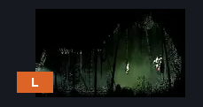
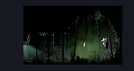

# Far Fields Target Practice (Bone_East_22)

**Game ID:** Bone_East_22

**Contributors:** herounit

## Subrooms

No subrooms defined.

## Room Transitions

| Alias | Name | From subroom | Destination | Destination alias | Requirements | TODO | Verification | Annotated | Notes |
| --- | --- | --- | --- | --- | --- | --- | --- | --- | --- |
| L | left1 |  | [Far Fields Wind Shaft (Bone_East_07)](far-fields-wind-shaft.md) | R4 | none |  | Verified | ✓ |  |

## Subroom Connections

No subroom connections defined.

## Check Locations

| No. | Check | Subroom | Requirements | TODO | Verification | Location Type | Annotated | Notes |
| --- | --- | --- | --- | --- | --- | --- | --- | --- |
| 1 | progressive curveclaw 2 |  | act 3 AND curveclaw |  | Verified | collectible |  | NOT CURRENTLY ON TRACKER - MAY NOT BE RANDOMIZED |

## Notes

this is the room where you get progressive curveclaw (curvesickle) in act 3

## Room Images

### Connections

### Checks

### Scene

