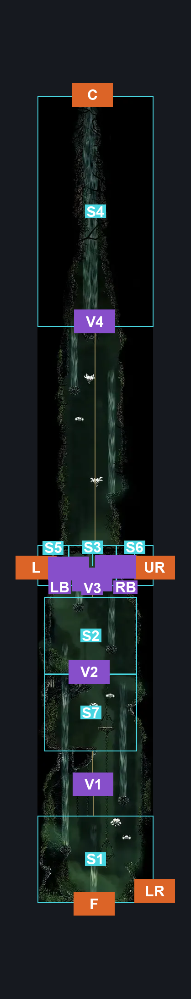
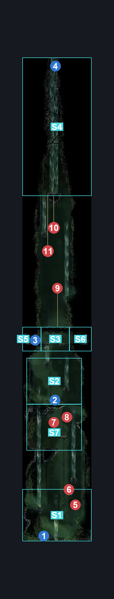
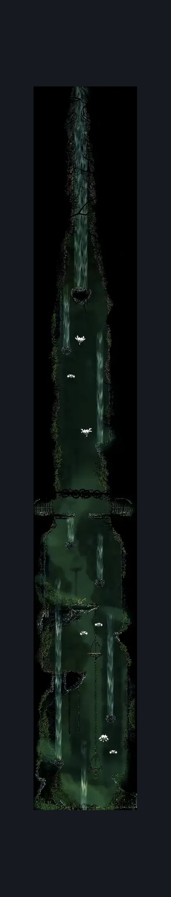

# Far Fields Upper Shaft (Bone_East_11)

**Game ID:** Bone_East_11

**Contributors:** herounit

## Subrooms

| No. | Subroom | Annotated |
| --- | --- | --- |
| S1 | the bottom | ✓ |
| S2 | above middle gate | ✓ |
| S3 | hunters march bridge | ✓ |
| S4 | top wind tunnel | ✓ |
| S5 | left march bridge room | ✓ |
| S6 | right march bridge room | ✓ |
| S7 | first shaft scaffold | ✓ |

## Room Transitions

| Alias | Name | From subroom | Destination | Destination alias | Requirements | TODO | Verification | Annotated | Notes |
| --- | --- | --- | --- | --- | --- | --- | --- | --- | --- |
| C | top1 | top wind tunnel | [Greymoor West Bellshrine Room (Greymoor_01)](../greymoor/greymoor-west-bellshrine-room.md) | D | drifter's cloak OR (silk soar AND (cling grip OR scuttlebrace)) |  | Verified | ✓ | silk soar will not attach to the exit ceiling |
| UR | right1 | right march bridge room | [Far Fields Deep Entrance (Bone_East_24)](far-fields-deep-entrance.md) | L | none |  | Verified | ✓ |  |
| L | left1 | left march bridge room | [Hunter's March Deep Entrance (Ant_09)](../hunter-s-march/hunter-s-march-deep-entrance.md) | R | none |  | Verified | ✓ |  |
| LR | right2 | the bottom | [Far Fields Pilgrim's Rest (Bone_East_10)](far-fields-pilgrim-s-rest.md) | UL | none |  | Verified | ✓ |  |
| F | bot1 | the bottom | [Far Fields Wind Shaft (Bone_East_07)](far-fields-wind-shaft.md) | C | none (activate lower gate lever) |  | Verified | ✓ |  |

## Subroom Connections

| Alias | Name | Source | Destination | Requirements | TODO | Verification | Annotated | Notes |
| --- | --- | --- | --- | --- | --- | --- | --- | --- |
| V1 | vertical 1 | the bottom | first shaft scaffold | drifter's cloak OR silk soar OR cling grip OR (scuttlebrace AND faydown cloak) |  | Verified | ✓ |  |
| V1 | vertical 1 | first shaft scaffold | the bottom | none (falling) |  | Verified | ✓ |  |
| V2 | vertical 2 | first shaft scaffold | above middle gate | drifter's cloak OR silk soar OR (faydown cloak AND (scuttlebrace OR cling grip)) OR (cling grip AND easy enemy pogo) |  | Verified | ✓ |  |
| V2 | vertical 2 | above middle gate | first shaft scaffold | none (falling) |  | Verified | ✓ |  |
| V3 | vertical 3 | above middle gate | hunters march bridge | drifter's cloak OR silk soar OR (activate hunter's march bridge lever AND (faydown cloak AND (ledge grab OR cling grip OR (proficient movement AND scuttlebrace AND easy flea brew stall )))) |  | Verified | ✓ |  |
| V3 | vertical 3 | hunters march bridge | above middle gate | none (falling) |  | Verified | ✓ |  |
| LB | left bridge crossing | left march bridge room | hunters march bridge | activate hunter's march bridge lever |  | Verified | ✓ |  |
| LB | left bridge crossing | hunters march bridge | left march bridge room | activate hunter's march bridge lever |  | Verified | ✓ |  |
| RB | right bridge crossing | hunters march bridge | right march bridge room | activate hunter's march bridge lever |  | Verified | ✓ |  |
| RB | right bridge crossing | right march bridge room | hunters march bridge | activate hunter's march bridge lever |  | Verified | ✓ |  |
| V4 | vertical 4 | hunters march bridge | top wind tunnel | silk soar OR drifter's cloak |  | Verified | ✓ | the bridge blocks the wind stream - not sure exactly how this should be represented |
| V4 | vertical 4 | top wind tunnel | hunters march bridge | none (falling) |  | Verified | ✓ |  |

## Check Locations

| No. | Check | Subroom | Requirements | TODO | Verification | Location Type | Annotated | Notes |
| --- | --- | --- | --- | --- | --- | --- | --- | --- |
| 1 | lower gate lever | the bottom | flip switch down |  | Verified | switch | ✓ |  |
| 2 | middle gate lever | above middle gate | flip switch down |  | Verified | switch | ✓ |  |
| 3 | hunter's march bridge lever | left march bridge room | flip switch down |  | Verified | switch | ✓ |  |
| 4 | greymoor floor blockade | top wind tunnel | none (opens once traveled through) |  | Verified | blockade | ✓ |  |
| 5 | caranid 1 | the bottom | none |  | Verified | enemy | ✓ | shell shards |
| 6 | vicious caranid 1 | the bottom | none |  | Verified | enemy | ✓ | shell shards |
| 7 | caranid 2 | first shaft scaffold | none |  | Verified | enemy | ✓ | shell shards |
| 8 | caranid 3 | first shaft scaffold | none |  | Verified | enemy | ✓ | shell shards |
| 9 | vicious caranid 2 | hunters march bridge | none |  | Verified | enemy | ✓ | shell shards |
| 10 | vicious caranid 3 | top wind tunnel | none |  | Verified | enemy | ✓ | shell shards |
| 11 | caranid 4 | top wind tunnel | none |  | Verified | enemy | ✓ | shell shards |

## Room Images

### Connections

### Checks

### Scene

