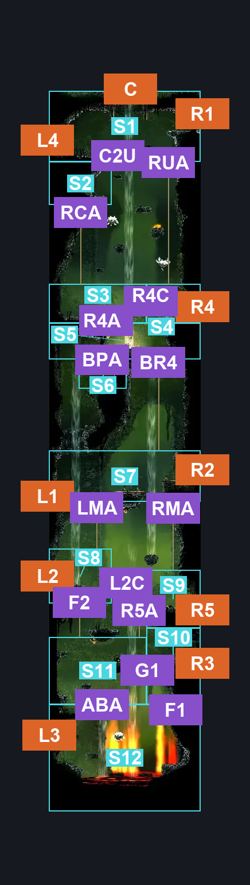
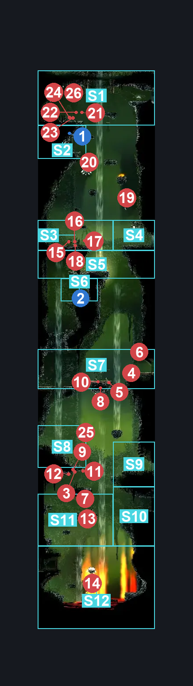
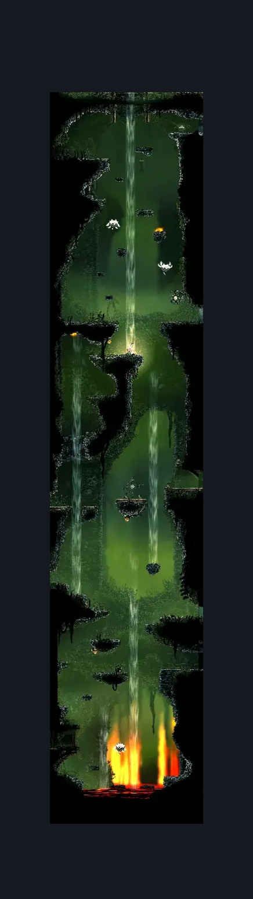

# Far Fields Wind Shaft (Bone_East_07)

**Game ID:** Bone_East_07

**Contributors:** herounit

## Subrooms

| No. | Subroom | Annotated |
| --- | --- | --- |
| S1 | upper crossing | ✓ |
| S2 | rosary cache spot | ✓ |
| S3 | R4 left | ✓ |
| S4 | R4 area | ✓ |
| S5 | below R4 | ✓ |
| S6 | mort corpse platform | ✓ |
| S7 | middle crossing | ✓ |
| S8 | L2 area | ✓ |
| S9 | R5 area | ✓ |
| S10 | R3 area | ✓ |
| S11 | left almost bottom | ✓ |
| S12 | the bottom | ✓ |

## Room Transitions

| Alias | Name | From subroom | Destination | Destination alias | Requirements | TODO | Verification | Annotated | Notes |
| --- | --- | --- | --- | --- | --- | --- | --- | --- | --- |
| C | top1 | upper crossing | [Far Fields Upper Shaft (Bone_East_11)](far-fields-upper-shaft.md) | F | activate lower gate lever IN far fields upper shaft |  | Verified | ✓ |  |
| R1 | right1 | upper crossing | [Far Fields Pilgrim's Rest (Bone_East_10)](far-fields-pilgrim-s-rest.md) | LL | none |  | Verified | ✓ |  |
| R4 | right4 | R4 area | [Far Fields Target Practice (Bone_East_22)](far-fields-target-practice.md) | L | none |  | Verified | ✓ |  |
| R2 | right2 | middle crossing | [Far Fields Bellway (Bellway_03)](far-fields-bellway.md) | L | none |  | Verified | ✓ |  |
| R5 | right5 | R5 area | [Far Fields Map Shop (Bone_East_21)](far-fields-map-shop.md) | L | none |  | Verified | ✓ |  |
| R3 | right3 | R3 area | [Far Fields Chorus (Bone_East_08)](far-fields-chorus.md) | L | none |  | Verified | ✓ |  |
| L4 | left4 | upper crossing | [Far Fields Fort Upper Passage (Bone_East_17)](far-fields-fort-upper-passage.md) | R | none |  | Verified | ✓ |  |
| L1 | left1 | middle crossing | [Far Fields Entrance West (Bone_East_02b)](far-fields-entrance-west.md) | UR | none |  | Verified | ✓ |  |
| L2 | left2 | L2 area | [Far Fields Entrance West (Bone_East_02b)](far-fields-entrance-west.md) | LR | none |  | Verified | ✓ |  |
| L3 | left3 | the bottom | [Far Fields Deep Docks Backdoor (Dock_03b)](far-fields-deep-docks-backdoor.md) | R | none |  | Verified | ✓ |  |

## Subroom Connections

| Alias | Name | Source | Destination | Requirements | TODO | Verification | Annotated | Notes |
| --- | --- | --- | --- | --- | --- | --- | --- | --- |
| ABA | almost bottom ascent | the bottom | left almost bottom | ledge grab OR faydown cloak OR scuttlebrace OR silk soar OR drifter's cloak OR easy shaman pogo |  | Verified | ✓ |  |
| ABA | almost bottom ascent | left almost bottom | the bottom | none (falling) |  | Verified | ✓ |  |
| G1 | gap 1 | left almost bottom | R3 area | run OR dash OR easy beast pogo OR drifter's cloak OR faydown cloak OR cling grip OR silk soar OR clawline OR sharpdart OR scuttlebrace |  | Verified | ✓ |  |
| G1 | gap 1 | R3 area | left almost bottom | ledge grab OR run OR dash OR easy beast pogo OR drifter's cloak OR faydown cloak OR cling grip OR silk soar OR clawline OR sharpdart OR scuttlebrace |  | Verified | ✓ | slightly lower, so ledge grab works here |
| F1 | fall 1 | R3 area | the bottom | none (falling) |  | Verified | ✓ |  |
| R5A | R5 ascent | left almost bottom | R5 area | ledge grab OR easy shaman pogo OR drifter's cloak OR faydown cloak OR clawline OR silk soar |  | Verified | ✓ |  |
| R5A | R5 ascent | R5 area | left almost bottom | none (falling) |  | Verified | ✓ |  |
| L2C | L2 crossing | R5 area | L2 area | run OR dash OR easy beast pogo OR drifter's cloak OR faydown cloak OR silk soar OR clawline OR sharpdart OR scuttlebrace |  | Verified | ✓ |  |
| L2C | L2 crossing | L2 area | R5 area | ledge grab OR run OR dash OR easy beast pogo OR drifter's cloak OR faydown cloak OR silk soar OR clawline OR sharpdart OR scuttlebrace |  | Verified | ✓ |  |
| F2 | fall 2 | L2 area | left almost bottom | none (falling) |  | Verified | ✓ |  |
| LMA | left middle ascent | L2 area | middle crossing | drifter's cloak OR silk soar |  | Verified | ✓ |  |
| LMA | left middle ascent | middle crossing | L2 area | none (falling) |  | Verified | ✓ |  |
| RMA | right middle ascent | R5 area | middle crossing | silk soar OR ( break blast rock down AND drifter's cloak ) |  | Verified | ✓ |  |
| RMA | right middle ascent | middle crossing | R5 area | none (falling) |  | Verified | ✓ |  |
| BR4 | below R4 ascent | middle crossing | below R4 | silk soar OR ( drifter's cloak AND break blast rock down ) OR ( ( cling grip OR scuttlebrace ) AND ( faydown cloak OR clawline ) ) |  | Verified | ✓ |  |
| BR4 | below R4 ascent | below R4 | middle crossing | none (falling) |  | Verified | ✓ |  |
| R4A | R4 ascent | below R4 | R4 left | break blast rock up AND ( silk soar OR drifter's cloak  ) |  | Verified | ✓ |  |
| R4A | R4 ascent | R4 left | below R4 | break blast rock down |  | Verified | ✓ |  |
| R4C | R4C crossing | R4 left | R4 area | run OR dash OR easy beast pogo OR drifter's cloak OR faydown cloak OR silk soar OR clawline OR sharpdart OR scuttlebrace |  | Verified | ✓ | this only applies if you break the right blast rock, but going with most restrictive solution |
| R4C | R4C crossing | R4 area | R4 left | run OR dash OR easy beast pogo OR drifter's cloak OR faydown cloak OR silk soar OR clawline OR sharpdart OR scuttlebrace |  | Verified | ✓ | this only applies if you break the right blast rock, but going with most restrictive solution |
| BPA | belt platform access | below R4 | mort corpse platform | none (falling) |  | Verified | ✓ | no point in scaffolding the reverse because this is a logical dead-end |
| RUA | right upper ascent | R4 area | upper crossing | drifter's cloak OR ( faydown cloak AND cling grip ) |  | Verified | ✓ | take the wind stream or scale the wall |
| RUA | right upper ascent | upper crossing | R4 area | none (falling) |  | Verified | ✓ |  |
| RCA | rosary cache ascent | R4 left | rosary cache spot | ledge grab OR drifter's cloak OR faydown cloak OR silk soar |  | Verified | ✓ |  |
| RCA | rosary cache ascent | rosary cache spot | R4 left | none (falling) |  | Verified | ✓ |  |
| C2U | cache to upper crossing | rosary cache spot | upper crossing | ledge grab OR drifter's cloak OR faydown cloak OR clawline OR scuttlebrace |  | Verified | ✓ |  |
| C2U | cache to upper crossing | upper crossing | rosary cache spot | none (falling) |  | Verified | ✓ |  |

## Check Locations

| No. | Check | Subroom | Requirements | TODO | Verification | Location Type | Annotated | Notes |
| --- | --- | --- | --- | --- | --- | --- | --- | --- |
| 1 | rosary cache far fields 1 | rosary cache spot | none |  | Verified | collectible | ✓ |  |
| 2 | weighted belt | mort corpse platform | act 3 |  | Verified | collectible | ✓ | according to the wiki you can either buy it from pilgrim's rest in act 1/2 OR you can grab it from mort's corpse here in act 3 |
| 3 | Brushflit 1 |  |  |  |  | enemy | ✓ |  |
| 4 | Brushflit 2 |  |  |  |  | enemy | ✓ |  |
| 5 | Brushflit 3 |  |  |  |  | enemy | ✓ |  |
| 6 | Brushflit 4 |  |  |  |  | enemy | ✓ |  |
| 7 | Brushflit 5 |  |  |  |  | enemy | ✓ |  |
| 8 | Brushflit 6 |  |  |  |  | enemy | ✓ |  |
| 9 | Brushflit 7 |  |  |  |  | enemy | ✓ |  |
| 10 | Brushflit 8 |  |  |  |  | enemy | ✓ |  |
| 11 | Brushflit 9 |  |  |  |  | enemy | ✓ |  |
| 12 | Brushflit 10 |  |  |  |  | enemy | ✓ |  |
| 13 | Fertid 1 |  |  |  |  | enemy | ✓ |  |
| 14 | Vicious Caranid 1 |  | Normal World Spawn |  |  | enemy | ✓ |  |
| 15 | Brushflit 11 |  | Normal World Spawn |  |  | enemy | ✓ |  |
| 16 | Brushflit 12 |  | Normal World Spawn |  |  | enemy | ✓ |  |
| 17 | Brushflit 13 |  | Normal World Spawn |  |  | enemy | ✓ |  |
| 18 | Brushflit 14 |  | Normal World Spawn |  |  | enemy | ✓ |  |
| 19 | Vicious Caranid 2 |  | Normal World Spawn |  |  | enemy | ✓ |  |
| 20 | Vicious Caranid 3 |  | Normal World Spawn |  |  | enemy | ✓ |  |
| 21 | Brushflit 15 |  | Normal World Spawn |  |  | enemy | ✓ |  |
| 22 | Brushflit 16 |  | Normal World Spawn |  |  | enemy | ✓ |  |
| 23 | Brushflit 17 |  | Normal World Spawn |  |  | enemy | ✓ |  |
| 24 | Brushflit 18 |  | Normal World Spawn |  |  | enemy | ✓ |  |
| 25 | Vicious Caranid 4 |  | Black Thread World Spawn |  |  | enemy | ✓ |  |
| 26 | Vicious Caranid 5 |  | Black Thread World Spawn |  |  | enemy | ✓ |  |

## Room Images

### Connections

### Checks

### Scene

