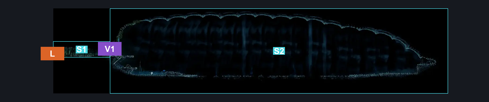
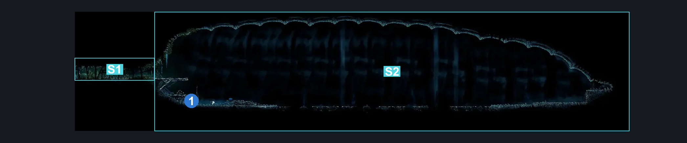
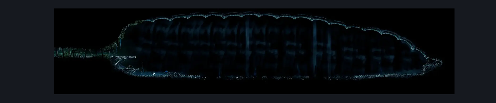

# Sprintmaster Cave (Sprintmaster_Cave)

**Game ID:** Sprintmaster_Cave

**Contributors:** herounit

## Subrooms

| No. | Subroom | Annotated |
| --- | --- | --- |
| S1 | the exit | ✓ |
| S2 | the race | ✓ |

## Room Transitions

| Alias | Name | From subroom | Destination | Destination alias | Requirements | TODO | Verification | Annotated | Notes |
| --- | --- | --- | --- | --- | --- | --- | --- | --- | --- |
| L | left1 | the exit | [Far Fields Deep Lower East (Bone_East_18b)](far-fields-deep-lower-east.md) | D | none |  | Verified | ✓ |  |

## Subroom Connections

| Alias | Name | Source | Destination | Requirements | TODO | Verification | Annotated | Notes |
| --- | --- | --- | --- | --- | --- | --- | --- | --- |
| V1 | vertical 1 | the race | the exit | silk soar OR faydown |  | Verified | ✓ |  |
| V1 | vertical 1 | the exit | the race | none (falling) |  | Verified | ✓ |  |

## Check Locations

| No. | Check | Subroom | Requirements | TODO | Verification | Location Type | Annotated | Notes |
| --- | --- | --- | --- | --- | --- | --- | --- | --- |
| 1 | RestBench | the race | none |  | Verified | bench | ✓ |  |
| 2 | fastest in pharloom wish promised | the race | none |  | Verified | event |  | can also start at the bellhart wish wall |
| 3 | fastest in pharloom wish granted | the race | complete fastest in pharloom wish promised AND complete race victory 3 |  | Verified | event |  |  |
| 4 | race victory 1 | the race | complete fastest in pharloom wish promised AND run AND dash AND cling grip AND clawline AND faydown cloak | TODO |  | event |  | these need to be refined for each race |
| 5 | race victory 2 | the race | complete race victory 1  AND run AND dash AND cling grip AND clawline AND faydown cloak | TODO |  | event |  | these need to be refined for each race |
| 6 | race victory 3 | the race | complete race victory 2  AND run AND dash AND cling grip AND clawline AND faydown cloak | TODO |  | event |  | these need to be refined for each race |
| 7 | race victory 4 | the race | complete race victory 3  AND run AND dash AND cling grip AND clawline AND faydown cloak | TODO |  | event |  | these need to be refined for each race |
| 8 | rosary beads | the race | complete race victory 1 |  | Verified | collectible |  |  |
| 9 | beast shard | the race | complete race victory 2 |  | Verified | collectible |  |  |
| 10 | fastest in pharloom mask shard | the race | complete race victory 3 |  | Verified | collectible |  |  |
| 11 | sprintmaster memento | the race | complete race victory 4 |  | Verified | collectible |  |  |

## Room Images

### Connections

### Checks

### Scene

