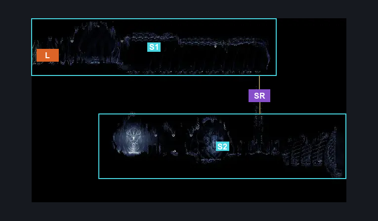
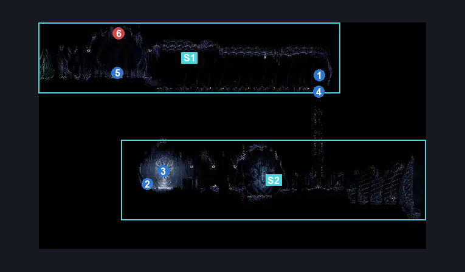
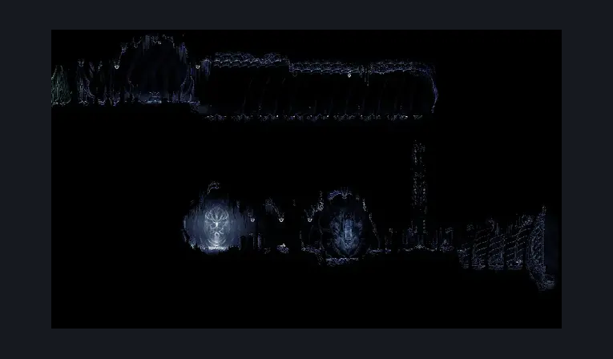

# Weavenest Cindril (Bone_East_Weavehome)

**Game ID:** Bone_East_Weavehome

**Contributors:** herounit

## Subrooms

| No. | Subroom | Annotated |
| --- | --- | --- |
| S1 | entrance | ✓ |
| S2 | secret room | ✓ |

## Room Transitions

| Alias | Name | From subroom | Destination | Destination alias | Requirements | TODO | Verification | Annotated | Notes |
| --- | --- | --- | --- | --- | --- | --- | --- | --- | --- |
| L | left1 | entrance | [Far Fields Skull Room East (Bone_East_14b)](far-fields-skull-room-east.md) | R | needolin |  | Verified | ✓ |  |

## Subroom Connections

| Alias | Name | Source | Destination | Requirements | TODO | Verification | Annotated | Notes |
| --- | --- | --- | --- | --- | --- | --- | --- | --- |
| SR | secret room | entrance | secret room | unlock secret room lock |  | Verified | ✓ |  |
| SR | secret room | secret room | entrance | unlock secret room lock AND ( cling grip OR silk soar OR scuttlebrace ) |  | Verified | ✓ |  |

## Check Locations

| No. | Check | Subroom | Requirements | TODO | Verification | Location Type | Annotated | Notes |
| --- | --- | --- | --- | --- | --- | --- | --- | --- |
| 1 | silkspeed anklets | entrance | run  OR (  proficient movement AND ( architect slash [right] OR easy hunter pogo OR easy beast pogo )  ) |  | Verified | collectible | ✓ |  |
| 2 | relic rune harp weavenest cindril | secret room | none |  | Verified | collectible | ✓ |  |
| 3 | map of paths away from pharloom | secret room | none |  | Verified | lore | ✓ |  |
| 4 | secret room lock | entrance | run AND silkspeed anklets AND flea brew speed |  | Verified | lock | ✓ |  |
| 5 | wvnest cindil bench | entrance | none |  | Verified | bench | ✓ |  |
| 6 | servitor ignim | entrance | needle [up] |  | Verified | enemy | ✓ |  |

## Room Images

### Connections

### Checks

### Scene

