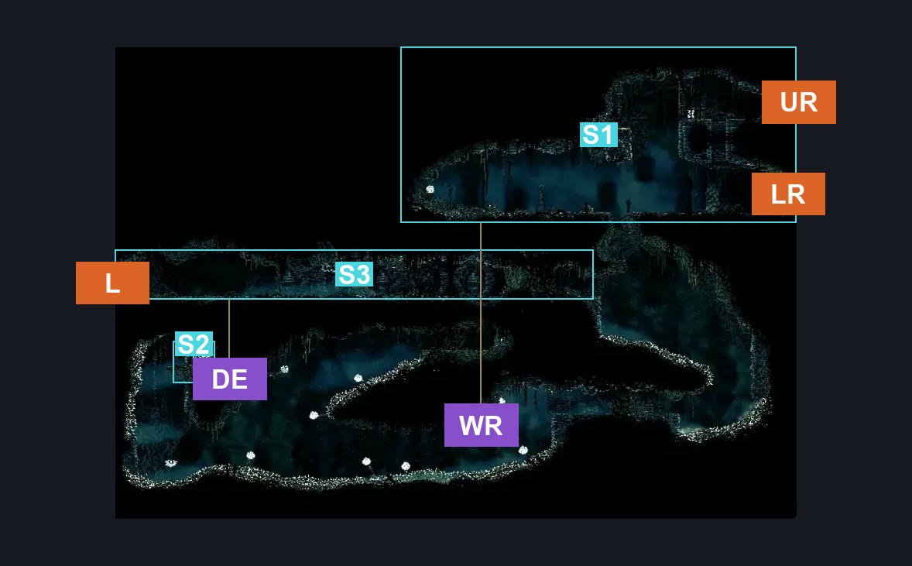
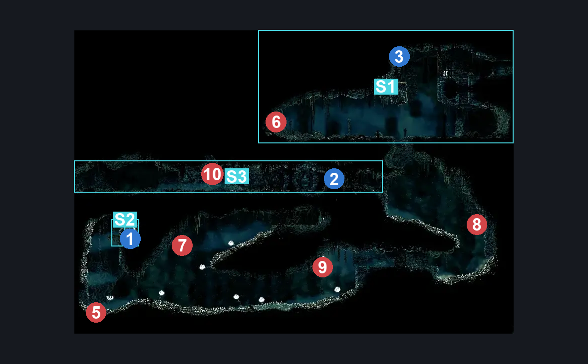
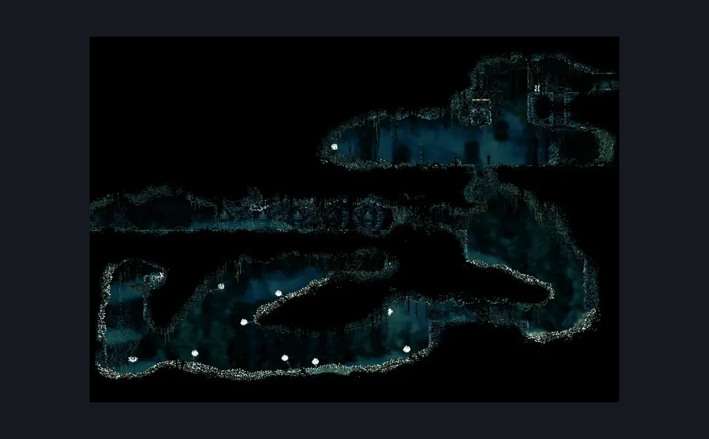

# Entrance to Nyleth (Under_27)

**Game ID:** Under_27

**Contributors:** Pyxl

## Subrooms

| No. | Subroom | Annotated |
| --- | --- | --- |
| S1 | Entrance | ✓ |
| S2 | Shell Shard Ledge | ✓ |
| S3 | Exit | ✓ |

## Room Transitions

| Alias | Name | From subroom | Destination | Destination alias | Requirements | TODO | Verification | Annotated | Notes |
| --- | --- | --- | --- | --- | --- | --- | --- | --- | --- |
| L | left1 | Exit | [Shrine Guardian Seth (Shellwood_22)](shrine-guardian-seth.md) | R | None |  | Verified | ✓ |  |
| UR | right1 | Entrance | [Grand Elevator (Under_01)](grand-elevator.md) | SLT | Silk Soar OR ( Faydown Cloak AND Cling Grip ) |  | Verified | ✓ |  |
| LR | right2 | Entrance | [Grand Elevator (Under_01)](grand-elevator.md) | SLB | Prereq Vined Up door |  | Verified | ✓ |  |

## Subroom Connections

| Alias | Name | Source | Destination | Requirements | TODO | Verification | Annotated | Notes |
| --- | --- | --- | --- | --- | --- | --- | --- | --- |
| WR | Whole Room | Entrance | Exit | prereq Breakable Chain - Entrance AND ( prereq Breakable Vines - Exit Hall OR ( Faydown Cloak AND ( Clawline OR Drifters Cloak ) AND ( Cling Grip OR Ledge grab OR Silk Soar OR Scuttlebrace ) ) ) |  | Verified | ✓ |  |
| WR | Whole Room | Exit | Entrance | ( prereq Breakable Vines - Exit Hall AND Faydown Cloak AND ( Cling Grip OR Ledge Grab OR Dash ) ) |  | Verified | ✓ |  |
| DE | Detour | Exit | Shell Shard Ledge | ( Faydown Cloak AND Cling Grip AND ( Clawline OR Dash OR Drifters Cloak ) ) |  | Verified | ✓ |  |
| DE | Detour | Shell Shard Ledge | Exit | ( Faydown Cloak AND ( Cling Grip OR Ledge Grab OR Silk Soar ) AND ( Clawline OR Dash OR Drifters Cloak ) ) |  | Verified | ✓ |  |

## Check Locations

| No. | Check | Subroom | Requirements | TODO | Verification | Location Type | Annotated | Notes |
| --- | --- | --- | --- | --- | --- | --- | --- | --- |
| 1 | Grand Gate - Shell Shard Cache | Shell Shard Ledge | None |  | Verified | resource | ✓ |  |
| 2 | Breakable Vines - Exit Hall | Exit | None |  | Verified | blockade | ✓ |  |
| 3 | Breakable Chain - Entrance | Entrance | Silk Soar OR ( Faydown Cloak OR Cling Grip ) |  | Verified | blockade | ✓ |  |
| 4 | Vined Up door | Entrance | None |  | Verified | blockade |  |  |
| 5 | Phacia 1 |  |  |  |  | enemy | ✓ |  |
| 6 | Phacia 2 |  |  |  |  | enemy | ✓ |  |
| 7 | Phacia 3 |  |  |  |  | enemy | ✓ |  |
| 8 | Phacia 4 |  |  |  |  | enemy | ✓ |  |
| 9 | Pollenica 1 |  |  |  |  | enemy | ✓ |  |
| 10 | Void Mass 1 |  | Black Thread World Spawn |  |  | enemy | ✓ |  |

## Room Images

### Connections

### Checks

### Scene

