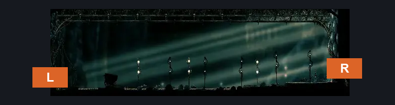
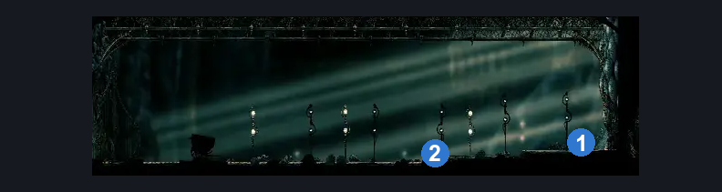
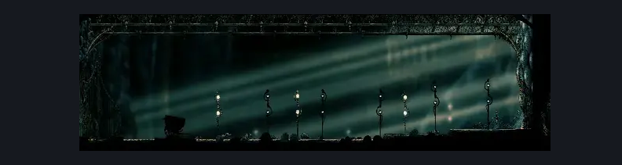

# Grand Bridge (Coral_10)

**Game ID:** Coral_10

**Contributors:** skai

## Subrooms

No subrooms defined.

## Room Transitions

| Alias | Name | From subroom | Destination | Destination alias | Requirements | TODO | Verification | Annotated | Notes |
| --- | --- | --- | --- | --- | --- | --- | --- | --- | --- |
| L | Left |  | [Last Judge Arena (Coral_Judge_Arena)](../blasted-steps/last-judge-arena.md) | R | prereq Boss: Last Judge IN Last Judge Arena |  | Verified | ✓ |  |
| R | Right |  | [Grand Gate Courtroom (Song_19_entrance)](grand-gate-courtroom.md) | L | activate Grand Bridge Plate |  | Verified | ✓ |  |

## Subroom Connections

No subroom connections defined.

## Check Locations

| No. | Check | Subroom | Requirements | TODO | Verification | Location Type | Annotated | Notes |
| --- | --- | --- | --- | --- | --- | --- | --- | --- |
| 1 | Grand Bridge Plate |  | Nothing |  | Verified | switch | ✓ |  |
| 2 | Seth Meeting Grand Gate |  | after THE Seth Meeting Shellwood |  | Verified | event | ✓ | skipped per the wiki if: - ecstasy of the end wish granted - have everbloom |
| 3 | import enemies |  |  | TODO | Needs verification |  |  |  |

## Room Images

### Connections

### Checks

### Scene

